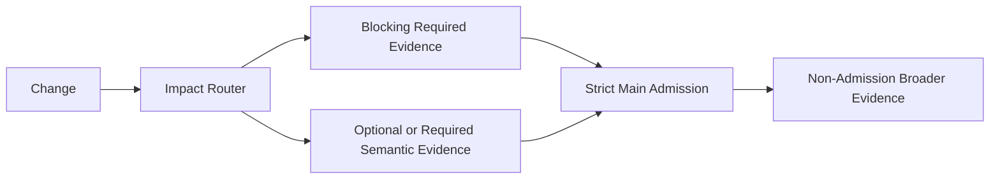

# CI Design Handoff

Produce one implementation-ready design artifact. It should preserve the repository discovery and decisions an implementer would otherwise have to repeat.

Use the sections below as a default shape, not a mandatory form. Omit optional sections that add no implementation value.

## Context

Record only evidence that affects the design:

- target and applicable repository guidance;
- admission branch (`main` or the established equivalent);
- current CI/workflows;
- relevant asset and generated/projection roots;
- tests, evals, validators, generators, and maintenance automation;
- material runner, secret, branch, provider, cost, or platform constraints.

Prefer concrete paths, commands, and existing workflow names.

## Goals and Non-Goals

State the admission standard first: what failures would make a change unacceptable on `main` and therefore need blocking pre-merge evidence.

Then state what the design should improve and what it intentionally does not introduce. Use non-goals only where they prevent likely scope expansion, such as a provider migration, new eval framework, write-back automation, or exhaustive provider matrix.

Do not treat CI speed or simplicity as a reason to weaken the admission standard.

## Failure → Evidence

Map each important failure to the cheapest sufficient evidence and decide whether it changes admission.

| Failure class | Evidence | Boundary |
| --- | --- | --- |
| malformed asset metadata | static/deterministic check | blocking PR |
| generator regression | contract/script test | blocking PR |
| projection drift | isolated projection check | blocking PR when unacceptable on main |
| routing regression | semantic smoke | blocking only when merge-critical |
| runtime parity | live runtime eval | blocking only when required for admission; otherwise scheduled/manual |
| pure style drift | formatter/normalizer | maintenance by default |

Keep only rows that apply to the target. If a failure would not change the merge decision, do not make its evidence blocking merely for completeness.

## CI Architecture

For each proposed workflow or logical job, specify only what implementation needs:

- purpose and failure class;
- trigger/change scope;
- selected checks or dependencies;
- blocking or informational role and why;
- permissions/secrets;
- timeout, concurrency, cache, matrix, or artifacts when material;
- evidence boundary: what it proves and does not prove.

Blocking jobs should correspond to failures that make a change unacceptable on `main`. Prefer logical responsibilities over premature filenames.

## Impact Routing

Show how representative changes select checks and how shared/global changes fan out.

Use the smallest maintainable mechanism: path filters, layout/naming convention, a small router script, or an explicit dependency map when justified.

Define the fail-safe behavior. If impact cannot be resolved confidently, broaden validation or fail the selector rather than silently skipping relevant merge-critical checks.

## Evaluation

Include this only when semantic or runtime evaluation is part of the design. Specify the triggering changes, case ownership, smoke/full boundary, evaluator type, provider/model scope, failure interpretation, stochastic sampling/retry policy when needed, cost/secret boundary, and whether results block merge.

If semantic/runtime evidence is required for admission, keep the blocking set as small and representative as possible. If deterministic evidence is sufficient, say that briefly instead of inventing an eval layer.

## Maintenance

Include only when write-capable automation is needed. Describe the write responsibility, canonical source authority, trigger, permissions, and how commit loops or silent overwrites are prevented.

Pure formatting and style normalization belong here by default rather than in the merge gate, unless representation itself affects correctness or an explicit contract.

## Implementation Plan

Give the smallest incremental order. Establish the admission boundary and merge-critical evidence first, then impact routing, then optional non-blocking semantic/runtime or maintenance layers.

Do not require a framework migration unless it is already an accepted prerequisite.

## Acceptance Criteria

Use observable, implementation-neutral criteria. Examples:

- every known failure that would make a change unacceptable on `main` maps to blocking pre-merge evidence;
- an isolated change does not run unrelated expensive checks;
- a shared change fans out to known dependents;
- uncertain impact broadens validation or fails safe instead of silently returning incomplete coverage;
- malformed eval fixtures fail before model execution;
- pure style differences do not block merge unless representation affects correctness or an explicit contract;
- PR merge gates do not require repository write permission without a demonstrated need;
- known merge-critical verification cannot be silently omitted from delegated or agent-authored changes by impact routing;
- approved semantic tuning is not rejected solely for differing from generated baseline text;
- exhaustive provider/model matrices do not run on every PR without justification.

## Risks and Open Decisions

List only unresolved items that can change implementation or evidence quality. Separate facts from assumptions; do not leave resolved repository facts hidden behind `<auto>`.

## Optional Diagram

Use Mermaid when it makes the evidence flow materially easier to understand.

## Final Review

Remove generic advice, duplicate higher-cost checks, unsupported hard-coded paths, speculative cache/matrix/secret choices, blocking checks that do not affect admission, model eval where deterministic assertions suffice, silent impact gaps, and runtime claims without runtime evidence.

Provider YAML, shell, or test snippets may be included only when they remove implementation ambiguity. Do not turn the handoff into completed CI unless implementation is explicitly requested.
