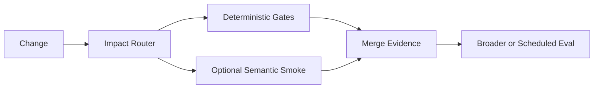

# CI Design Handoff

Produce one implementation-ready design artifact. It should preserve the repository discovery and decisions an implementer would otherwise have to repeat.

Use the sections below as a default shape, not a mandatory form. Omit optional sections that add no implementation value.

## Context

Record only evidence that affects the design:

- target and applicable repository guidance;
- current CI/workflows;
- relevant asset and generated/projection roots;
- tests, evals, validators, generators, and maintenance automation;
- material runner, secret, branch, provider, cost, or platform constraints.

Prefer concrete paths, commands, and existing workflow names.

## Goals and Non-Goals

State what the design should improve and what it intentionally does not introduce. Use non-goals only where they prevent likely scope expansion, such as a provider migration, new eval framework, write-back automation, or exhaustive provider matrix.

## Failure → Evidence

Map each important failure to the cheapest sufficient evidence.

| Failure class | Evidence | Boundary |
| --- | --- | --- |
| malformed asset metadata | static/deterministic check | PR |
| generator regression | contract/script test | PR |
| projection drift | isolated projection check | PR or main |
| routing regression | semantic smoke | conditional PR |
| runtime parity | live runtime eval | scheduled/manual |

Keep only rows that apply to the target.

## CI Architecture

For each proposed workflow or logical job, specify only what implementation needs:

- purpose and failure class;
- trigger/change scope;
- selected checks or dependencies;
- blocking or informational role;
- permissions/secrets;
- timeout, concurrency, cache, matrix, or artifacts when material;
- evidence boundary: what it proves and does not prove.

Prefer logical responsibilities over premature filenames.

## Impact Routing

Show how representative changes select checks and how shared/global changes fan out.

Use the smallest maintainable mechanism: path filters, layout/naming convention, a small router script, or an explicit dependency map when justified.

## Evaluation

Include this only when semantic or runtime evaluation is part of the design. Specify the triggering changes, case ownership, smoke/full boundary, evaluator type, provider/model scope, failure interpretation, stochastic sampling/retry policy when needed, cost/secret boundary, and whether results block merge.

If deterministic evidence is sufficient, say that briefly instead of inventing an eval layer.

## Maintenance

Include only when write-capable automation is needed. Describe the write responsibility, canonical source authority, trigger, permissions, and how commit loops or silent overwrites are prevented. Keep it separate from merge confidence.

## Implementation Plan

Give the smallest incremental order. Usually stabilize cheap deterministic checks and impact routing before adding optional semantic/runtime layers.

Do not require a framework migration unless it is already an accepted prerequisite.

## Acceptance Criteria

Use observable, implementation-neutral criteria. Examples:

- an isolated Skill change does not run unrelated script tests;
- a shared routing change fans out to known dependents;
- malformed eval fixtures fail before model execution;
- PR merge gates do not require repository write permission without a demonstrated need;
- approved semantic tuning is not rejected solely for differing from generated baseline text;
- exhaustive provider/model matrices do not run on every PR without justification.

## Risks and Open Decisions

List only unresolved items that can change implementation or evidence quality. Separate facts from assumptions; do not leave resolved repository facts hidden behind `<auto>`.

## Optional Diagram

Use Mermaid when it makes the evidence flow materially easier to understand.

## Final Review

Remove generic advice, duplicate higher-cost checks, unsupported hard-coded paths, speculative cache/matrix/secret choices, model eval where deterministic assertions suffice, and runtime claims without runtime evidence.

Provider YAML, shell, or test snippets may be included only when they remove implementation ambiguity. Do not turn the handoff into completed CI unless implementation is explicitly requested.
