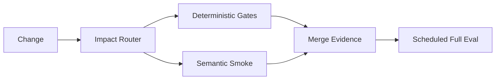

# CI Design Handoff

Produce one implementation-ready design artifact. The handoff should let an implementation agent act without rediscovering the repository, while keeping design decisions separate from implementation syntax.

## Required Sections

### Context

Record only evidence that affects the design:

- target repository/workspace and relevant instructions;
- current CI provider and workflows;
- asset roots and important generated/projection surfaces;
- tests, evals, validators, generators, and maintenance automation;
- relevant constraints such as secrets, runner limits, branch policy, or model/provider access.

Cite concrete repository paths or commands where possible.

### Goals

State the desired properties of the CI system, such as:

- fast PR feedback;
- protection of canonical asset contracts;
- bounded semantic/runtime cost;
- clear projection/runtime evidence boundaries;
- low maintenance burden.

### Non-Goals

Explicitly exclude work that the design does not require, especially:

- CI provider migrations;
- new eval frameworks;
- full runtime parity claims;
- write-back automation;
- new dependency manifests;
- exhaustive provider/model matrices.

Include an excluded item only when relevant to preventing accidental scope expansion.

### Failure and Evidence Model

Map important failure classes to the cheapest sufficient evidence.

Suggested shape:

| Failure class | Evidence | Gate |
| --- | --- | --- |
| malformed asset metadata | deterministic static check | PR |
| generator regression | script/contract test | PR |
| target projection drift | isolated projection check | PR or main |
| Skill trigger regression | semantic smoke eval | conditional PR |
| cross-provider parity | runtime eval | scheduled/manual |

Do not include rows without a real target failure class.

### CI Architecture

Describe each responsibility independently.

For every proposed workflow or logical job, specify:

- purpose;
- trigger and path/change scope;
- dependencies or selected targets;
- evidence tier;
- blocking versus informational behavior;
- permissions and secrets;
- timeout/concurrency/caching when material;
- outputs or artifacts when material;
- what the job explicitly does **not** prove.

Prefer logical workflow names over final filenames unless filename choice matters.

### Impact Routing

Define how repository changes select checks.

Use the smallest maintainable representation that fits the target:

- path filters;
- naming/layout convention;
- selector script;
- explicit dependency mapping only if justified.

Include representative mappings and shared/global changes that intentionally fan out.

### Eval Strategy

If semantic/runtime evaluation is justified, specify:

- which asset changes trigger it;
- case/fixture ownership;
- smoke versus exhaustive suites;
- evaluator type: deterministic, model grader, human, or runtime assertion;
- provider/model scope;
- threshold/baseline or failure interpretation;
- retry/sample policy if stochastic;
- cost/secret boundary;
- whether the result blocks merge.

If no model/runtime eval is justified, say so explicitly and explain which deterministic evidence covers the current contract.

### Maintenance Automation

Describe formatting, regeneration, synchronization, indexing, or write-back separately from merge gates.

Specify canonical source authority and how commit loops or silent overwrites are prevented.

If no maintenance workflow is needed, omit this section or state `None` briefly.

### Implementation Order

Give an incremental sequence. Prefer establishing cheap deterministic gates before optional semantic/runtime layers.

Example:

1. stabilize existing deterministic checks;
2. add or simplify impact routing;
3. isolate projection/integration checks;
4. add semantic smoke only for uncovered behavior risk;
5. add scheduled exhaustive evaluation if justified.

Do not require a framework migration unless it is itself an accepted prerequisite.

### Acceptance Criteria

Make criteria observable and implementation-neutral where possible.

Examples:

- a Skill-only change does not run unrelated script tests;
- shared routing changes trigger representative dependent tests;
- PR gates require no repository write permission;
- malformed eval fixtures fail before model execution;
- tuned semantic metadata is not rejected solely because it differs byte-for-byte from a generated baseline;
- full provider/model matrices do not run on every PR without explicit justification.

### Risks and Open Decisions

List only unresolved items that could change implementation or evidence quality.

Separate known facts from assumptions. Do not hide uncertainty behind `<auto>` after the repository has been inspected.

## Optional Diagram

Use Mermaid when the execution/evidence flow is easier to understand visually.

Example:

Keep the diagram subordinate to the written contract.

## Implementation Syntax

YAML, shell, test code, or provider configuration may be included as short illustrative snippets when they remove ambiguity. Do not turn the handoff into a completed implementation unless the caller explicitly requests implementation.

## Final Review

Before handing off, remove:

- generic CI advice not tied to the target;
- duplicate gates that detect the same failure at higher cost;
- stale hard-coded paths not supported by the inspected repository;
- speculative caches, matrices, secrets, or hosted services;
- model eval where deterministic assertions suffice;
- claims of runtime behavior without runtime evidence.
