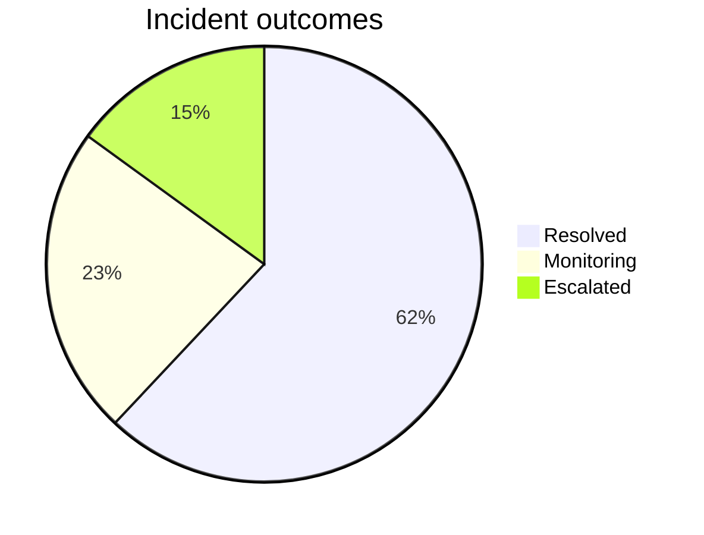
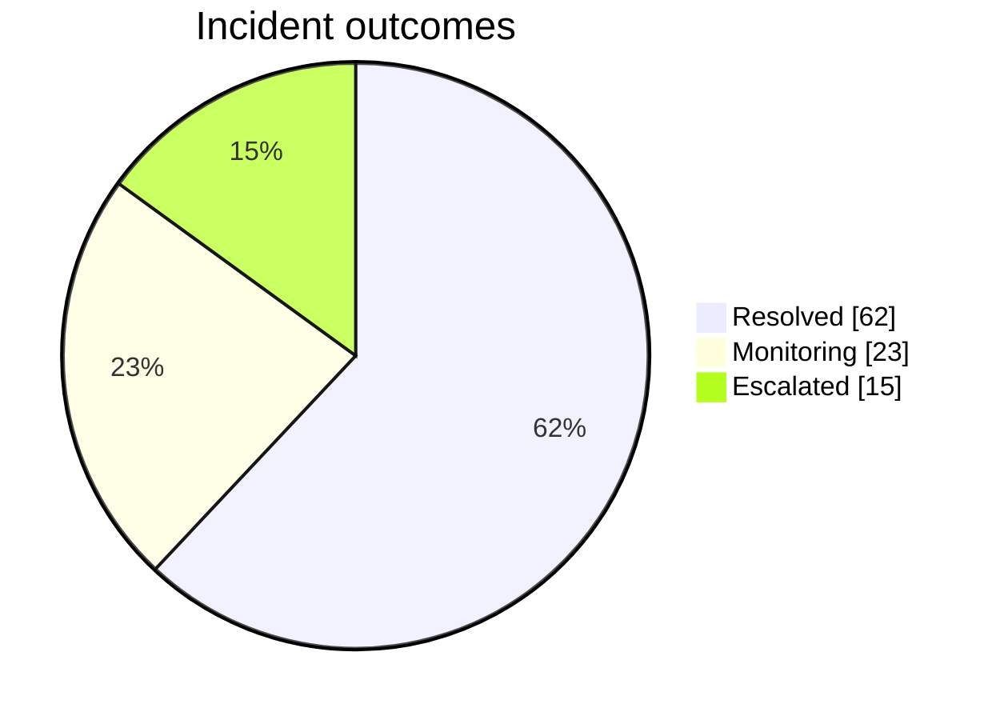
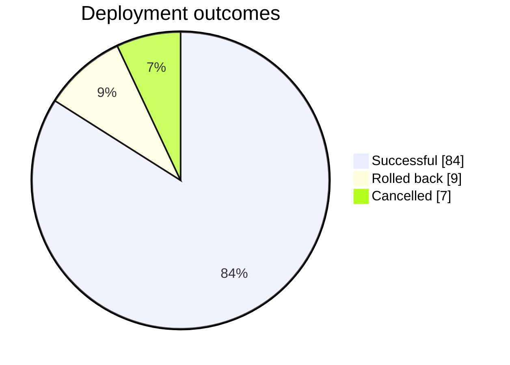

# Pie Chart

적은 category가 하나의 전체를 어떻게 구성하는지 보여줄 때 `pie`를 사용한다. 정확한 순위나 많은 category에는 bar chart를 우선한다.

## Intermediate: Show Exact Values

slice의 비율뿐 아니라 각 category의 값을 읽어야 하면 `showData`를 사용한다. category가 많아지면 작은 slice를 억지로 추가하지 말고 `Other`로 묶거나 bar chart로 전환한다.

## Improvement: Define The Whole

개선된 pie chart는 모든 slice가 같은 모집단과 기준 시점을 공유하도록 한다. 비율의 합이 전체를 구성하지 않거나 category가 중복되면 pie 대신 table 또는 bar chart를 사용한다.

## Advanced: Donut, Legend Position And Highlight

Mermaid 11.16.0 이상에서는 pie config로 donut hole, legend 위치와 특정 slice 강조를 지정할 수 있다. active theme은 그대로 유지한다.

강조는 분석 질문과 연결될 때만 사용한다. slice가 많거나 정확한 순위가 핵심이면 bar chart로 전환한다.
