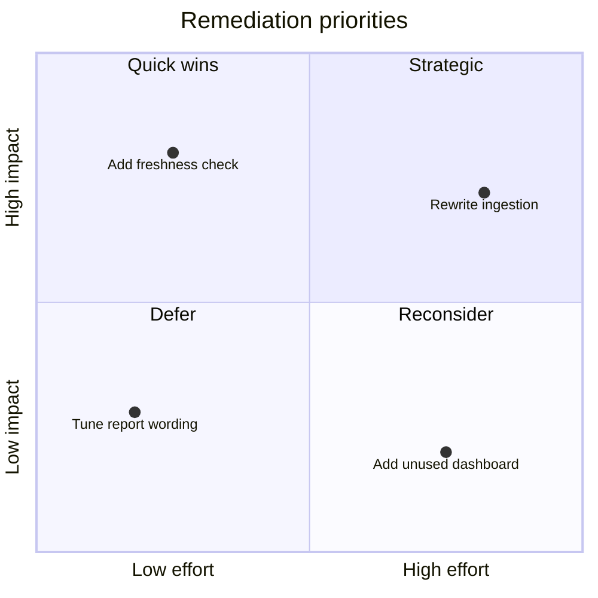
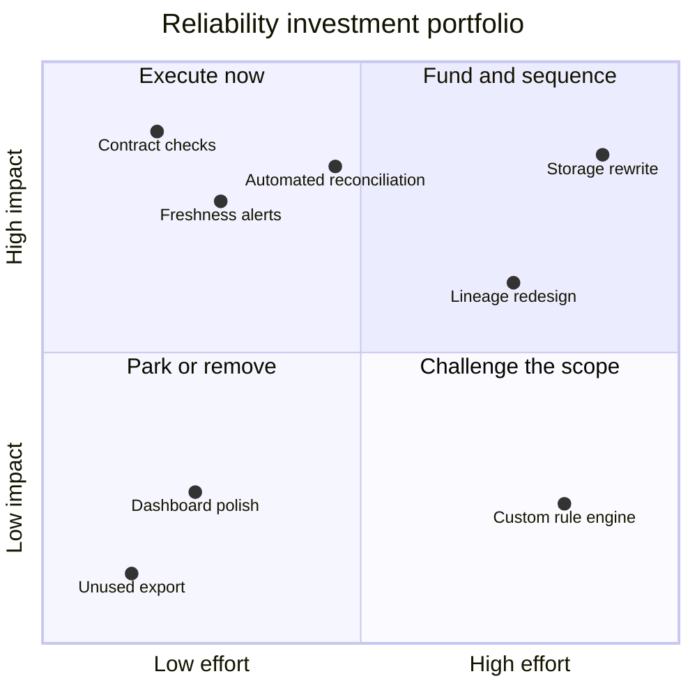
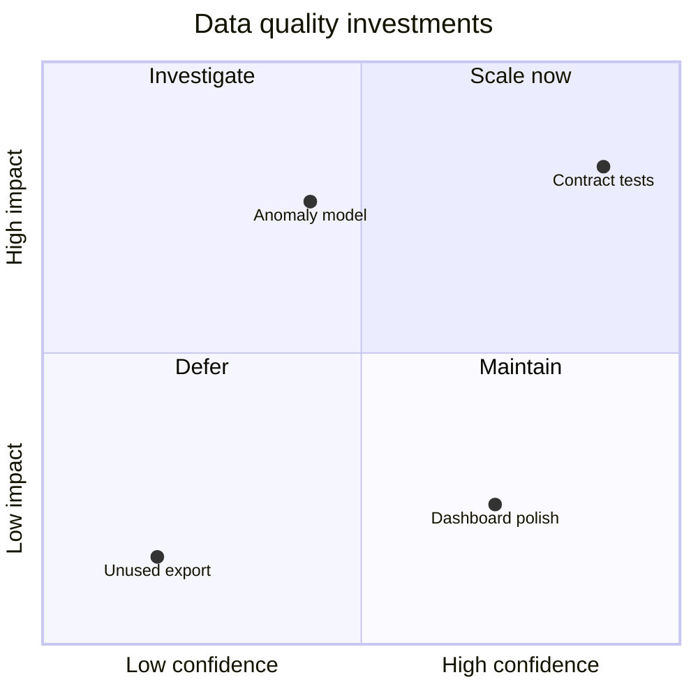

# Quadrant Chart

두 축의 positioning과 prioritization이 핵심이면 `quadrantChart`를 사용한다. 축의 의미와 좌표 기준이 불명확하면 사용하지 않는다.

## Advanced: Decision Portfolio Across All Quadrants

Advanced example은 item 수만 늘리지 않고, 각 quadrant가 실제 action으로 이어지도록 구성한다. 좌표는 impact와 effort score를 0~1로 normalization한 값이며 status나 owner는 좌표에 섞지 않는다.

이 예시는 four-quadrant coverage, action-oriented labels와 normalized scoring을 결합한다. 실제 실행 순서와 owner는 별도 table에서 관리한다.

## Improvement: Separate Priority From Status

개선된 Quadrant chart는 effort와 impact처럼 비교 가능한 두 축만 사용한다. 진행 상태, owner, deadline을 좌표에 숨기지 말고 별도 table이나 semantic marker로 제공한다.

## Intermediate: Explicit Coordinate Scale

Quadrant 좌표는 0~1 normalized 값이다. source score를 normalization한 경우 계산식을 문서에 남긴다.

