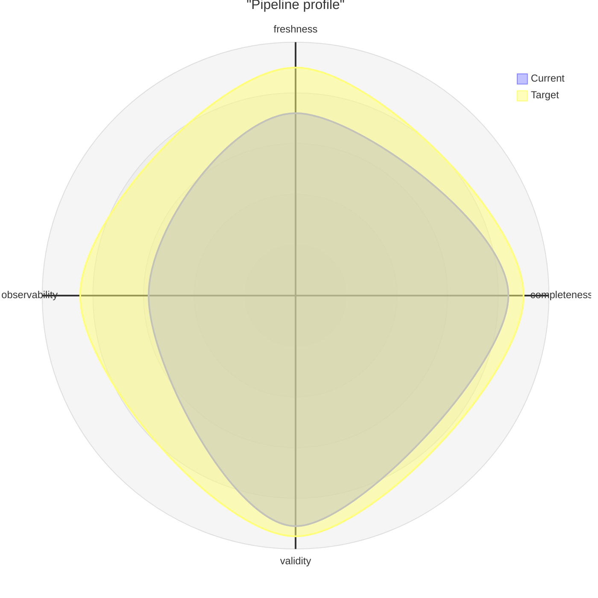
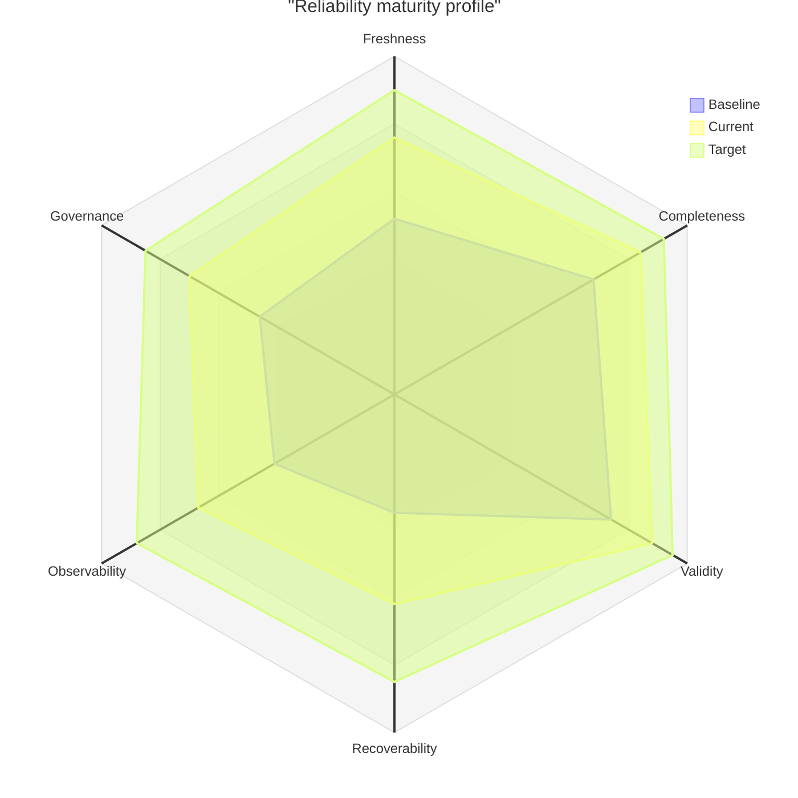

# Radar

동일한 dimension에서 여러 대상의 profile을 비교할 때 `radar-beta`를 사용한다. dimension이 많거나 scale이 서로 다르면 사용하지 않는다.

## Basic: Named Curves

`curve`에는 stable ID를 먼저 쓰고 display label은 bracket으로 분리한다.

## Advanced: Comparable Baseline, Current And Target Profiles

Advanced example은 stable axis ID, 사람이 읽는 label, 세 개의 비교 curve와 명시적 scale을 함께 사용한다. baseline→current→target의 gap을 같은 dimension에서 읽을 수 있다.

curve 간 값은 동일한 scoring rubric과 기준 시점을 사용해야 한다. dimension별 가중치가 다르면 radar에 숨기지 말고 별도로 설명한다.

## Improvement: Keep Dimensions Comparable

- 모든 dimension은 같은 방향과 scale을 사용한다.
- curve마다 axis 수와 value 수가 일치해야 한다.
- 서로 다른 단위나 중요도를 하나의 profile로 합치지 않는다.
