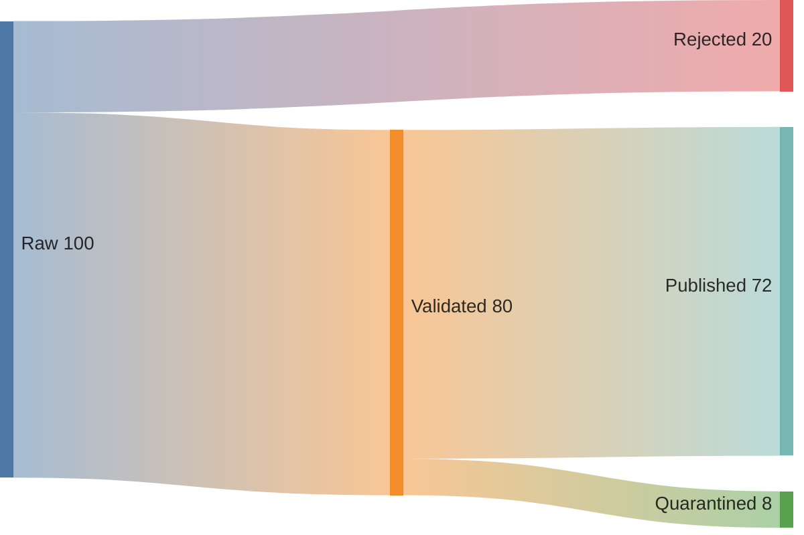
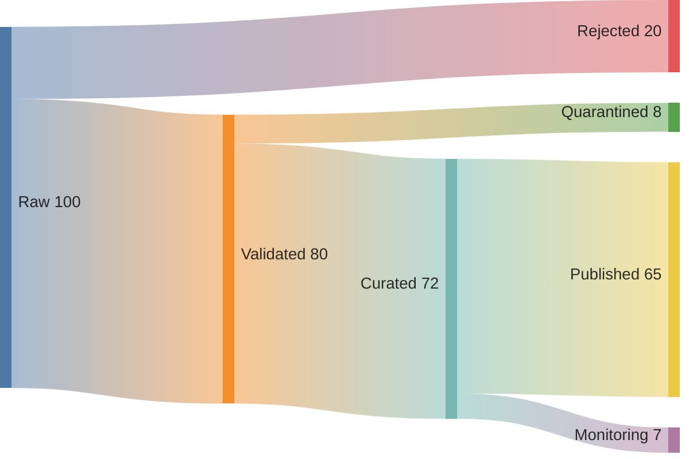
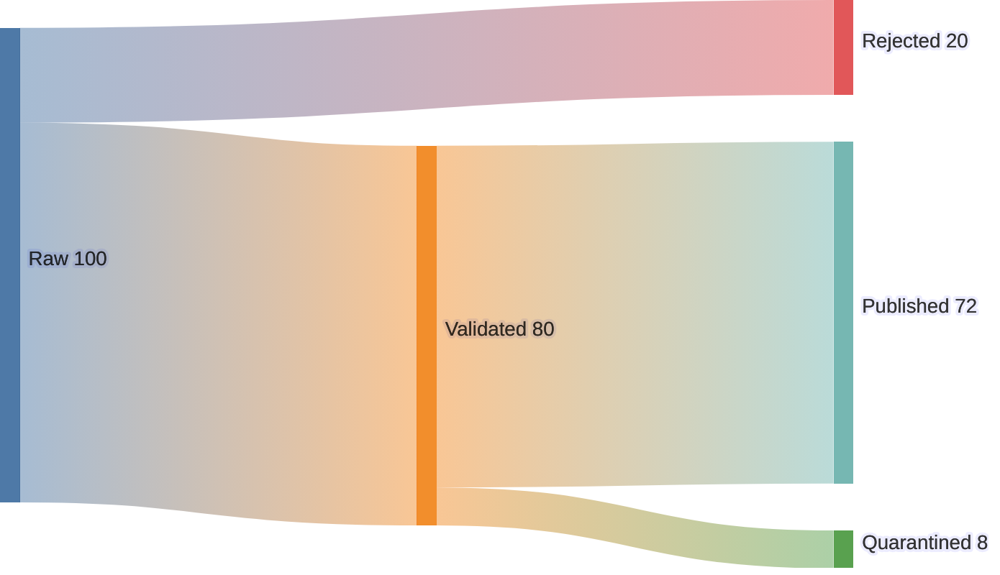

# Sankey

source에서 target으로 이동하는 양과 분배가 핵심이면 `sankey`를 사용한다. 값이 없고 topology만 중요하면 diagram을 사용한다.



## Advanced: Multi-Stage Distribution

source에서 target까지 여러 단계의 분배를 보여줄 때는 중간 node를 명시한다. 각 단계의 값이 보존되는지 확인하고, 단순 연결 수가 아니라 실제 이동량을 넣는다.



## Improvement: Preserve Flow Meaning

개선된 Sankey는 node 이름을 source, processing stage, destination처럼 같은 의미 수준으로 유지한다. 관계만 보여주고 양이 없다면 Sankey를 사용하지 않고 flowchart나 diagram으로 바꾼다.


## Intermediate: Quoted CSV Fields

comma가 포함된 label은 CSV quoting을 사용한다.

```mermaid
sankey
    "Raw, incoming",Validated,80
    "Raw, incoming",Rejected,20
    Validated,"Published, trusted",72
    Validated,Quarantined,8
```

## Advanced: Label And Node Spacing

Mermaid 11.15.0 이상에서는 Sankey config로 outlined label과 node spacing을 조정할 수 있다. active palette는 유지한다.



spacing config는 label overlap을 완화할 때만 사용한다. flow conservation이나 stage meaning의 오류를 layout으로 숨기지 않는다.
