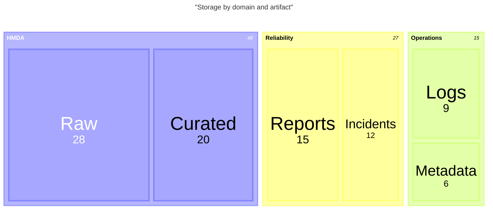
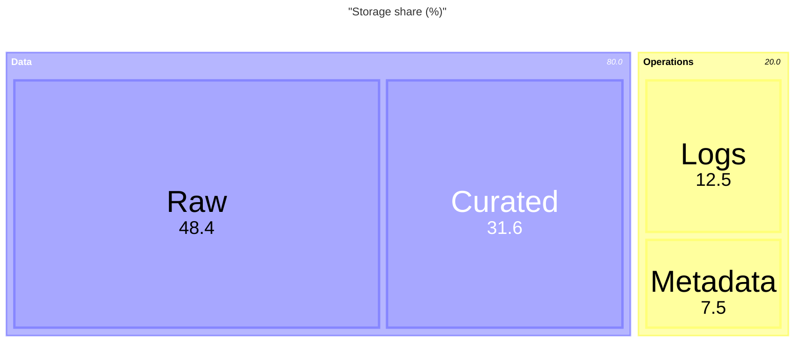

# Treemap

계층별 category의 크기와 구성 비율을 함께 보여줄 때 `treemap-beta`를 사용한다. 음수 값이나 깊은 계층에는 사용하지 않는다.

## Basic: Flat Categories

```mermaid
treemap-beta
    title "Storage by domain"
    "HMDA" : 48
    "Reliability" : 27
    "Operations" : 15
    "Metadata" : 10
```

## Advanced: Nested Hierarchy

parent는 값 없이 선언하고 leaf에 동일한 단위의 값을 둔다. hierarchy는 indentation으로 표현한다.



## Improvement: Limit Depth And Label Length

- 모든 leaf value는 같은 단위와 기준 시점을 사용한다.
- 깊은 hierarchy는 overview와 detail treemap으로 분리한다.
- 정확한 순위가 중요하면 bar chart나 table을 사용한다.

## Intermediate: Value Formatting

값이 비율이나 소수인 경우 renderer가 지원하는 value format을 사용하되 source precision보다 더 정밀하게 표시하지 않는다.



formatting은 display만 바꾸며 source value와 단위를 바꾸지 않는다. target renderer가 option을 지원하지 않으면 label이나 companion table에 단위를 적는다.
