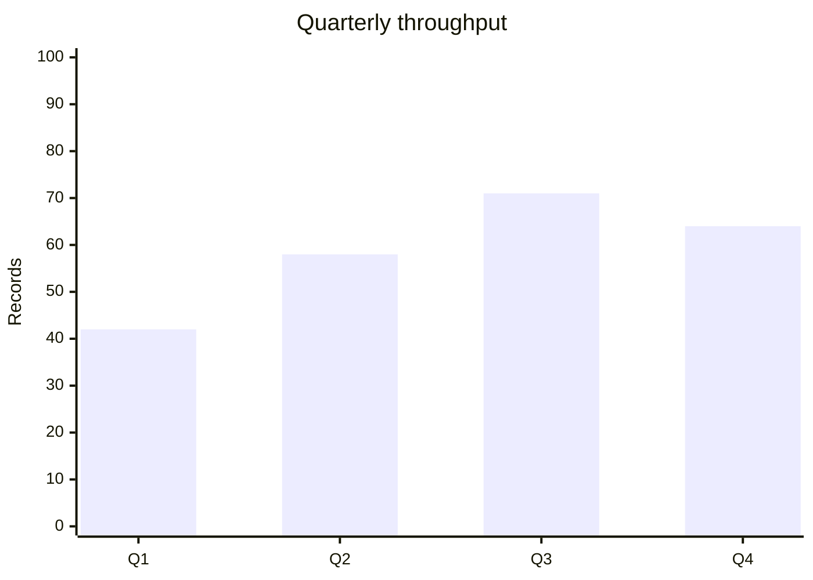
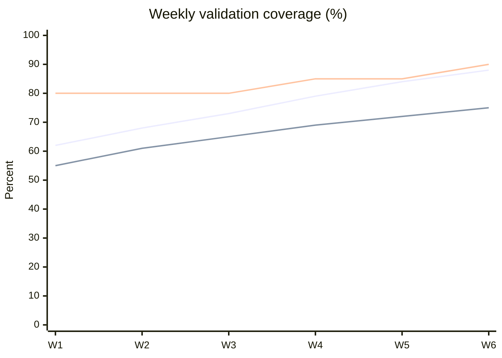
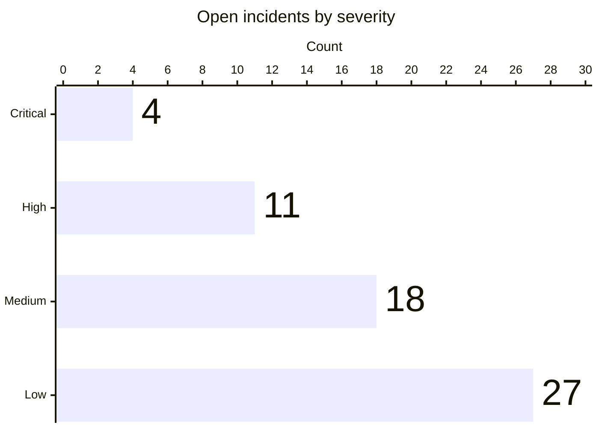

# XY Chart

category 비교나 ordered trend가 핵심이면 안정화된 `xychart`를 사용한다. `xychart-beta`는 구버전 호환 alias로 남아 있을 수 있으나 새 예제는 `xychart`를 우선한다.

## Basic: Bar Chart



## Basic: Line Chart

```mermaid
xychart
    title "Weekly error rate (%)"
    x-axis [W1, W2, W3, W4, W5]
    y-axis "Percent" 0 --> 10
    line "Error rate" [8, 7, 5, 4, 3]
```

## Advanced: Multi-Series Trend With A Target

같은 단위와 시간축을 공유하는 series만 결합한다. actual, previous period와 target을 함께 보여주면 추세와 gap을 한 번에 읽을 수 있다.



series가 많아져 추적이 어려워지면 핵심 비교만 남기거나 chart를 분리한다.

## Advanced: Data Labels And Horizontal Orientation



## Intermediate: Per-Point Labels On A Line

> Per-point line labels require Mermaid v11.16.0+.

```mermaid
xychart
    title "Release latency"
    x-axis [Jan, Feb, Mar, Apr]
    y-axis "Minutes" 0 --> 60
    line "p95" [52 "Baseline", 44, 31, 24 "Target reached"]
```

## Improvement: Keep The Scale Honest

- y-axis 단위와 범위를 명시한다.
- 서로 다른 단위의 metric을 하나의 axis에 섞지 않는다.
- category 수와 모든 series의 value 수가 일치해야 한다.
