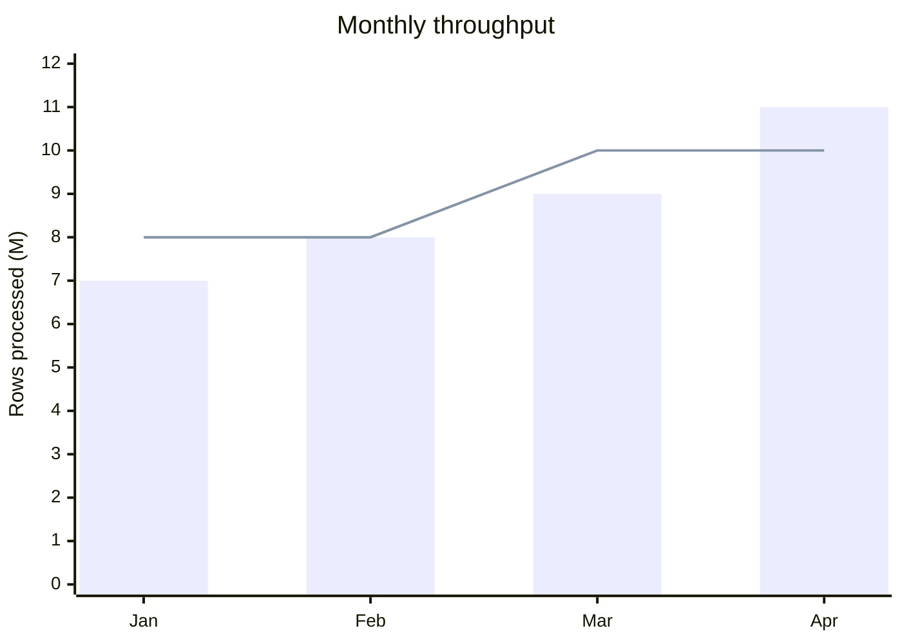

# Mermaid Chart Style Policy

Mermaid chart의 style은 **수치 구조를 더 정확하고 빠르게 읽게 하는 수단**이다. Chart type, scale, order, label과 legend를 color보다 먼저 설계한다.

## Priority

```text
question → chart type → scale → order → label → legend → annotation → color
```

앞 단계가 잘못되면 style로 보완하지 말고 구조를 수정한다.

## Editing Existing Work

다음 우선순위를 따른다.

```text
explicit user instruction → local source convention → document convention → project convention → this policy
```

- 요청된 목적에 필요한 최소 범위만 수정한다.
- 기존 theme, layout, series order, label 방식과 visual language를 불필요하게 바꾸지 않는다.
- 이 정책에 맞추기 위한 전면 재스타일링이나 정규화를 하지 않는다.
- 판단이 어려우면 기존 표현을 보존한다.

## Theme And Palette

- 사용자가 요청하지 않으면 `theme`, `themeVariables`, `plotColorPalette`, `cScale*`를 지정하지 않는다.
- active theme과 Mermaid의 automatic palette를 우선한다.
- custom theme은 `base` theme과 concrete `themeVariables`가 필요한 작업으로 취급한다.
- light/dark와 target renderer에서 검증하지 못한 palette를 portable documentation에 넣지 않는다.
- `positive`, `negative`, `warning` 같은 이름이 Mermaid 내장 semantic color라고 가정하지 않는다.

## Semantic Intent

Intent는 Mermaid token이 아니라 skill-level instruction이다.

| Intent | Meaning | Default expression |
| --- | --- | --- |
| `primary` | 핵심 series·category | 첫 series, 명확한 이름, 필요 시 별도 chart |
| `comparison` | 비교 series | 안정적인 order + legend |
| `target` | 목표·threshold | 이름 있는 line 또는 label |
| `baseline` | 기준 | 이름 있는 series + 설명 |
| `positive` / `negative` | 개선·악화 | sign, axis, label |
| `warning` | 주의 영역 | label, title 또는 companion table |
| `muted` | 보조 series | 낮은 우선순위 order 또는 별도 chart |

색상을 제거해도 intent가 읽혀야 한다.

## Quantitative Styling

- Category 비교는 bar, ordered progression은 line, 하나의 전체 구성은 pie를 우선한다.
- Axis에는 quantity와 unit을 명시하고 서로 다른 unit을 같은 axis에 겹치지 않는다.
- zero가 의미 있는 비교에서는 가능한 한 zero baseline을 유지한다.
- y-axis를 잘라 차이를 강조하면 prose에 명시한다.
- series와 category 순서를 source 또는 분석 목적에 맞게 안정적으로 유지한다.
- target, baseline과 actual은 이름으로 구분한다.
- title은 장식적 주제가 아니라 측정 대상과 비교 질문을 드러낸다.
- 정확한 값이 핵심이면 label 또는 source table을 사용하되 모든 point에 불필요하게 반복하지 않는다.

## Automatic Palette First



이 예제는 explicit color 없이 mark, series name, legend, order와 axis로 구분된다. 색상 없이 구분되지 않으면 palette보다 label, mark 또는 chart 분리를 먼저 검토한다.

## Color Escalation

다음 중 하나일 때만 custom color를 고려한다.

1. 사용자가 brand palette나 특정 color를 요청했다.
1. 동일 mark의 여러 series를 다른 방법으로 구분하기 어렵다.
1. 기존 문서의 검증된 semantic palette를 이어야 한다.
1. target renderer에서 contrast와 mapping을 실제로 확인할 수 있다.

색상을 추가해도 label, sign, legend와 stable series order를 유지한다. Red/green pair만으로 상태를 구분하지 않으며 작은 차이를 강한 saturation으로 과장하지 않는다.

## Type Guidance

| Type | Priority | Avoid |
| --- | --- | --- |
| XY Bar | category order, zero baseline, unit | category마다 임의 color |
| XY Line | time order, named series, 필요한 point label | unordered category 연결 |
| Pie | 적은 slice, 의미 있는 전체 | 많은 slice와 정확한 순위 |
| Quadrant | axis meaning, 근거 있는 normalized coordinate | color로 근거 없는 cluster 암시 |
| Sankey | node name, stage order, quantity 보존 | link color를 causal meaning으로 오해 |
| Radar | 동일 scale 방향, 적은 dimension | curve color만으로 식별 |
| Treemap | 얕은 hierarchy, size label | 깊이마다 장식용 palette |

## Review

- active theme과 automatic palette를 불필요하게 덮어쓰지 않았는가?
- 색상을 보지 않아도 series와 category를 식별할 수 있는가?
- chart type, axis, scale, order와 unit이 질문을 정확하게 표현하는가?
- custom style이 magnitude나 ordering을 왜곡하지 않는가?
- table이 더 간단하고 정확하지 않은가?
