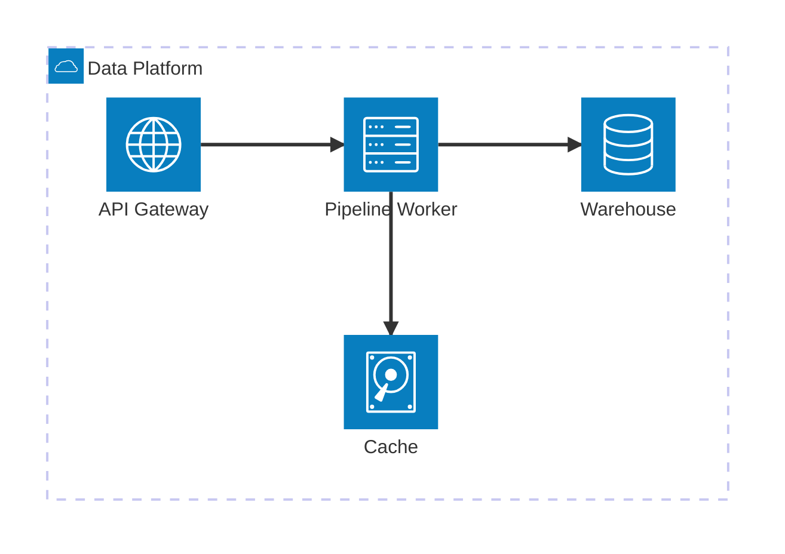
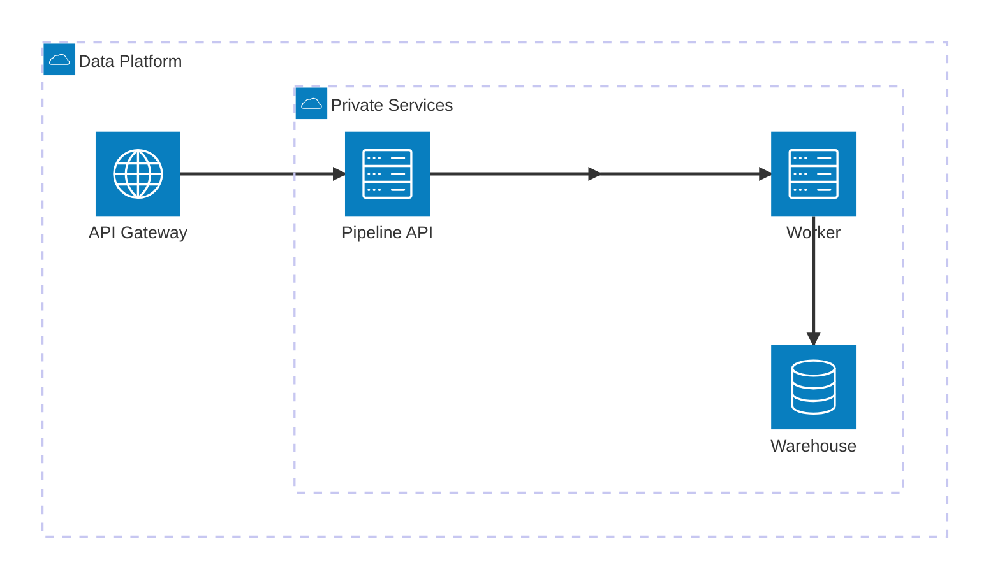
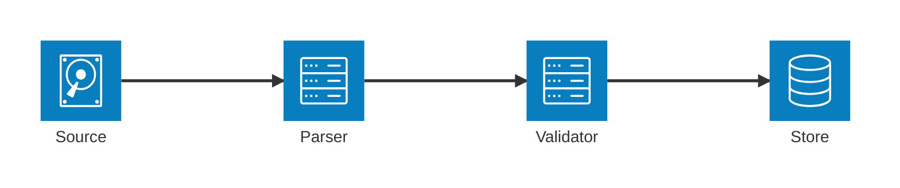
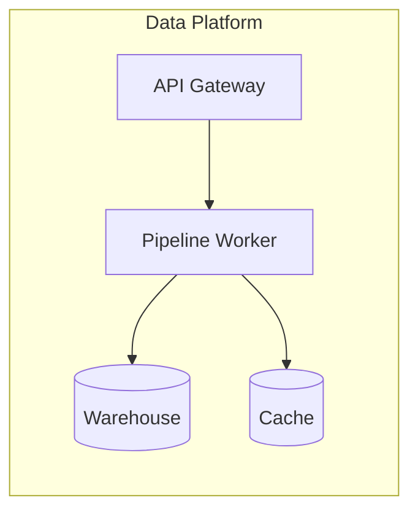

# Architecture Diagram

service, group, infrastructure topology와 연결 port가 핵심이고 target renderer가 지원하면 `architecture-beta`를 사용한다.

## Advanced: Nested Groups And Junctions

nested group과 junction으로 public/private boundary와 fan-out을 표현할 수 있다.

## Advanced: Deterministic Layout Tuning

Mermaid 11.15.0 이상에서는 architecture config로 sibling spacing과 layout iteration을 조정할 수 있다. source topology를 바꾸기 전에 최소한으로 사용한다.

layout tuning은 overlap과 density를 완화하는 도구다. 잘못된 grouping이나 과도한 topology를 config 값으로 숨기지 않는다.

## Rules

- group은 system boundary나 deployment 영역을 나타낸다.
- service ID는 stable identifier로, bracket label은 사람이 읽는 이름으로 사용한다.
- edge side `L`, `R`, `T`, `B`는 topology를 읽기 쉽게 만들 때만 지정한다.
- external icon pack은 renderer configuration이 확인된 경우에만 사용한다.

## Portable Fallback

`architecture-beta`를 지원하지 않는 Markdown renderer에는 같은 정보를 Core flowchart로 제공한다.

