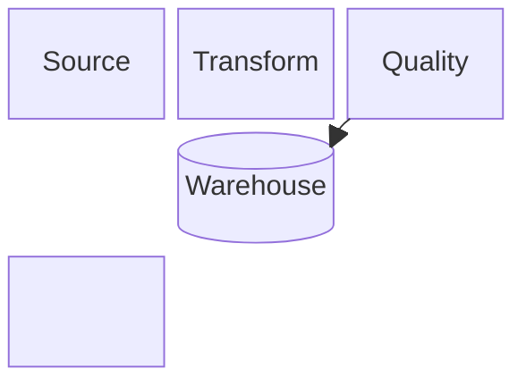
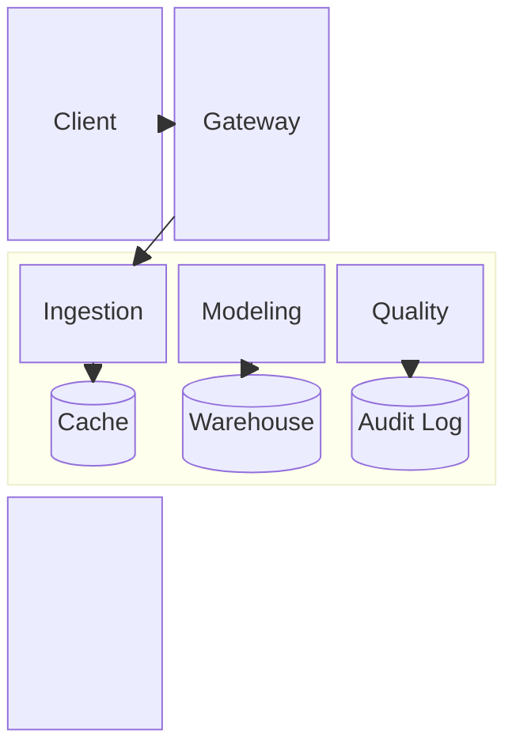

# Block Diagram

> Mermaid v11 계열의 extended type이다. target renderer 지원을 확인한다.

자동 layout보다 **명시적인 grid와 block 배치**가 중요한 system overview에 `block`을 사용한다.

## Basic: Grid Layout

## Advanced: Composite Blocks And Spans

## Rules

- manual placement 자체가 설명의 일부일 때 사용한다.
- block span과 nested block을 과도하게 사용해 layout 퍼즐로 만들지 않는다.
- 자동 관계 배치가 더 적합하면 flowchart 또는 architecture diagram을 사용한다.
