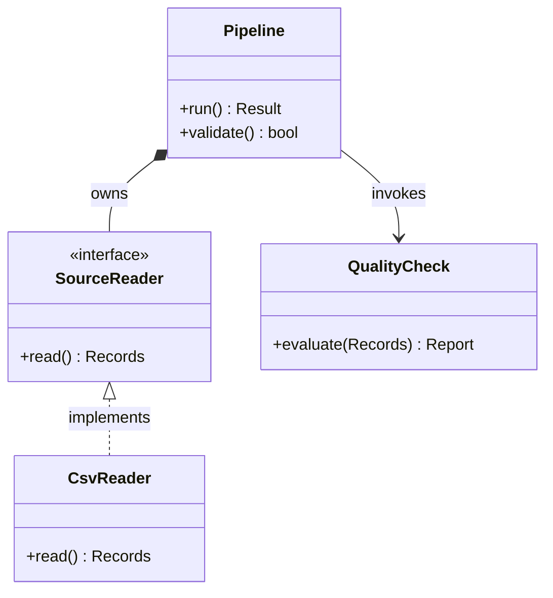
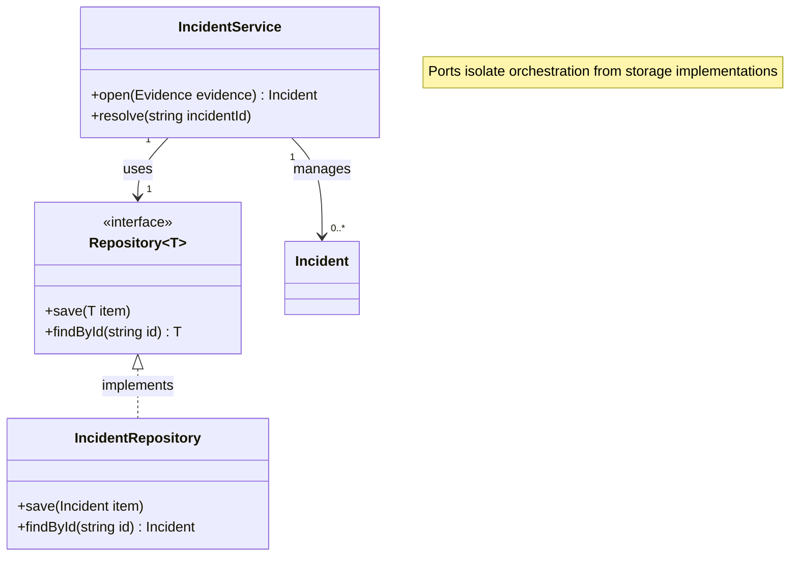
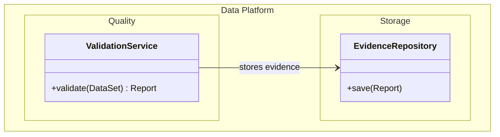
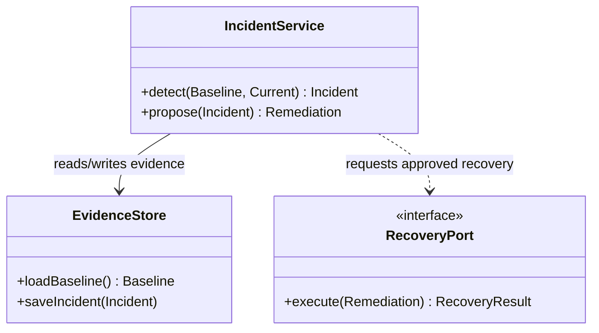

# Class Diagram

class, interface, member와 inheritance·composition·dependency가 핵심이면 `classDiagram`을 사용한다.

## Advanced: Generics, Multiplicity And Notes

## Advanced: Labeled And Nested Namespaces

Mermaid 11.15.0 이상에서는 namespace label과 hierarchical namespace를 사용할 수 있다. package boundary가 설계 질문에 중요할 때만 사용한다.

`hierarchicalNamespaces: false`는 기존 프로젝트가 fully-qualified namespace를 flat box로 표현하는 convention일 때만 사용한다.

## Relationship Choice

| Syntax | Meaning | Use |
| --- | --- | --- |
| `<|--` | inheritance | subtype가 base implementation을 상속한다 |
| `<|..` | realization | class가 interface를 구현한다 |
| `*--` | composition | parent가 child lifecycle을 소유한다 |
| `o--` | aggregation | 독립 lifecycle을 가진 객체를 묶는다 |
| `-->` | association | 지속적 reference나 협력 관계다 |
| `..>` | dependency | 일시적으로 사용하거나 의존한다 |

## Improvement: Model Responsibility, Not Every Field

class diagram은 source code listing이 아니다. 설계 질문과 관련된 member만 남기고, framework boilerplate와 trivial accessor는 생략한다.

