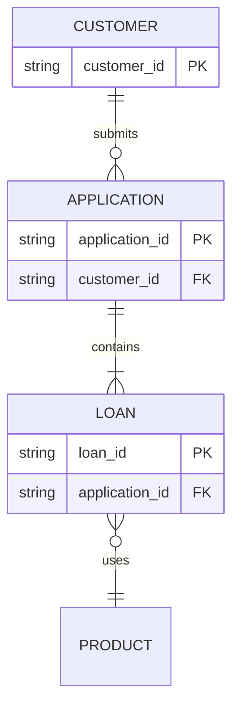
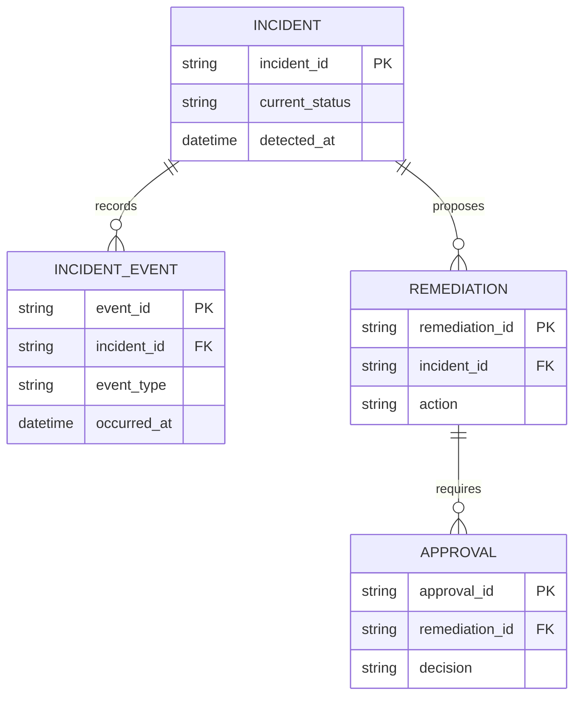
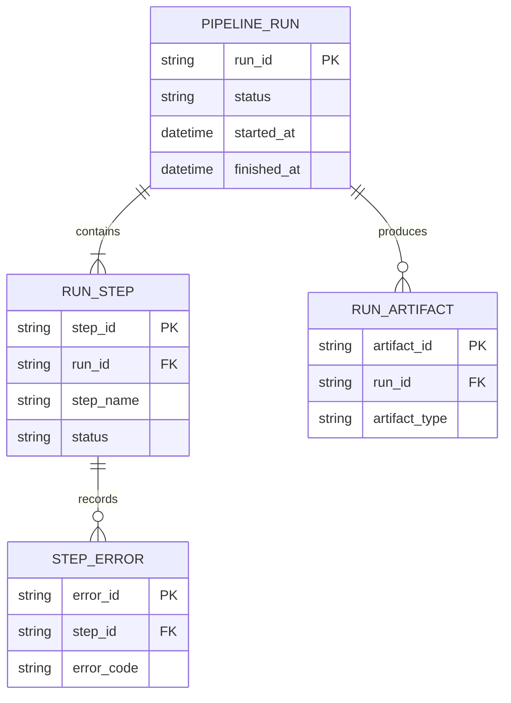

# ER Diagram

entity가 어떤 key와 cardinality로 연결되는지 보여줄 때 `erDiagram`을 사용한다.



## Advanced: Grain And History

반복 event나 상태 변화를 표현할 때는 현재 entity와 history entity를 분리한다. history를 현재 entity의 여러 column으로 펼치지 말고, 각 history row가 하나의 사건을 나타내도록 한다.



## Improvement: Make Cardinality And Ownership Explicit

개선된 ER diagram은 primary key, foreign key와 cardinality를 함께 보여준다. `INCIDENT`는 현재 상태를 소유하고, `INCIDENT_EVENT`는 append-only history를 소유한다는 역할도 entity 이름과 field로 드러낸다.



## Advanced: Optional Types And Entity Aliases

Mermaid 11.16.0 이상에서는 nullable attribute type에 `?`를 붙일 수 있다. 내부 ID와 표시 이름을 분리하면 relationship source는 안정적으로 유지된다.

```mermaid
erDiagram
    p[Person] {
        string first_name
        string? middle_name
        string last_name
    }
    a["Customer Account"] {
        uuid account_id PK
        string email UK
    }
    p ||--o| a : owns
```

nullable 표시는 실제 schema 계약과 일치할 때만 사용하고, unknown과 optional을 혼동하지 않는다.
