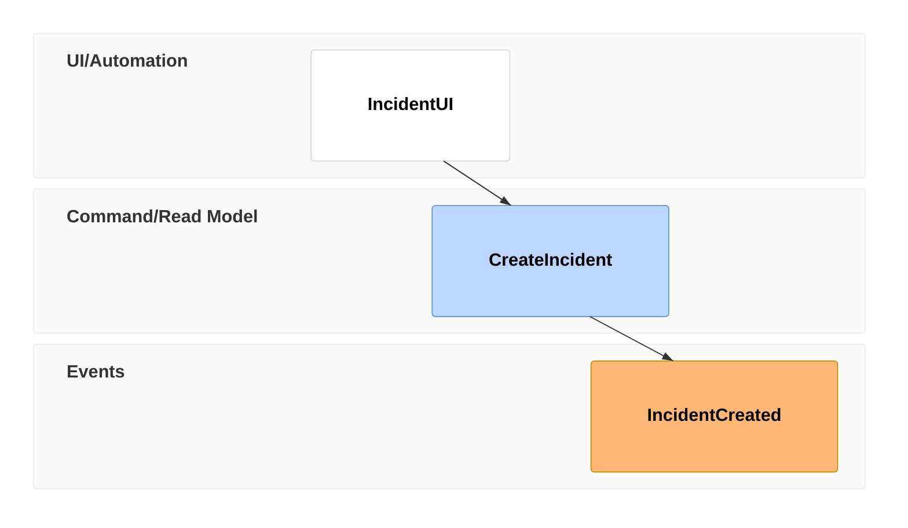
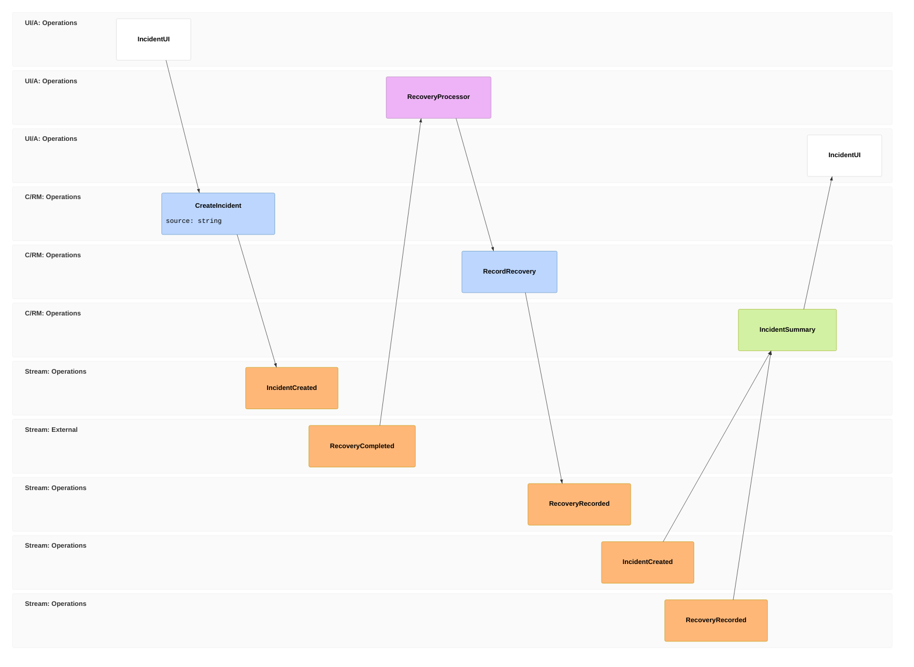

# Event Modeling

> Mermaid v11.15.0+의 `eventmodeling` DSL이다.

command, event, read model과 UI가 시간 순서로 어떻게 연결되는지 보여줄 때 사용한다.

## Basic: State Change

## Advanced: Reset Frames, Namespaces And Read Models

## Rules

- timeframe 번호는 전체 timeline에서 unique하게 유지한다.
- inference를 끊어야 할 때만 `rf`/`resetframe`을 사용한다.
- UI, processor, command, read model, event의 의미를 섞지 않는다.
