# Flowchart

검증 결과에 따라 다음 단계가 달라지는 흐름에는 `flowchart`를 사용한다.

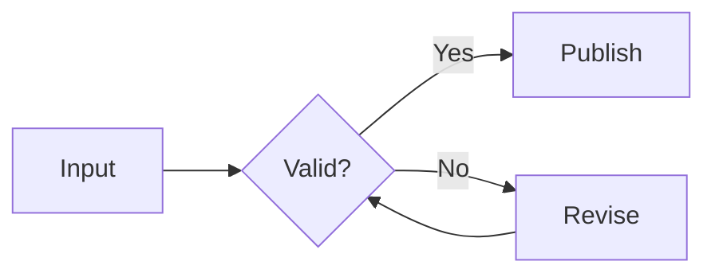

## Splitting A Large Flowchart Package

큰 flowchart는 하나의 pipeline을 임의로 반으로 자르는 대신, 같은 수준의 책임을 가진 네 영역을 package로 분리한다.

### Before: Four Equal Areas In One Diagram

각 영역은 독립적인 질문과 내부 흐름을 가지며, 전체 diagram에서는 영역 사이의 주요 handoff만 보여준다.

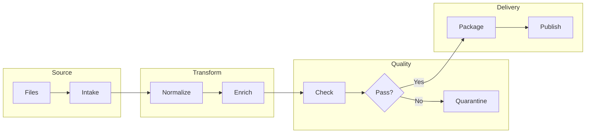

### After: Overview

전체 boundary와 주요 handoff만 overview flowchart로 남긴다.

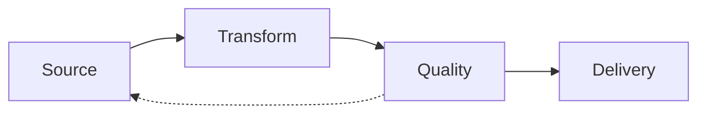

### After: Four Detail Diagrams

overview의 네 영역을 각각 하나의 detail diagram으로 확장한다. 영역을 합치거나 pipeline의 중간을 임의로 나누지 않는다.

#### Source Detail

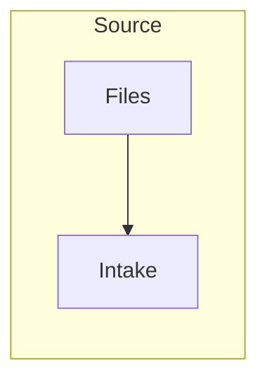

#### Transform Detail

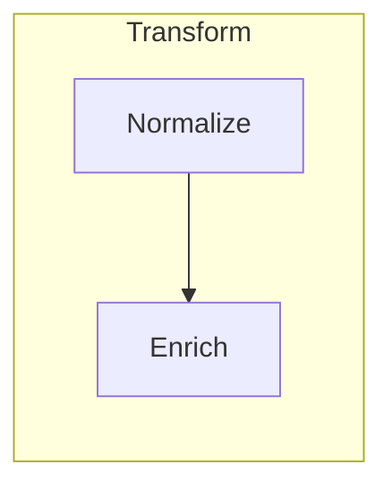

#### Quality Detail

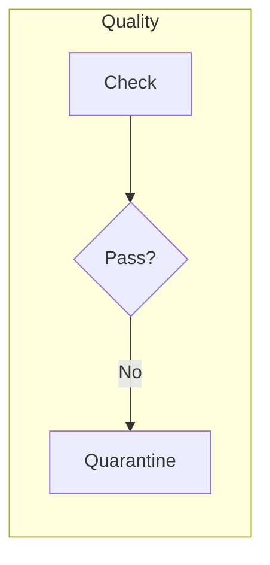

#### Delivery Detail

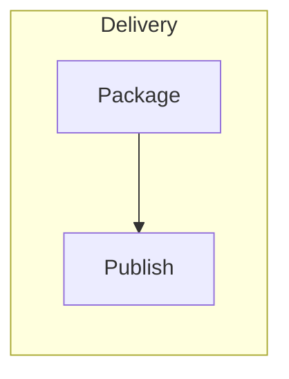

## Subgraph Grouping

관련 node를 stage나 ownership 영역으로 묶을 때 `subgraph`를 사용한다.

### Grouping By Pipeline Stage

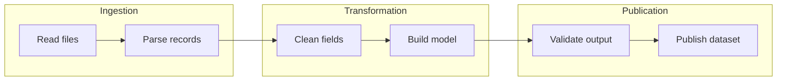

### Grouping By Ownership

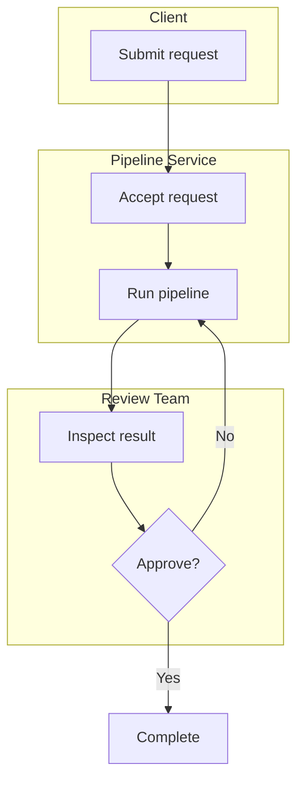

## Advanced: Storage Boundaries, Validation And Quarantine

General shape syntax를 실제 pipeline boundary와 결합한다. source artifact, mutable staging, validation decision, quarantine와 trusted warehouse를 shape와 edge label로 구분한다.

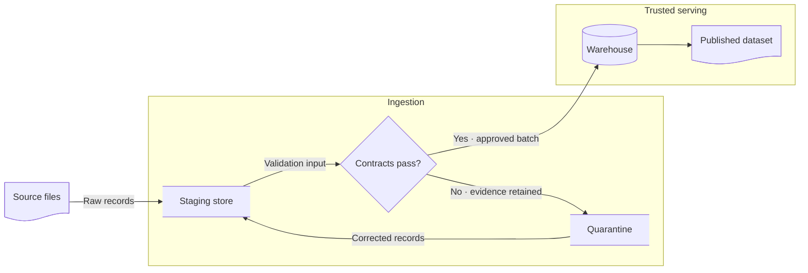

이 예시는 specialized shape, system boundary, decision, failure path와 recovery loop를 결합한다. shape는 domain meaning을 전달할 때만 사용하고, target renderer가 general shape syntax를 지원하지 않으면 bracket shape로 fallback한다.

## Styling And Animation

기본 theme을 유지하고 shape, border, line과 label로 먼저 상태를 구분한다.

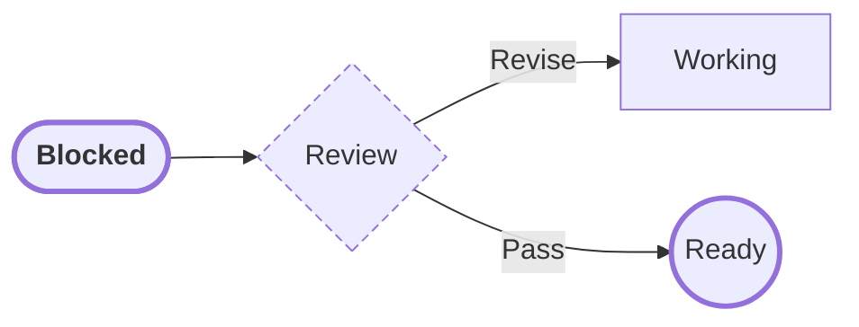

색상이 반드시 필요하면 [Mermaid Diagram Style Policy](../style-policy.md)의 escalation 규칙에 따라 최소 범위에만 추가한다. 색상 없이도 label과 shape로 의미가 유지되어야 한다.

핵심 경로와 retry 방향만 animation으로 강조한다. animation이 없어도 관계와 의미가 이해되어야 한다. **Edge ID와 animation을 지원하는 renderer에서만 사용하고, portable documentation에서는 생략한다.**

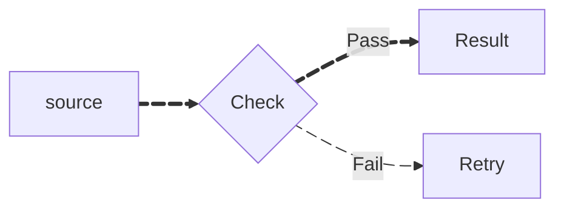
