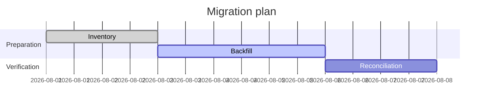
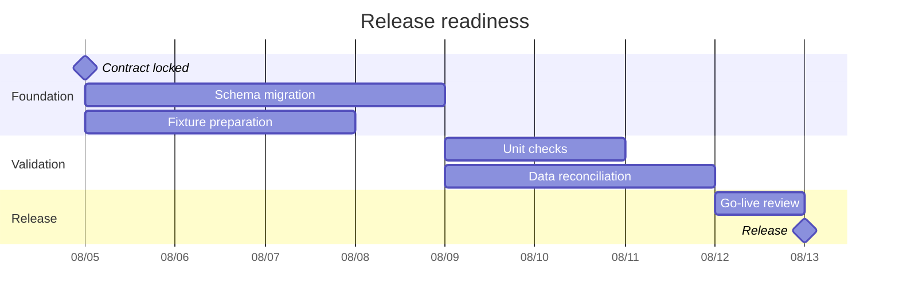
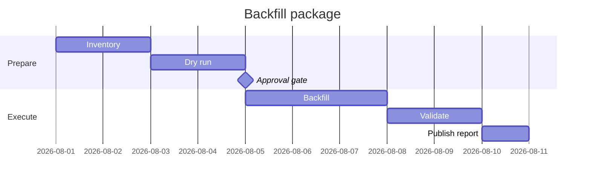

# Gantt

작업 기간과 dependency가 핵심이면 `gantt`를 사용한다.

## Advanced: Milestones And Parallel Work

작업의 완료 여부만 보여주는 대신 milestone과 병렬 작업을 분리하면, critical path와 병렬화 가능 구간을 읽을 수 있다.

## Improvement: Separate Decision Gates From Work

개선된 Gantt는 사람이 승인해야 하는 decision gate를 일반 task와 구분한다. gate를 dependency로 연결하면 무엇이 완료되어야 다음 작업을 시작할 수 있는지 명확해진다.

