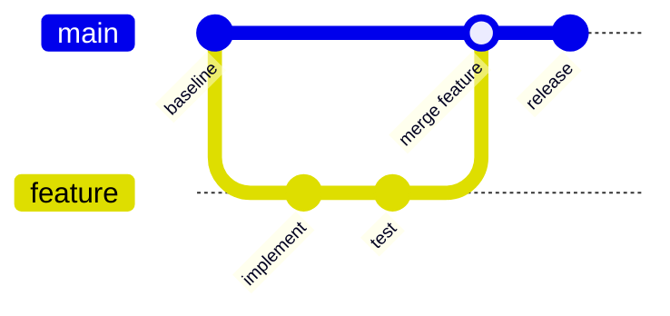
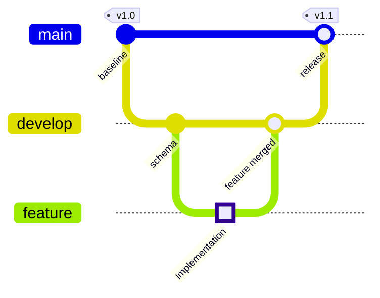
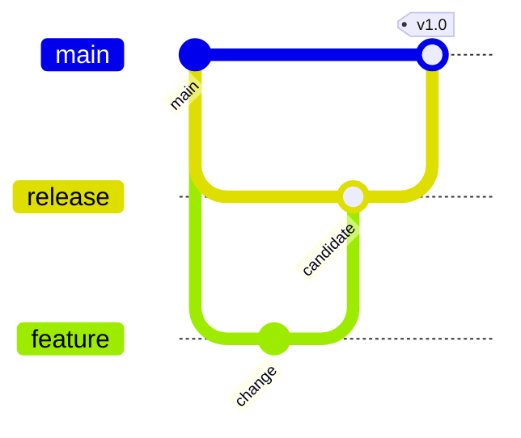

# Git Graph

branch, merge, release strategy의 **의도된 흐름**을 설명할 때 `gitGraph`를 사용한다. 실제 repository history를 정확히 재현하는 용도로 사용하지 않는다.

## Advanced: Tags, Branch Ordering And Highlighted Commits

## Improvement: Keep Strategy Visible

commit을 모두 복사하지 않고 branch 생성, integration, release처럼 독자가 이해해야 하는 event만 남긴다.

renderer가 `gitGraph`를 지원하지 않으면 branch policy table이나 flowchart로 대체한다.
