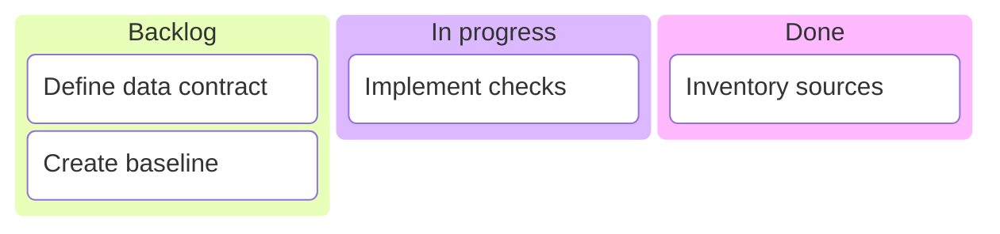
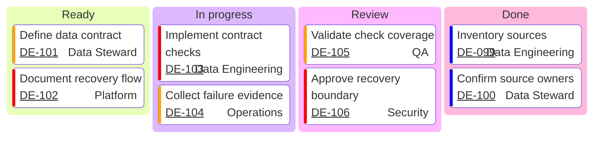

# Kanban

workflow stage별 현재 작업 상태가 핵심이면 `kanban`을 사용한다. 시간 흐름이나 dependency 계획은 Gantt가 더 적합하다.

## Basic: Workflow Columns

## Advanced: Governed Snapshot With Ownership And Review Queue

Advanced board는 ticket link, owner, priority와 review stage를 결합한다. 여러 item을 넣어 WIP concentration과 review queue를 읽을 수 있게 하되 dependency planning으로 사용하지 않는다.

이 예시는 four-stage snapshot, cross-functional ownership, ticket traceability, priority와 review queue를 결합한다. snapshot timestamp는 diagram 밖에 명시한다.

## Rules

- column ID와 task ID는 unique하게 유지한다.
- priority 허용값은 renderer 문서와 일치시킨다.
- board가 실제 상태와 동기화되지 않으면 snapshot 시점을 명시한다.
