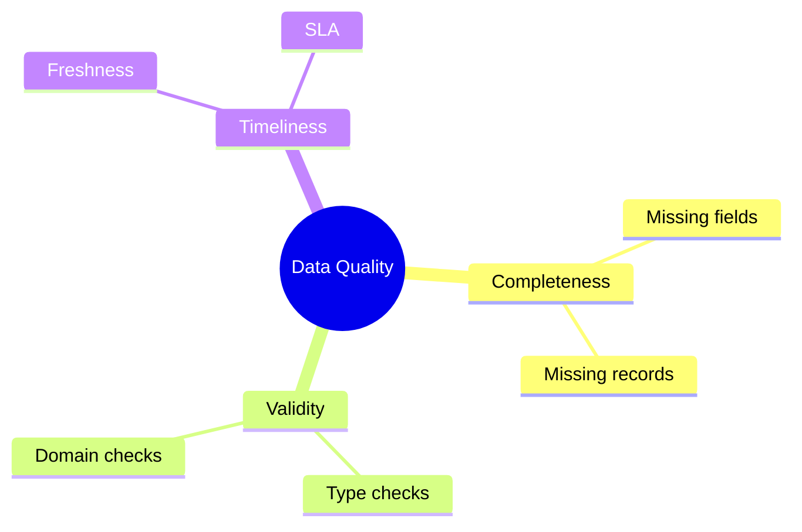
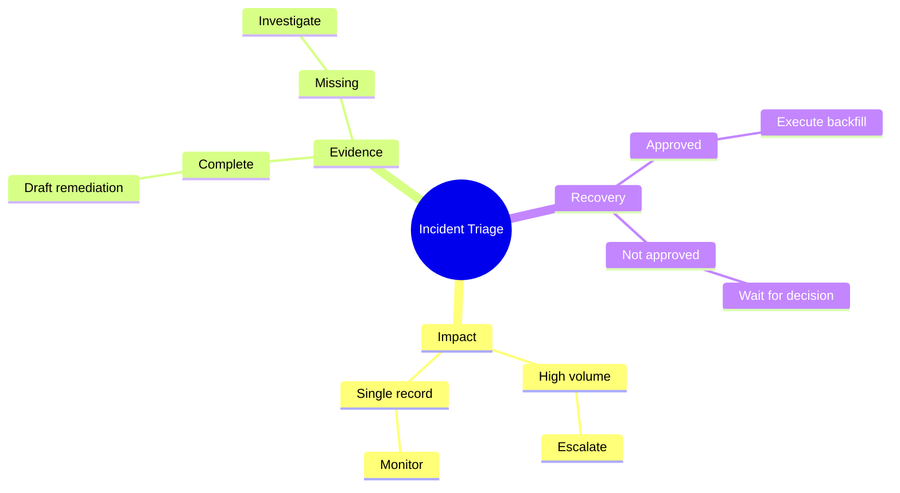
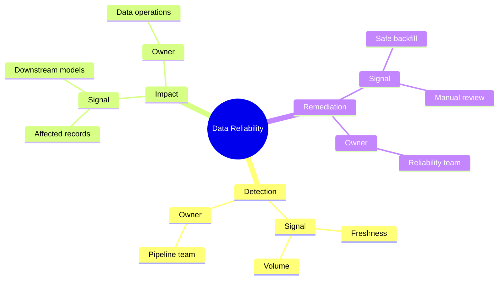

# Mindmap

개념이나 scope가 어떤 계층으로 분해되는지 보여줄 때 `mindmap`을 사용한다.

## Advanced: Decision And Action Map

taxonomy를 나열하는 데서 끝나지 않고, 각 branch에 관찰 기준과 다음 행동을 연결하면 mindmap이 decision map으로 확장된다.

## Improvement: Keep One Hierarchy Question

개선된 mindmap은 같은 level에서 category, action, owner를 무작위로 섞지 않는다. 각 branch가 동일한 질문에 답하도록 “risk → signal → response” 순서를 유지한다.

