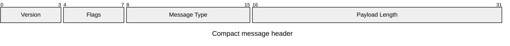
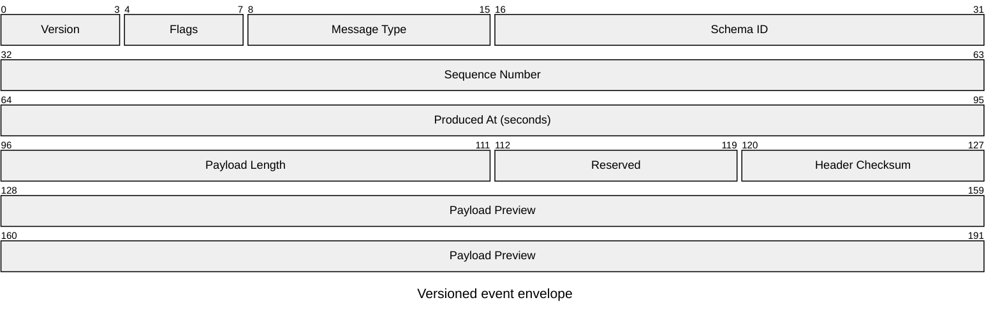

# Packet Diagram

> Mermaid v11.0.0+, bit-count syntax는 v11.7.0+다.

network packet, binary header 또는 고정 bit field layout을 보여줄 때 `packet`을 사용한다.

## Basic: Explicit Bit Ranges

## Advanced: Versioned Envelope With Flags And Integrity Fields

Advanced example은 bit-count syntax와 explicit range를 결합해 version, flags, schema, ordering, time, length와 integrity boundary를 한 header에 표현한다.

이 예시는 field continuity, future extension을 위한 reserved bits와 header integrity field를 함께 보여준다. variable payload 전체 길이는 `Payload Length`가 정의하며 preview range와 혼동하지 않는다.

## Rules

- range가 겹치거나 비는지 계산한다.
- bit-count와 explicit range를 섞을 때 다음 시작 bit를 다시 확인한다.
- variable-length payload 전체를 고정 field처럼 오해시키지 않는다.
