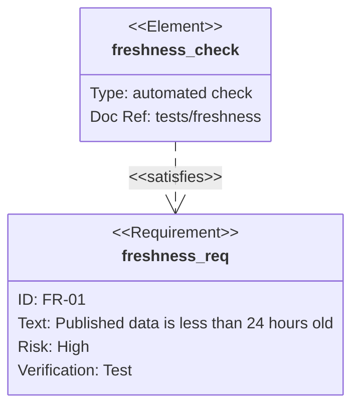
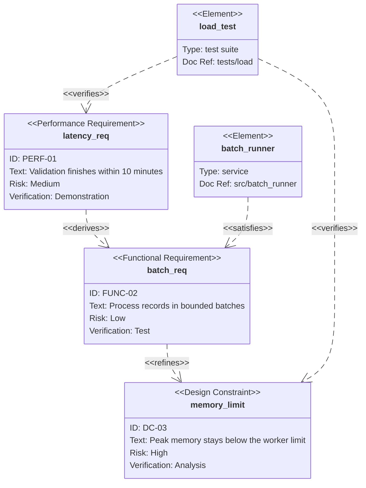

# Requirement Diagram

requirement와 설계 element 사이의 **traceability**가 핵심이면 `requirementDiagram`을 사용한다.

> Bundled Mermaid version에 따라 `direction`과 styling 지원 범위가 다를 수 있다. 아래 예제는 optional direction을 생략하고, 다중 단어와 특수 문자가 포함된 user-defined value를 인용해 호환성을 높인다.

## Basic: Requirement Satisfaction



## Advanced: Derivation, Refinement And Verification



## Optional Direction

Target renderer의 Mermaid version이 requirement direction을 지원할 때 declaration 다음에 추가한다.

```text
requirementDiagram
    direction LR
```

## Rules

- requirement ID와 text는 원문을 보존한다.
- user-defined value에 공백, 기호 또는 Mermaid keyword가 포함되면 큰따옴표로 감싼다.
- `contains`, `copies`, `derives`, `satisfies`, `verifies`, `refines`, `traces`를 의미에 맞게 구분한다.
- 일반 dependency만 필요하면 flowchart가 더 단순하다.
