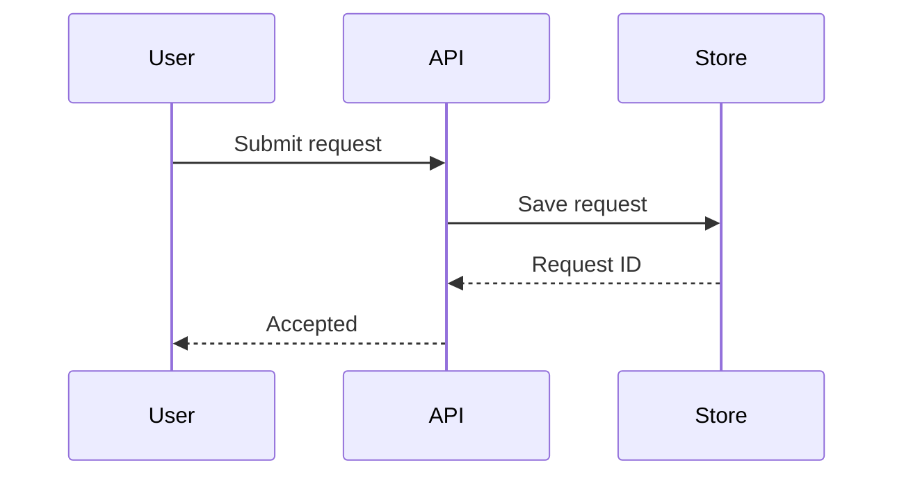
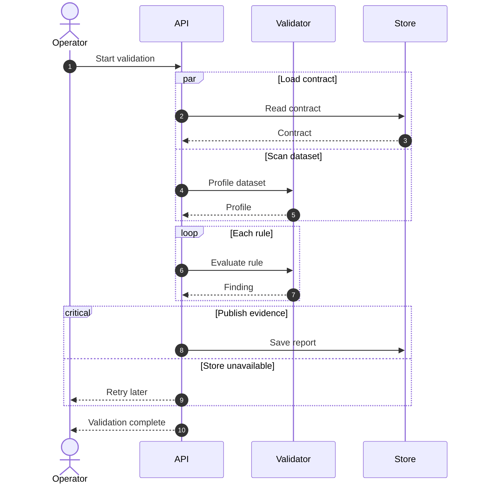
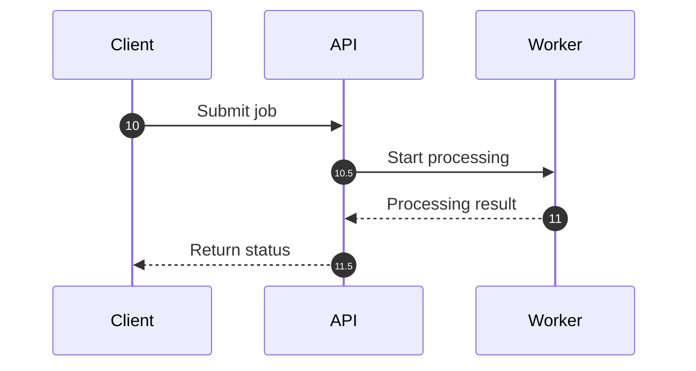
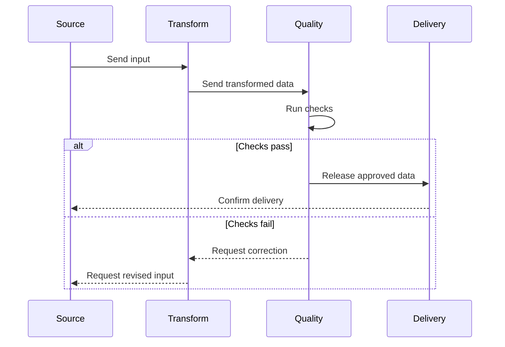
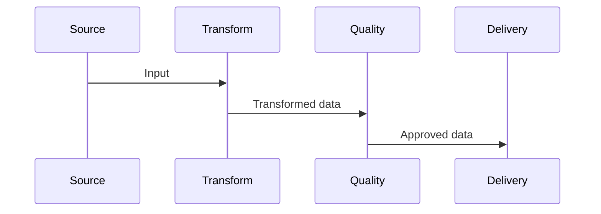
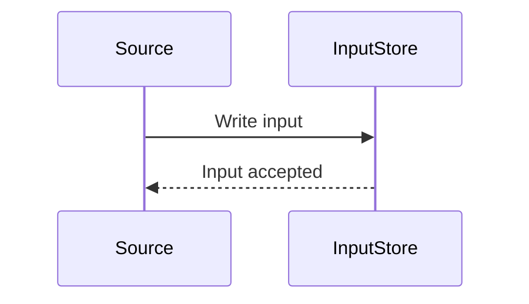
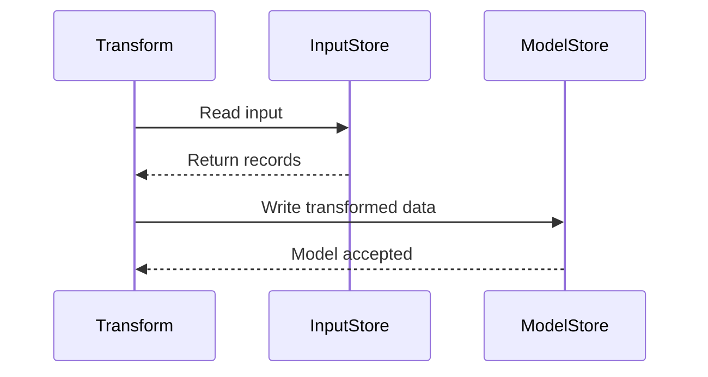
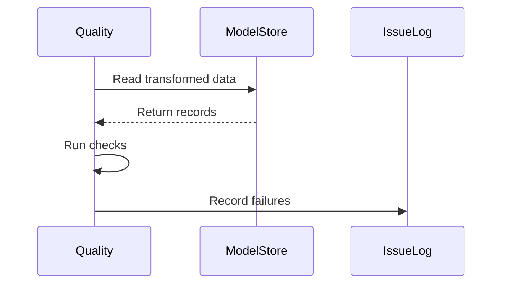
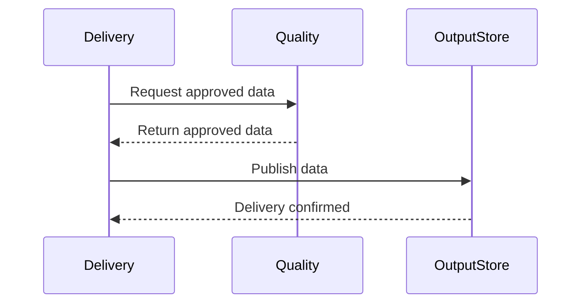

# Sequence Diagram

participant가 누구에게 어떤 message를 보내는지가 핵심이면 `sequenceDiagram`을 사용한다.

## Advanced: Loop, Parallel Work And Critical Section

## Intermediate: Custom Sequence Numbering

Mermaid 11.15.0 이상에서는 `autonumber <start> <increment>`로 시작값과 증가값을 지정할 수 있다. 번호는 설명 순서를 보조할 때만 사용한다.

문서 본문에서 message를 번호로 참조한다면 source 변경 후 번호가 바뀌지 않았는지 다시 검토한다.

## Splitting A Large Sequence Diagram Package

큰 sequence diagram은 participant와 message를 임의로 반으로 자르지 않고, 같은 수준의 책임을 가진 네 participant 영역을 package로 분리한다.

### Before: Four Equal Areas In One Diagram

네 영역의 주요 participant와 전체 handoff를 한 diagram에서 먼저 보여준다.

### After: Overview

네 영역 사이의 주요 message만 overview로 남긴다.

### After: Four Detail Diagrams

overview의 네 영역을 각각 하나의 detail diagram으로 확장한다. participant 영역을 합치거나 하나의 message 흐름을 임의로 끊지 않는다.

#### Source Detail

#### Transform Detail

#### Quality Detail

#### Delivery Detail

