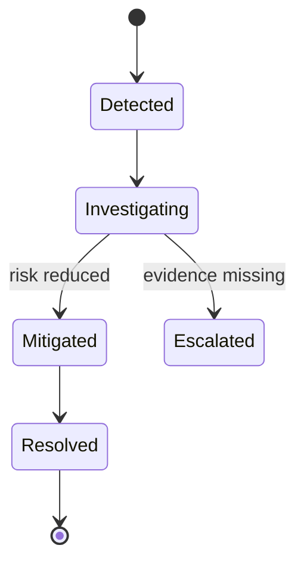
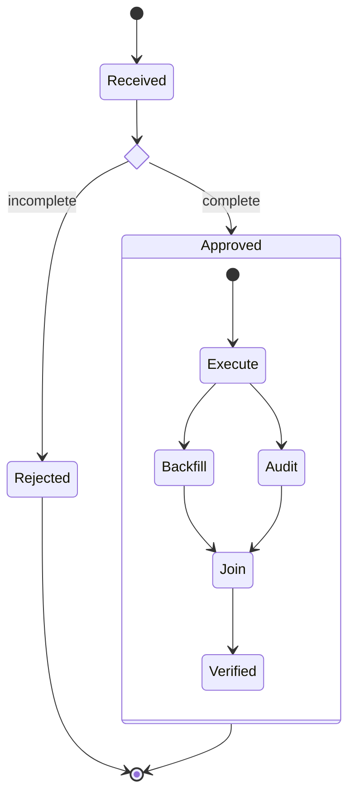
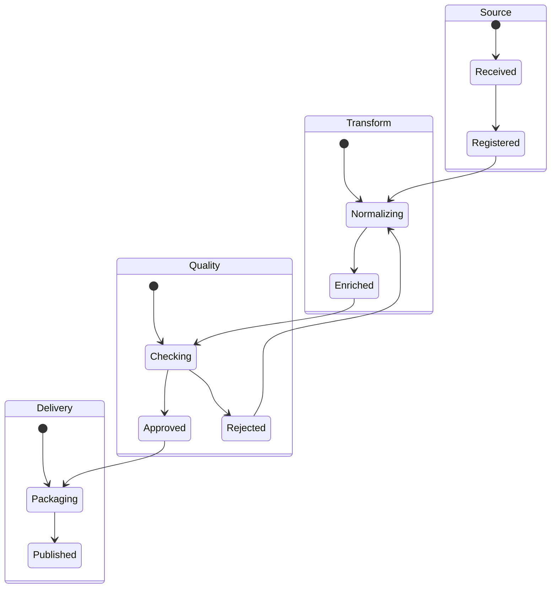
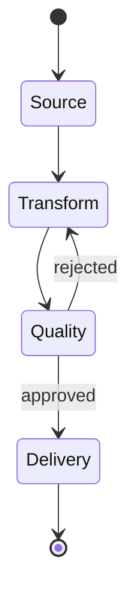
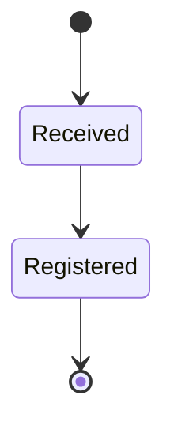
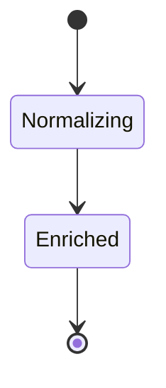
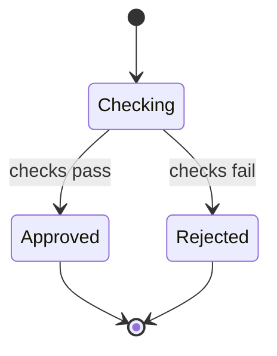
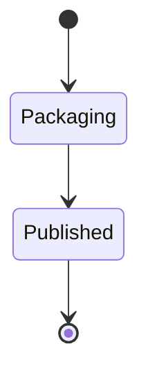

# State Diagram

incident나 workflow가 어떤 상태를 거쳐 이동하는지 보여줄 때 `stateDiagram-v2`를 사용한다.

## Advanced: Choice, Fork And Concurrent Regions

## Splitting A Large State Diagram Package

큰 state diagram은 상태를 임의로 반으로 자르지 않고, 같은 수준의 lifecycle 책임을 가진 네 상태 영역을 package로 분리한다.

### Before: Four Equal Areas In One Diagram

네 영역의 상태와 전체 전이를 한 diagram에서 먼저 보여준다.

### After: Overview

네 영역 사이의 주요 상태 전이만 overview로 남긴다.

### After: Four Detail Diagrams

overview의 네 영역을 각각 하나의 detail state diagram으로 확장한다. 영역을 합치거나 lifecycle의 중간 상태를 임의로 잘라내지 않는다.

#### Source Detail

#### Transform Detail

#### Quality Detail

#### Delivery Detail

