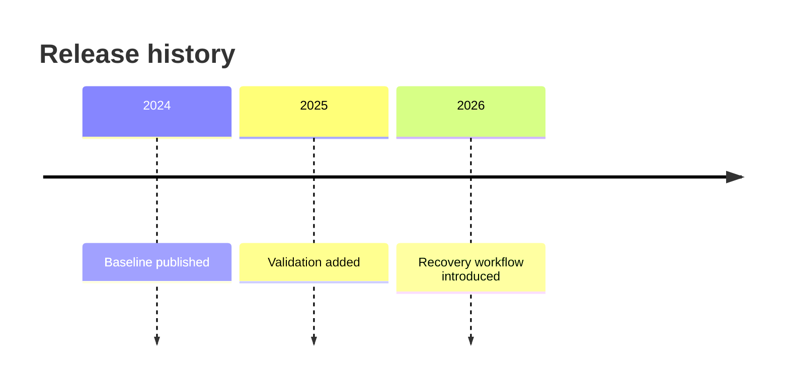
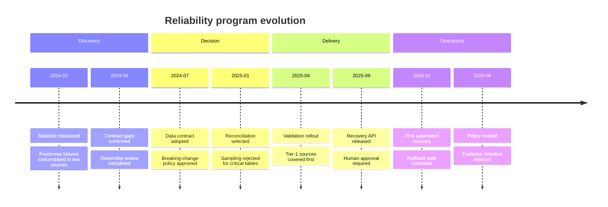
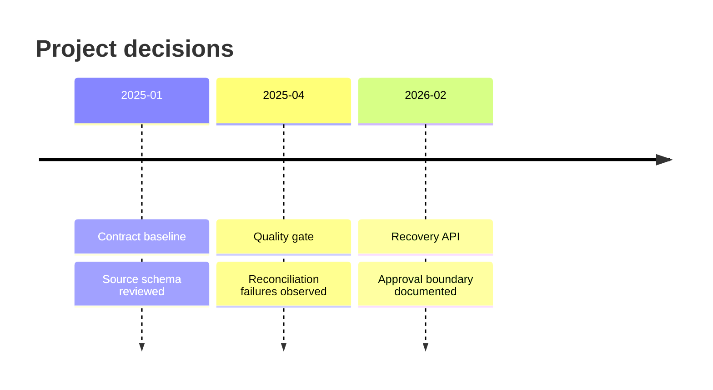

# Timeline

사건의 기간보다 주요 사건의 순서가 중요하면 `timeline`을 사용한다.

## Advanced: Phases, Decisions And Operational Consequences

Advanced timeline은 release만 나열하지 않고 discovery, decision, delivery와 operations를 구분한다. 같은 시점의 decision과 consequence를 함께 두어 변화의 이유를 추적한다.

이 예시는 chronology, phase boundary, decision rationale와 downstream consequence를 결합한다. duration과 dependency가 핵심이면 Gantt로 전환한다.

## Improvement: Add Evidence To Milestones

개선된 timeline은 milestone만 적지 않고 각 변화의 근거를 짧게 붙인다. 근거가 긴 경우에는 별도 문서 link를 사용하고 timeline label에 세부 설명을 넣지 않는다.

