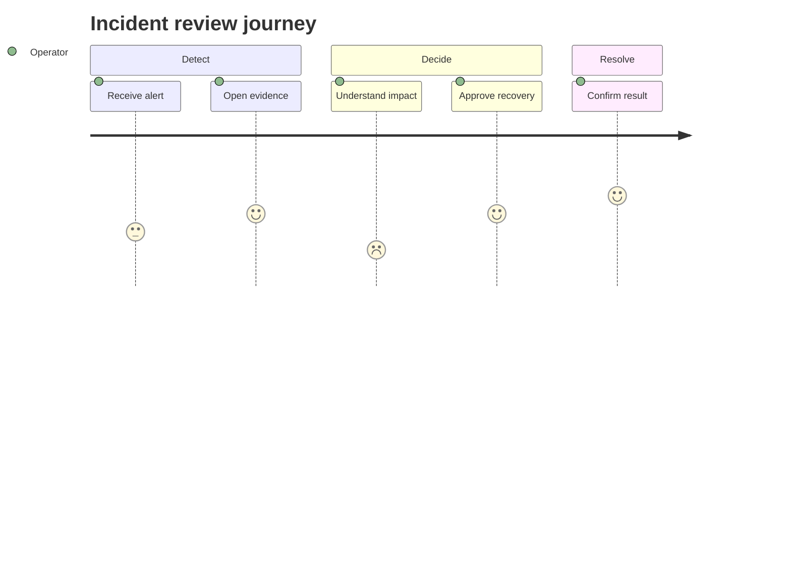
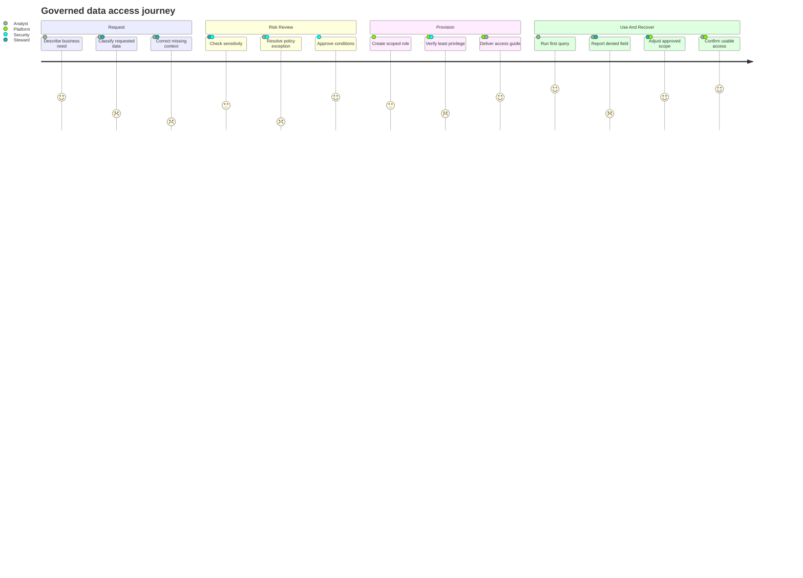

# User Journey

사용자가 목표를 완료하는 단계와 각 단계의 경험 점수, 관련 actor를 보여줄 때 `journey`를 사용한다.

## Basic: Single Actor Journey

## Advanced: Multiple Actors, Pain Points And Recovery

여러 actor를 사용할 때는 책임뿐 아니라 경험 저하가 발생하는 handoff와 회복 지점을 함께 보여준다. score는 정밀 KPI가 아니라 상대적 경험 신호다.

이 예시는 네 단계, 네 actor, low-score pain point, policy exception과 recovery loop를 결합한다.

## Rules

- score는 정밀 metric이 아니라 경험의 상대적 신호다.
- system call 순서를 설명하려면 sequence diagram을 사용한다.
- 실제 정량 만족도 비교가 목적이면 chart와 source table을 사용한다.
