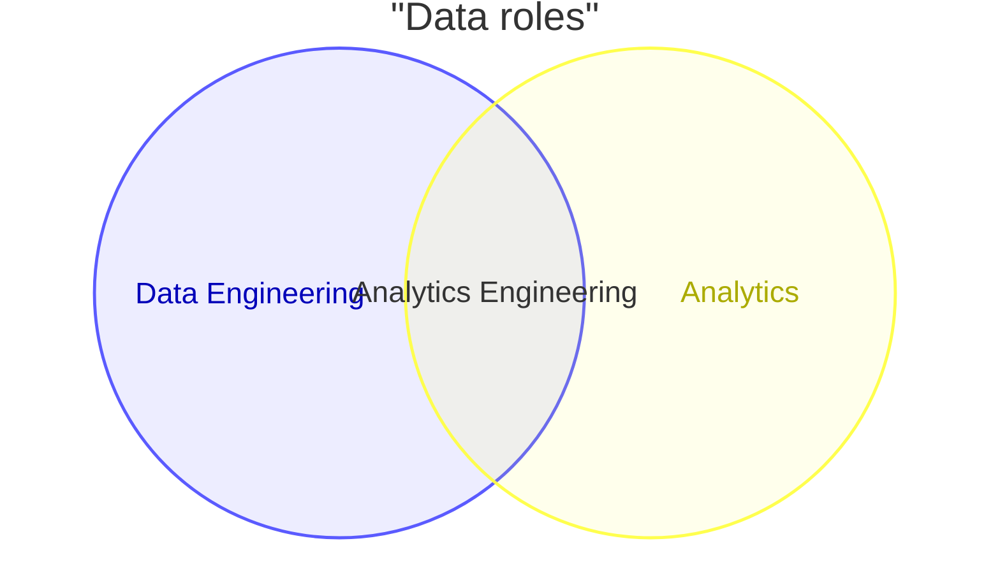
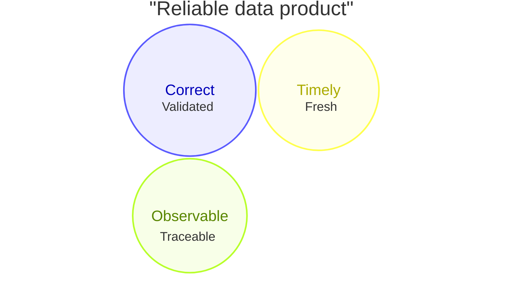

# Venn Diagram

> Mermaid v11.12.3+의 `venn-beta` 문법이다.

set의 포함·중첩보다 **교집합의 의미**가 핵심일 때 사용한다.

## Basic: Two Sets And Union

## Advanced: Size, Text Nodes And Higher-Arity Union

## Rules

- `union`의 set ID는 먼저 선언한다.
- area 크기를 실제 비율처럼 사용할 때는 수치 근거를 명시한다.
- 정확한 포함 관계나 taxonomy는 mindmap 또는 class/ER diagram이 더 적합할 수 있다.
