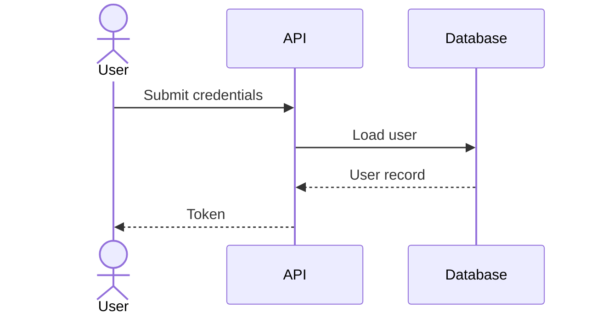
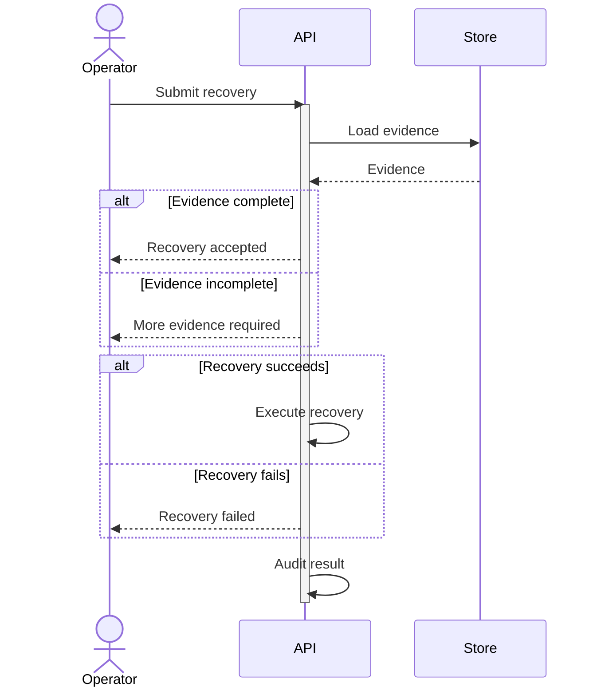

# ZenUML

> ZenUML은 Mermaid core에 항상 포함되는 타입이 아니다. renderer가 `@mermaid-js/mermaid-zenuml`을 등록하지 않았다면 `UnknownDiagramError`가 발생한다. 따라서 ZenUML 원문은 `zenuml` fence로 제공하고, 일반 Mermaid renderer용 `sequenceDiagram` fallback을 함께 제공한다.

code-like interaction, nesting과 exception 흐름을 sequence 형태로 표현할 때 `zenuml`을 사용한다.

## Basic: ZenUML Source

```zenuml
zenuml
    title Authentication
    U as User
    A as API
    D as Database
    U->A: Submit credentials
    A->D: Load user
    D->A: User record
    A->U: Token
```

## Basic: Portable Mermaid Fallback



## Advanced: ZenUML Source

```zenuml
zenuml
    title Recovery request
    @Actor Operator
    @Boundary API
    @Database Store

    Operator->API: Submit recovery
    API.validate() {
        result = Store.loadEvidence()
        if(result.complete) {
            API->Operator: Recovery accepted
        } else {
            API->Operator: More evidence required
        }
    }

    try {
        API.executeRecovery()
    } catch {
        API->Operator: Recovery failed
    } finally {
        API.auditResult()
    }
```

## Advanced: Portable Mermaid Fallback



## Rules

- standard `sequenceDiagram`과 ZenUML 문법을 한 block 안에서 섞지 않는다.
- nested sync call, `if`, loop, `try/catch/finally`가 실제 이해를 높일 때만 사용한다.
- plugin 지원을 확인할 수 없으면 portable fallback을 기본 출력으로 사용한다.
- ZenUML source를 Mermaid fence로 감싸는 것은 target renderer가 plugin을 지원한다고 확인된 경우에만 허용한다.
