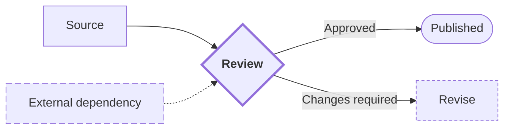

# Mermaid Diagram Style Policy

Mermaid diagram의 style은 **관계·책임·상태·경계와 핵심 경로를 더 빠르게 읽게 하는 수단**이다. Structure, position, shape, line과 label을 color보다 먼저 사용한다.

## Priority

```text
structure → position → shape → line → label → typography → color
```

앞 단계에서 충분히 구분되면 뒤 단계는 추가하지 않는다.

## Editing Existing Work

다음 우선순위를 따른다.

```text
explicit user instruction → local source convention → document convention → project convention → this policy
```

- 요청된 목적에 필요한 최소 범위만 수정한다.
- 기존 direction, grouping, node order, naming, theme과 visual language를 불필요하게 바꾸지 않는다.
- 이 정책에 맞추기 위한 전면 재스타일링이나 정규화를 하지 않는다.
- 판단이 어려우면 기존 표현을 보존한다.

## Theme

- 사용자가 요청하지 않으면 `theme`, `look`, `themeVariables`를 지정하지 않는다.
- 문서와 renderer가 선택한 active theme을 따른다.
- custom theme은 `base` theme과 concrete `themeVariables`가 필요한 작업으로 취급한다.
- light/dark에서 검증하지 못한 고정 fill, background와 text color를 portable documentation에 넣지 않는다.
- `success`, `warning`, `danger`가 Mermaid 내장 semantic color라고 가정하지 않는다.

## Semantic Intent

Intent는 Mermaid token이 아니라 skill-level instruction이다.

| Intent | Meaning | Default non-color expression |
| --- | --- | --- |
| `primary` | 핵심 요소·경로 | 굵은 border 또는 line, 짧은 핵심 label |
| `secondary` | 일반 요소 | active theme 기본 style |
| `muted` | 보조·참고 | dashed border 또는 dotted edge |
| `external` | 외부 actor·system | boundary 밖 배치 + dashed border |
| `selected` | 현재 검토 대상 | 굵은 border + 명시적 label |
| `success` | 완료 | terminal shape + 상태 label |
| `warning` | 검토·대기 | decision/note shape + 상태 label |
| `danger` | 실패·차단 | stop/terminal shape + 상태 label |

색상을 제거해도 intent가 읽혀야 한다.

## Structural Styling

- 핵심 경로는 source 순서와 layout 방향에서 자연스럽게 읽히게 배치한다.
- system, domain, team 또는 phase 경계는 의미 있는 boundary나 `subgraph`로 표현한다.
- 외부 요소는 내부 boundary 밖에 둔다.
- 결정, 시작·종료, 저장소에는 의미에 맞는 shape을 사용한다.
- 주요 flow는 solid arrow, optional·asynchronous·external dependency는 필요한 경우 dashed/dotted edge를 사용한다.
- edge label에는 condition, message, handoff 또는 relationship 의미를 쓴다.
- 상태는 `Ready`, `Blocked`, `Pending`처럼 text로 직접 표시한다.
- 긴 설명은 node가 아니라 diagram 주변 prose나 note에 둔다.

## Minimal Class Pattern



`fill`, `color`와 `background`를 생략해 active theme을 보존한다. Class가 없어도 diagram의 의미가 완전해야 한다.

## Color Escalation

다음 중 하나일 때만 explicit color를 고려한다.

1. 사용자가 brand palette나 특정 color를 요청했다.
1. shape, line과 label만으로 필요한 category를 구분하기 어렵다.
1. 기존 문서의 검증된 semantic palette를 이어야 한다.
1. target renderer에서 accessibility와 contrast를 확인할 수 있다.

색상을 추가해도 label, shape, border 또는 line style을 유지한다. Red/green pair만으로 상태를 구분하지 않는다.

## Type Guidance

| Type | Priority | Avoid |
| --- | --- | --- |
| Flowchart | direction, grouping, shape, edge label | node마다 다른 fill |
| Swimlanes | ownership, cross-lane handoff | lane마다 장식용 color |
| Sequence | participant order, fragment, activation, notes | message마다 다른 color |
| Class | relationship notation, visibility, namespace | class마다 임의 palette |
| State | hierarchy, terminal state, guard label | 상태를 color에만 의존 |
| ER | cardinality, key marker, entity grouping | entity마다 다른 fill |
| Architecture/C4 | boundary, dependency direction, external placement | vendor color를 필수 의미로 사용 |
| Gantt/Timeline | chronology, milestone, section | 장식용 gradient |
| Mindmap/TreeView | depth, indentation, concise labels | 깊이마다 고정 palette |

## Review

- active theme을 불필요하게 덮어쓰지 않았는가?
- 색상을 제거해도 핵심 의미가 유지되는가?
- shape, line, position과 label이 실제 semantic difference를 나타내는가?
- style보다 정보 구조를 먼저 개선했는가?
- 강조가 많다면 diagram을 분리해야 하지 않는가?
