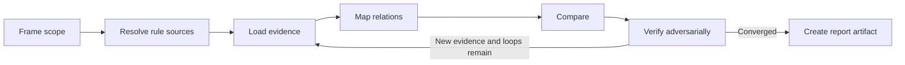

# Artifact Consistency Inspector

## Bundled References

Read only the references needed for the current run:

- Read `./references/inspection-rules.md` before mapping relations, classifying findings, or verifying absence.
- Read `./references/rule-sources.md` when rules, guidelines, policies, configuration, or conventions may define the expected state.
- Read `./references/report-format.md` before creating the downloadable report artifact.
- Read `./references/example-report.md` only when an output example is useful. Its evidence is fictional.
- `./README.md` and `.github/skills/artifact-consistency-inspector/tests/` are maintainer/development-facing package material. Repository maintainer docs live outside the runtime package and are never evidence from the inspected repository.

## Objective

Find evidence-backed gaps between artifacts that are expected to agree or remain traceable, especially:

```text
intent, rule, or contract ↔ implementation ↔ validation
```

The skill is project-, language-, framework-, methodology-, and host-agnostic. Do not assume a directory layout, test convention, writable workspace, or local checkout.

## Runtime Contract

- Treat the repository as a remote evidence source, not a persistent directory.
- Use read-only repository and web retrieval only.
- Never create, edit, delete, commit, comment on, label, merge, or otherwise modify repository content or repository-host objects.
- Do not produce patches, redesigns, broad quality verdicts, approval decisions, or unrelated review findings.
- Return one downloadable Markdown report by default.
- Return one ZIP only when requested or when multiple necessary artifacts cannot be represented clearly in one Markdown file.
- Do not require or describe a repository-local report path.

## Inputs

Interpret every control as `auto` unless the user overrides it in natural language.

```yaml
repository: auto
target: auto
relations: auto
rule_sources: auto
scope: auto
baseline: auto
exclude: auto
loops: auto
output: auto
```

This is a natural-language control model, not a CLI contract. An identifiable repository is ultimately required, but it may be resolved from a repository, PR, branch, commit, file, or comparison URL; an `owner/repository` identifier; selected connector context; or prior conversation context.

## Auto Resolution

### Repository and target

Resolve `repository: auto` from the most specific repository-bearing context available. If none can be resolved, request a repository URL or identifier.

Resolve `target: auto` in this order:

1. artifact, symbol, rule, relation, requirement, endpoint, model, configuration key, or behavior named by the user
1. file, PR, commit, branch, tag, or comparison represented by the supplied URL
1. feature or concept stated in the request
1. repository default branch

Resolve the inspected state to an immutable revision whenever the available source exposes one. Never silently mix moving refs or unrelated revisions.

### Relations

Derive `relations: auto` from traceable repository evidence rather than predefined directories.

Artifact roles may include:

- intent or rule: policy, guideline, contribution rule, ADR, RFC, requirement, issue-linked decision, or normative documentation
- contract: API, event, data, schema, CLI, configuration, compatibility, migration, or deployment contract
- implementation: application, library, infrastructure, data, workflow, registration, or integration logic
- validation: unit, integration, contract, snapshot, migration, schema, end-to-end, static analysis, or operational checks

Trace signals may include direct links, identifiers, symbols, routes, commands, fields, models, tables, topics, configuration keys, environment variables, feature flags, imports, registrations, manifests, dependency edges, test names, or changed-file relationships.

Do not invent a required counterpart merely because it is common in another project.

### Rule sources

`rule_sources` is either `auto` or an ordered list. The list order is authority precedence for this run.

Examples:

```yaml
rule_sources: auto
```

```yaml
rule_sources:
  - "docs/team-api-policy.md"
  - auto
  - "baseline:release-2026.07"
```

A list item may be an artifact locator, named document, symbol, heading, configuration file, revision, user-provided rule, or a clearly bounded source selector. `auto` may appear once in the list and expands in place to repository-specific source candidates.

For `rule_sources: auto`, or for an embedded `auto` item:

1. discover candidate rule sources that directly apply to the target relation
1. determine authority from repository evidence such as explicit applicability, normative language, active status, specificity, revision alignment, enforcement wiring, cross-reference, and ownership metadata
1. produce an ordered list of actual source locators, not a universal category order
1. record the resolved order and the evidence used to establish it

Do not assume that policy documents, executable configuration, specifications, or conventions always outrank one another. Repository evidence determines their order. If authority cannot be ordered reliably, keep the candidates at the same unresolved tier and do not select one silently.

A repeated convention may be inspected, but convention-only evidence cannot produce a verified violation unless the repository or user establishes that convention as mandatory. Otherwise report it as `unresolved` or omit it when the evidence is weak.

Read `./references/rule-sources.md` for conflict, expansion, and reporting rules.

### Scope

Build `scope: auto` as a bounded relation frontier:

1. start from the target anchor
1. inspect direct references and directly referenced artifacts
1. inspect direct consumers, registrations, dependencies, rule sources, and validation counterparts
1. inspect only the counterevidence needed to confirm or reject candidate gaps

For a repository-wide request, identify high-signal artifact clusters from repository-provided entry points, metadata, manifests, references, indexes, and naming patterns. Inspect each selected cluster independently. Never claim exhaustive coverage without evidence.

Stop expanding when the relation is sufficiently mapped, a candidate is verified or disproved, searches repeat existing evidence, or broader search loses direct traceability.

Do not use a fixed directory list. Record inspected clusters, skipped or inaccessible areas, search limitations, and material coverage boundaries.

### Baseline

Resolve `baseline: auto` from the first reliable source available:

1. user-specified comparison target
1. PR base ref when the target is a PR
1. baseline embedded in the resolved `rule_sources`
1. explicitly related branch, tag, or commit
1. current relationships within the resolved snapshot, without cross-revision comparison

Do not treat the default branch as an authoritative contract merely because it is the default branch.

### Exclusions

For `exclude: auto`, exclude an artifact only when evidence indicates it is generated, vendored, archived, superseded, non-authoritative, or outside the requested relation. A path pattern alone is insufficient.

Generated, lock, fixture, example, compatibility, migration, or deprecated material may still be direct evidence. Include it when it defines, consumes, validates, or explains the relation.

User-specified exclusions take precedence and must be recorded.

### Verification loops

`loops` limits Compare plus Verify passes, not individual searches.

For `loops: auto`:

- narrow file or single relation: up to 1 pass
- PR, feature, rule-set, or multi-artifact target: up to 2 passes
- repository-wide, omission-heavy, convention-heavy, or cross-revision target: up to 3 passes

End early when no new evidence or counterevidence appears. Never widen scope only to consume the loop count.

### Output

For `output: auto`:

- return one Markdown report by default
- name it `<repository-name>-artifact-consistency-report[-<target>]-<yyyyMMddHHmm>.md`
- if a stable repository name is unavailable, use `artifact-consistency-report[-<target>]-<yyyyMMddHHmm>.md`
- use the user's local timezone when available; otherwise use the runtime timezone and record it in front matter
- keep the timestamp as the final filename segment before the extension
- for duplicate logical names in the same minute, insert `-r2`, `-r3`, and so on immediately before the timestamp
- use ZIP only when requested or when multiple necessary artifacts are required

The report must begin with the YAML front matter defined in `./references/report-format.md`.

## Evidence Access

For GitHub repositories, prefer connected read operations for repository metadata, scoped search, file retrieval, PR metadata, changed files, patches, and ref comparison. Never invoke repository write actions.

For other hosts, use only connected or publicly readable evidence exposed by the runtime. Do not simulate unsupported access. If access, indexing, truncation, unsupported formats, permissions, or missing refs prevent verification, record the limitation and do not infer missing content.

## Evidence Rules

- Base every reported fact on retrieved repository content, repository metadata, a diff or comparison, explicit user-provided evidence, or a reproducible read-only command result.
- Pin evidence to an immutable revision when possible; otherwise record the exact ref and limitation.
- Prefer a canonical file URL plus line range. When unavailable, use a reproducible heading, symbol, key, route, test name, or structural locator.
- Never invent a line number, revision, file state, search result, rule source, or absence.
- A zero-result search is not sufficient evidence of omission. Verify expected location, aliases, registrations, indexes, replacement paths, and directly related scope.
- Search snippets are discovery aids, not final evidence when the underlying artifact can be retrieved.
- Check counterevidence before verification: aliases, compatibility layers, feature flags, generated sources, parameterized tests, migrations, intentional deferrals, versioned contracts, and revision differences.

## Workflow



1. **Frame:** normalize repository, target, relations, rule sources, scope, baseline, exclusions, loops, and output.
1. **Resolve rule sources:** expand `auto`, establish repository-specific ordering, and preserve unresolved authority conflicts.
1. **Load:** retrieve only the evidence needed for the bounded relation frontier.
1. **Map:** identify expected and actual sources before comparing files.
1. **Compare:** detect only supported differences in the requested relations.
1. **Verify:** seek counterevidence and classify candidates as verified, unresolved, disproved, or out of scope.
1. **Report:** merge common root causes, record coverage, and create the downloadable artifact.

## Responsibility Boundaries

Report consistency gaps and supporting evidence only. Do not:

- grade overall repository quality
- enforce external best practices as repository rules
- turn weak repeated patterns into mandatory conventions
- prefer one design or implementation style
- inspect unrelated defects
- write patches, fixes, redesigns, or migration plans
- issue approval or rejection verdicts
- modify the repository or repository-host state

## Result

- `findings`: one or more verified findings
- `incomplete`: no verified finding, but unresolved candidates or material blockers remain
- `no-verified-findings`: bounded inspection completed without a verified finding

Never describe `no-verified-findings` as proof of overall consistency.

## Report Creation

Create the report according to `./references/report-format.md`.

- Merge symptoms that share one relation and root cause.
- Sort findings by relation, type, and primary locator.
- Assign IDs from `CON-001`.
- Keep the reader-facing report concise: summarize the observed difference, provide reproducible references, and state only the potential direct impact.
- Use `#### Observed difference`, `#### References`, and `#### Potential impact` for every finding.
- Add `#### Why unresolved` only for an `unresolved` finding.
- Keep detailed verification and counterevidence work internal unless its absence is the reason a finding remains unresolved.
- Record resolved rule-source order, authority conflicts, evidence access, exclusions, assumptions, and limitations in Coverage rather than repeating rule-source metadata in every finding.
- `author` remains the literal placeholder `<author>` unless the user supplies a value.
- Do not include secrets, credentials, private connector identifiers, or temporary machine paths.
- Validate front matter, filename timestamp, internal consistency, and artifact readability before returning the file.