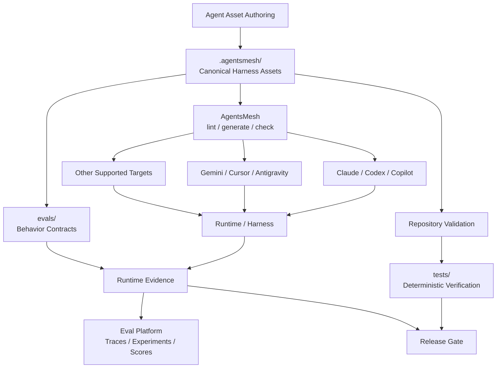
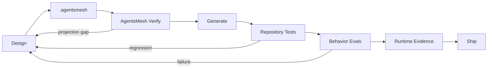

# Project EXODUS — AgentsMesh 대이주 계획

> **Status:** Planned  
> **Scope:** Repository architecture, Agent Asset authority, harness projection, validation, evaluation  
> **Execution:** 이 문서는 계획만 정의한다. 실제 migration은 별도 작업으로 수행한다.

## 선언

이번 대이주의 목적은 단순히 Rulesync를 AgentsMesh로 교체하는 것이 아니다.

`mols-agent-assets`가 직접 떠안아 온 harness별 자산 변환, 배치, compatibility, link rewriting, drift 관리 책임을 AgentsMesh에 위임하고, 저장소의 중심을 **Agent Asset 개발·검증·평가·회귀 관리**로 옮긴다.

현재 저장소는 `src/`를 자산 source workspace로 사용하고 `Author → Validate → Deploy` 흐름을 따른다. 대이주가 완료되면 AgentsMesh가 자연스럽게 표현할 수 있는 multi-harness 자산은 `.agentsmesh/`가 canonical source가 된다.

새 원칙은 하나다.

> **Harness engineering은 AgentsMesh에게 맡기고, Agent Asset engineering은 이 저장소가 소유한다.**

## 목표 상태



AgentsMesh는 canonical representation, target projection, import/conversion, structural compatibility와 drift 검증을 담당한다.

이 저장소는 asset doctrine, semantic quality, deterministic validation, behavioral eval, routing eval, adversarial eval, regression, runtime evidence policy와 development lifecycle을 계속 소유한다.

## 목표 Repository Topology

```text
mols-agent-assets/
├── .agentsmesh/
│   ├── rules/
│   ├── commands/
│   ├── agents/
│   ├── skills/
│   ├── mcp.json
│   ├── hooks.yaml
│   ├── permissions.yaml
│   └── lessons/                 # 후속 검토
├── evals/
│   ├── routing/
│   ├── behavior/
│   ├── adversarial/
│   └── regression/
├── tests/
│   ├── assets/
│   ├── tooling/
│   └── integration/
├── src/
│   ├── skills-chatbot/          # 초기 유지
│   ├── skills-chatbot-runtime/  # 초기 유지
│   └── tooling/                 # 필요할 때만
├── scripts/
├── docs/
├── agentsmesh.yaml
└── generated harness surfaces
```

`src/` 자체를 제거하는 것이 목표는 아니다. AgentsMesh가 자연스럽게 소유할 수 있는 자산만 이동한다.

## 책임 경계

| 영역 | Owner |
| --- | --- |
| Canonical multi-harness configuration | AgentsMesh / `.agentsmesh/` |
| Target-specific projection | AgentsMesh |
| Import / conversion | AgentsMesh |
| Projection compatibility lint | AgentsMesh |
| Generated drift | AgentsMesh |
| Agent Asset doctrine | `mols-agent-assets` |
| Deterministic repository tests | `mols-agent-assets` |
| Behavioral / routing / adversarial eval | `mols-agent-assets` |
| Eval datasets and regression contracts | `mols-agent-assets` |
| Runtime traces / experiments / scores | Langfuse-class eval platform |

## 자산별 이주 판정

| Current | Target | Initial Decision |
| --- | --- | --- |
| `src/rules/` | `.agentsmesh/rules/` | 전면 이주 후보 |
| `src/agents/` | `.agentsmesh/agents/` | 전면 이주 후보 |
| `src/skills/` | `.agentsmesh/skills/` | 강한 이주 후보 |
| `src/prompts/` | `.agentsmesh/commands/` 또는 유지 | 개별 의미 판정 |
| `src/skills-chatbot/` | 유지 | hosted chatbot 전용 profile |
| `src/skills-chatbot-runtime/` | 유지 | hosted/runtime 전용 profile |
| `src/scripts/` | 유지 또는 정리 | harness asset 아님 |
| `tests/` | 유지 및 확대 | repository verification |
| `docs/` | 유지 및 재구성 | doctrine와 architecture |
| `.agents/` | projection 여부 판정 | source authority 제거가 목표 |
| `AGENTS.md` 등 target output | generated | 직접 편집 금지 후보 |

`Prompt → Command`는 기계적으로 변환하지 않는다. Harness-invocable reusable prompt만 AgentsMesh command로 이동한다.

## Cutover Constitution

### Single Authority

AgentsMesh가 담당하는 자산은 `.agentsmesh/`가 유일한 source가 되어야 한다.

다음 상태는 migration 실패다.

```text
src/rules/foo.md
.agentsmesh/rules/foo.md
AGENTS.md
.github/instructions/foo.instructions.md
```

이 중 무엇이 원본인지 다시 판단해야 한다면 대이주의 목적을 달성하지 못한 것이다.

### Generated Means Generated

AgentsMesh가 관리하는 generated surface는 직접 수정하지 않는다.

예시는 다음과 같다.

```text
AGENTS.md
CLAUDE.md
.cursor/*
.codex/*
.github/copilot-instructions.md
.github/instructions/*
```

단, `.github/workflows/`, PR template처럼 AgentsMesh가 관리하지 않는 sibling surface는 기존 repository authority를 유지한다.

### Eval Authority Is Independent

```text
.agentsmesh/ = 실행될 자산
evals/       = 자산을 평가할 계약
```

평가 대상과 평가 기준의 authority를 분리한다.

### Runtime Claims Require Runtime Evidence

`generate`, `lint`, round-trip 성공은 runtime behavior 성공을 증명하지 않는다.

```text
projection success != behavioral success
```

실제 trigger, task completion, tool behavior, semantic quality, stability는 별도 runtime evidence와 eval로 판정한다.

## Phase 0 — The Census

**목표:** 이동 전에 현재 자산과 권위를 완전히 inventory한다.

이 단계에서는 source를 옮기지 않는다.

산출물은 다음과 같다.

- Asset Inventory
- Authority Map
- Projection Map
- Validation Map
- Migration Classification
- Preservation Contract

각 asset에 대해 최소한 다음을 기록한다.

| Question | Evidence |
| --- | --- |
| 현재 canonical source는 어디인가 | path |
| asset type은 무엇인가 | Rule / Skill / Prompt / Agent |
| target-specific인가 | yes/no |
| AgentsMesh에서 자연스럽게 표현 가능한가 | yes/partial/no |
| generated sibling은 무엇인가 | paths |
| 기존 deterministic test가 있는가 | test evidence |
| runtime behavior가 중요한가 | yes/no |
| migration action | move / adapt / keep / retire |

**Gate:** 모든 이동 대상의 목적지가 설명되기 전에는 migration을 시작하지 않는다.

## Phase 1 — Raise the New Capital

**목표:** `.agentsmesh/`와 AgentsMesh toolchain을 도입하되 기존 authority는 아직 제거하지 않는다.

초기 작업:

- AgentsMesh exact version pin
- `agentsmesh.yaml`
- 최소 `.agentsmesh/rules/_root.md`
- `agentsmesh lint`, `check`, `generate --check` baseline
- 기존 source와 generated output의 비교 기준 수립

초기 migration에서는 다음 고급 기능을 기본적으로 열지 않는다.

- Lessons
- remote packs
- custom target plugins
- 복잡한 hooks

대이주와 새로운 runtime behavior를 동시에 도입하지 않는다.

## Phase 2 — The First Crossing

**목표:** Rules를 첫 canonical migration 대상으로 삼는다.

```text
src/rules/*
    ↓
.agentsmesh/rules/*
    ↓
AgentsMesh generate
    ↓
AGENTS.md / harness-native rules
```

보존 대상:

- scope
- glob
- always-on 여부
- precedence
- meaningful exclusions
- repository-local rule authority

**Gate:** 설명되지 않은 semantic loss가 하나라도 있으면 rules cutover를 금지한다.

## Phase 3 — The Skills Exodus

**목표:** portable Skill과 Agent를 canonical territory로 이동한다.

```text
src/skills/foo/
    ↓
.agentsmesh/skills/foo/

src/agents/bar.*
    ↓
.agentsmesh/agents/bar.*
```

보존 대상:

- Skill name
- description
- activation intent
- supporting resources
- relative links
- Agent role
- tools
- permissions
- model hints
- authority

**Gate:** 중요한 asset은 `generate → import → generate` round-trip에서 canonical semantics가 보존되어야 한다.

## Phase 4 — The Borderlands

**목표:** AgentsMesh가 자연스럽게 소유하지 못하는 profile을 억지로 흡수하지 않는다.

초기에는 다음을 유지한다.

```text
src/skills-chatbot/
src/skills-chatbot-runtime/
```

이들은 일반 coding harness Skill과 다른 hosted chatbot/runtime profile이다. AgentsMesh plugin이나 다른 distribution mechanism이 실제로 더 나은 authority를 제공한다는 증거가 생길 때만 재검토한다.

> `.agentsmesh/` 하나로 모든 파일을 통일하는 것이 목표가 아니다. 하나의 책임에 하나의 권위만 존재하게 만드는 것이 목표다.

## Phase 5 — The Coronation

**목표:** `.agentsmesh/`를 공식 canonical source로 승격한다.

기존 pipeline:

```text
Author in src/
→ Validate
→ Deploy
```

새 pipeline:

```text
Author in .agentsmesh/
→ AgentsMesh lint
→ Generate / Check
→ Deterministic Validation
→ Behavior Eval when applicable
→ Deploy
```

이 단계에서 root `AGENTS.md`, README와 관련 reference의 authority 설명을 새 구조에 맞춘다.

저장소의 목표 정체성은 다음과 같다.

> **`mols-agent-assets`는 AgentsMesh를 사용해 multi-harness Agent Assets를 canonical하게 관리하고, 자체 검증·평가 체계를 통해 그 품질과 행동을 개발하는 저장소다.**

## Phase 6 — The Iron Gate

**목표:** AgentsMesh verification과 repository verification을 하나의 pipeline으로 연결한다.

검증 계층:

```text
L0  Markdown / schema
L1  agentsmesh lint
L2  agentsmesh check
L3  agentsmesh generate --check
L4  repository deterministic tests
L5  eval corpus
L6  runtime trials
```

로컬 fast path는 비싸지 않아야 한다.

```text
changed files
→ formatting / static checks
→ agentsmesh lint
→ agentsmesh check
```

CI full path는 다음을 기준으로 한다.

```text
agentsmesh lint
agentsmesh check
agentsmesh generate --check
repository tests
affected eval validation
```

비싼 model-based runtime eval은 모든 PR에서 의무 실행하지 않는다. 중요한 behavior change, release candidate, scheduled evaluation 또는 명시적 요청에서 실행한다.

## Phase 7 — The Tribunal

**목표:** `/evals/`를 공식 supporting evaluation surface로 만든다.

```text
evals/
├── routing/
├── behavior/
├── adversarial/
└── regression/
```

Eval은 Rule, Skill, Prompt, Agent와 동급의 primary Agent Asset type이 아니다. 이들을 평가하는 supporting asset이다.

초기 우선순위는 routing eval이다.

```text
positive
negative
near-miss
failure regression
```

이후 behavior, adversarial, orchestration, runtime stability로 확장한다.

구현 선언과 검증 oracle은 분리한다.

```text
implementation claim != verification oracle
```

## Phase 8 — The Observatory

**목표:** 실제 LLM behavior를 관측하고 비교할 수 있는 runtime evaluation layer를 붙인다.

```text
Git /evals
    ↓
Runtime Eval Runner
    ↓
Codex / Claude / Gemini / Observable Harnesses
    ↓
Results / Traces
    ↓
Langfuse-class Eval Platform
```

권위는 다음과 같이 둔다.

```text
/evals   = canonical evaluation contracts
Langfuse = runtime evidence, experiment runs, scores, traces
```

Langfuse 자체를 canonical eval source로 만들지 않는다. 초기에는 별도 provider abstraction framework도 만들지 않는다.

## Phase 9 — The Purge

**목표:** 새 authority가 검증된 뒤 구세계의 중복 source를 제거한다.

퇴역 후보:

- `src/rules/`
- `src/agents/`
- AgentsMesh로 완전히 이주한 `src/skills/`
- Rulesync-specific projection machinery
- Rulesync-specific documentation
- 중복 vendor profile logic
- obsolete INDEX paths
- legacy generated-source assumptions

기존 `rulesync-agent-assets` Skill은 이 단계에서 retire 또는 명확한 새 책임으로 재정의한다. 이름만 바꿔 responsibility가 사라진 Skill을 남기지 않는다.

## Index와 Discovery

Asset index는 source가 아니라 derived metadata다.

```text
Canonical Assets
    ↓
Index generation
    ↓
INDEX.jsonl
```

일반 Skill의 canonical source가 `.agentsmesh/skills/`로 이동하면 index metadata와 routing path도 새 authority에 맞춰 재설계한다.

초기 방향:

```text
.agentsmesh/skills/          → portable/general Skill index
src/skills-chatbot/          → chatbot-specific index
src/skills-chatbot-runtime/  → runtime chatbot index
```

## AgentsMesh Lessons 도입 정책

Lessons는 recall/capture와 token-budgeted memory 측면에서 매력적이지만 초기 migration의 필수 요소로 두지 않는다.

먼저 다음을 안정시킨다.

```text
asset migration
projection correctness
eval baseline
```

그 뒤 `Without Lessons`와 `With Lessons`를 실제 eval로 비교한다. 반복 실패, token cost, recall precision 또는 task success가 의미 있게 개선될 때 정식 채택한다.

## Cutover Gates

| Gate | Pass Condition |
| --- | --- |
| Authority | AgentsMesh-managed asset에 복수 canonical source가 없음 |
| Fidelity | 중요 semantics migration mapping 완료 |
| Projection | 선정된 주요 harness에서 generation 성공 |
| Lint | target compatibility 오류가 없음 |
| Drift | `agentsmesh check` 통과 |
| Regeneration | `agentsmesh generate --check` 통과 |
| Round-trip | 중요 asset import/generate 보존 확인 |
| Repository Tests | deterministic regression 없음 |
| Runtime Smoke | 주요 실제 harness에서 최소 smoke evidence 확보 |
| Docs | README, AGENTS, references가 새 authority와 일치 |
| Legacy | obsolete source 제거 |
| Rollback | migration 이전 상태로 복구 가능한 Git point 존재 |

## 실패와 탈출 전략

### Projection Bug

Canonical semantics가 정상이지만 target projection이 틀리면 upstream issue, version pin, plugin 또는 최소 patch로 대응한다.

### Abstraction Gap

AgentsMesh canonical model이 필요한 semantics를 표현하지 못하면 억지 변환하지 않는다. 해당 profile은 별도 authority를 유지한다.

### Upstream Stagnation

AgentsMesh는 작은 community를 가진 신생 dependency이므로 다음 안전장치를 유지한다.

- exact version pin
- Git-based eval corpus
- framework-independent repository tests
- 불필요한 wrapper abstraction 금지
- 필요 시 plugin, patch 또는 fork 가능성 보존

### Migration Failure

Legacy source는 cutover gate를 통과하기 전까지 삭제하지 않는다.

```text
copy / adapt
→ verify
→ cutover
→ delete legacy
```

## Git 전략

Migration implementation은 장수 branch에서 진행하되 Phase별 atomic commit으로 나눈다.

권장 branch:

```text
refactor/agentsmesh-migration
```

예상 commit sequence:

```text
chore: establish AgentsMesh migration baseline
chore: pin AgentsMesh toolchain
refactor(rules): migrate canonical rules to AgentsMesh
refactor(skills): migrate portable skills to AgentsMesh
refactor(agents): migrate agent definitions
test: add AgentsMesh projection gates
feat(evals): establish evaluation workspace
docs: cut over repository authority
refactor: remove legacy asset sources
```

Draft PR은 migration 전체의 living review surface로 사용한다. `main`에 반쯤 이주된 authority를 단계적으로 누적하지 않는다.

## Definition of Done

대이주가 끝난 뒤 새로운 기여자가 다음 흐름만 이해하면 된다.

```text
Agent-facing portable asset 수정
    ↓
.agentsmesh/ 수정
    ↓
agentsmesh lint
    ↓
agentsmesh generate
    ↓
tests / evals
    ↓
commit
```

다음 질문이 다시 필요해지면 migration은 실패다.

```text
AGENTS.md를 직접 고쳐야 하나?
src/rules가 원본인가?
Copilot용 파일은 어디서 고치지?
Codex Skill을 따로 복사해야 하나?
이 generated file이 source인가?
```

대이주의 목적은 파일 이동이 아니라 **이 질문들을 역사로 만드는 것**이다.

## 최종 운영 모델



## 대이주의 헌장

> 우리는 더 이상 각 AI harness의 파일 형식을 손으로 섬기지 않는다.
>
> `.agentsmesh/`에 의도를 작성하고 AgentsMesh에게 번역을 맡긴다.
>
> 우리는 translation glue가 아니라 **Agent Asset의 품질**을 개발한다.
>
> 구조적 진실은 deterministic validation으로 증명한다.
>
> 행동의 진실은 Eval과 runtime evidence로 증명한다.
>
> 생성물은 원본인 척하지 않는다.
>
> 검증되지 않은 호환성을 호환된다고 부르지 않는다.
>
> 프레임워크가 대신할 수 있는 일을 다시 만들지 않는다.
>
> 프레임워크가 대신할 수 없는 판단·품질·회귀·평가에 우리의 시간을 쓴다.

## References

- AgentsMesh repository: <https://github.com/sampleXbro/agentsmesh>
- AgentsMesh documentation: <https://samplexbro.github.io/agentsmesh/>
- Langfuse evaluation documentation: <https://langfuse.com/docs/evaluation/overview>
