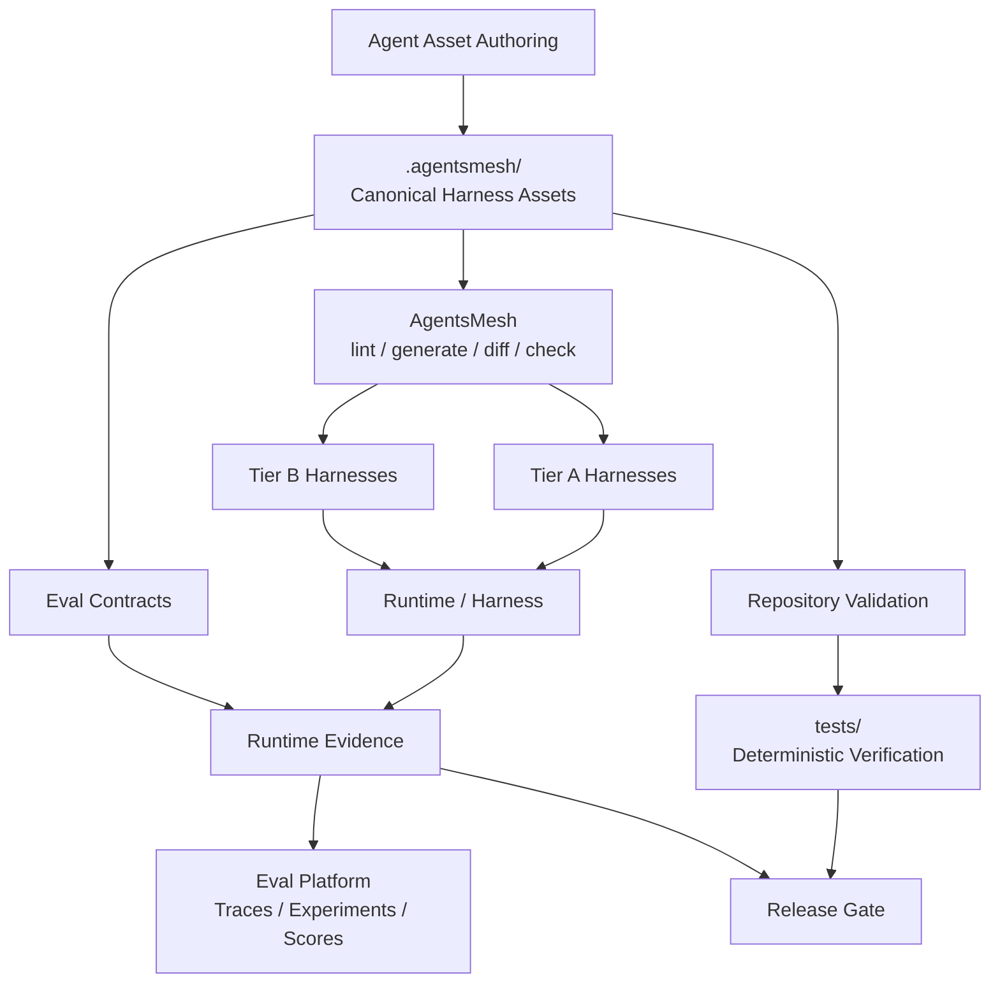
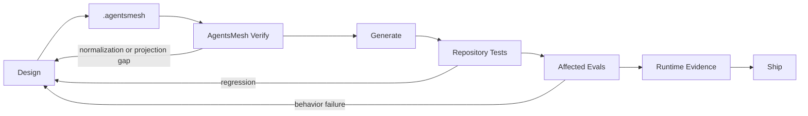

# Project EXODUS — AgentsMesh 대이주 계획

> **Status:** Planned  
> **Scope:** Repository architecture, Agent Asset authority, harness projection, validation, evaluation  
> **Execution:** 이 문서는 계획만 정의한다. 실제 migration은 별도 작업으로 수행한다.

## 선언

이번 대이주의 목적은 단순히 Rulesync를 AgentsMesh로 교체하는 것이 아니다.

`mols-agent-assets`가 직접 떠안아 온 harness별 자산 변환, 배치, compatibility, link rewriting, drift 관리 책임을 AgentsMesh에 위임하고, 저장소의 중심을 **Agent Asset 개발·검증·평가·회귀 관리**로 옮긴다.

현재 저장소는 `src/`를 자산 source workspace로 사용하고 `Author → Validate → Deploy` 흐름을 따른다. 대이주가 완료되면 AgentsMesh가 자연스럽게 표현할 수 있는 multi-harness 자산은 `.agentsmesh/`가 canonical source가 된다.

새 원칙은 하나다.

> **Harness engineering은 AgentsMesh에게 맡기고, Agent Asset engineering은 이 저장소가 소유한다.**

이 migration은 AgentsMesh 위에 또 다른 projection framework를 만드는 작업이 아니다. AgentsMesh가 이미 소유하는 canonicalization, target conversion, generated drift와 compatibility 기능은 그대로 사용한다. 이 저장소는 그 위에서 asset semantics, quality contract, validation과 eval만 소유한다.

## 목표 상태



AgentsMesh는 canonical representation, target projection, import/conversion, structural compatibility와 drift 검증을 담당한다.

이 저장소는 asset doctrine, semantic quality, deterministic validation, behavioral eval, routing eval, adversarial eval, regression, runtime evidence policy와 development lifecycle을 계속 소유한다.

## 목표 Repository Topology

```text
mols-agent-assets/
├── .agentsmesh/
│   ├── rules/
│   ├── commands/
│   ├── agents/
│   ├── skills/
│   ├── mcp.json
│   ├── hooks.yaml
│   ├── permissions.yaml
│   ├── ignore
│   └── lessons/                    # 후속 검토
│
├── evals/                          # 공통 / cross-asset eval만
│   ├── routing/
│   ├── behavior/
│   ├── adversarial/
│   └── regression/
│
├── tests/
│   ├── assets/
│   ├── tooling/
│   └── integration/
│
├── src/
│   ├── prompts/                    # Command로 자연스럽게 이주하지 않는 Prompt
│   ├── skills-chatbot/             # 초기 유지
│   ├── skills-chatbot-runtime/     # 초기 유지
│   └── tooling/                    # 실제 필요가 있을 때만
│
├── scripts/
├── docs/
├── agentsmesh.yaml
└── generated harness surfaces
```

`src/` 자체를 제거하는 것이 목표는 아니다. AgentsMesh가 자연스럽게 소유할 수 있는 자산만 이동한다.

Package 고유 Eval은 package 안에 남길 수 있다. 예를 들어 특정 validator package만을 검증하는 fixture를 root `/evals`로 끌어올리는 것은 목적이 아니다.

## 책임 경계

| 영역 | Owner |
| --- | --- |
| Canonical multi-harness configuration | `.agentsmesh/` |
| Target-specific projection | AgentsMesh |
| Import / conversion | AgentsMesh |
| Projection compatibility lint | AgentsMesh |
| Generated drift | AgentsMesh |
| Agent Asset doctrine | `mols-agent-assets` |
| Deterministic repository tests | `mols-agent-assets` |
| Shared behavioral / routing / adversarial eval | root `/evals` |
| Package-specific eval | owning package |
| Runtime eval execution | repository runner / observable harness |
| Traces / experiment history / score analytics | Langfuse-class eval platform |

## 대이주의 불변 원칙

### Single Authority

AgentsMesh가 담당하는 자산은 `.agentsmesh/`가 유일한 source가 되어야 한다.

다음 상태는 migration 실패다.

```text
src/rules/foo.md
.agentsmesh/rules/foo.md
AGENTS.md
.github/instructions/foo.instructions.md
```

이 중 무엇이 원본인지 다시 판단해야 한다면 대이주의 목적을 달성하지 못한 것이다.

### Generated Means Generated

AgentsMesh가 관리하는 generated surface는 직접 수정하지 않는다.

예시는 다음과 같다.

```text
AGENTS.md
CLAUDE.md
.cursor/*
.codex/*
.github/copilot-instructions.md
.github/instructions/*
.agents/*
```

단, 실제로 AgentsMesh가 관리한다고 확인된 path에만 이 규칙을 적용한다. `.github/workflows/`, PR template처럼 AgentsMesh가 관리하지 않는 sibling surface는 기존 repository authority를 유지한다.

AgentsMesh-managed root 파일을 generated로 승격하기 전에 기존 root instruction의 모든 책임을 `.agentsmesh/rules/_root.md`, scoped rule 또는 명시적 예외 owner에 먼저 매핑한다.

### Use AgentsMesh, Do Not Rebuild AgentsMesh

다음과 같은 shadow framework를 migration의 기본 구조로 만들지 않는다.

```text
our canonical schema
→ our projection adapter
→ AgentsMesh canonical schema
→ AgentsMesh projection
```

AgentsMesh가 실제로 반복해서 해결하지 못하는 구체적 한계가 확인되기 전에는 wrapper compiler, parallel schema, custom IR 또는 target abstraction을 만들지 않는다.

### Target Capability Is Evidence, Not Ambition

AgentsMesh가 target을 지원한다고 해서 모든 feature가 모든 target에서 동일하게 동작하는 것은 아니다.

Migration은 반드시 다음 feature 단위로 capability를 본다.

```text
rules
additional rules
commands
agents
skills
mcp
hooks
ignore
permissions
```

지원 수준은 `native`, `embedded`, `partial`, `none`을 구분한다. `partial`이나 `none`을 성공으로 포장하지 않는다.

### Eval Authority Is Independent

```text
.agentsmesh/ = 실행될 자산
/evals       = 공통 평가 계약
package/evals = package 고유 평가 계약
```

평가 대상과 평가 기준의 authority를 분리한다.

### Runtime Claims Require Runtime Evidence

`generate`, `lint`, `diff`, round-trip 성공은 runtime behavior 성공을 증명하지 않는다.

```text
projection success != behavioral success
```

실제 trigger, task completion, tool behavior, semantic quality, stability는 별도 runtime evidence와 eval로 판정한다.

### Generated Artifacts Are Committed for Active Targets

초기 운영은 AgentsMesh 공식 adoption model을 따른다.

```text
canonical source
+
generated active-target outputs
+
agentsmesh.yaml
```

을 함께 commit한다.

이렇게 하면 PR에서 normalization과 projection 변화가 보이고, 서비스 이동 시 이미 생성된 target configuration을 바로 사용할 수 있다.

단, 지원하는 모든 target을 생성하지 않는다. 실제 사용할 target만 active target으로 지정한다.

## 자산별 초기 이주 판정

| Current | Target | Initial Decision |
| --- | --- | --- |
| `src/rules/` | `.agentsmesh/rules/` | 전면 이주 후보 |
| `src/agents/` | `.agentsmesh/agents/` | 강한 이주 후보, target capability 확인 필수 |
| `src/skills/` | `.agentsmesh/skills/` | 강한 이주 후보 |
| `src/prompts/` | `.agentsmesh/commands/` 또는 유지 | 개별 의미 판정 |
| `src/skills-chatbot/` | 유지 | hosted chatbot 전용 profile |
| `src/skills-chatbot-runtime/` | 유지 | hosted/runtime 전용 profile |
| `src/scripts/` | 유지 또는 정리 | harness asset 아님 |
| `tests/` | 유지 및 확대 | repository verification |
| root `/evals` | 신규 | shared / cross-asset eval |
| package-local `evals/` | 유지 가능 | package-owned eval |
| `docs/` | 유지 및 재구성 | doctrine와 architecture |
| `.agents/` | generated / exception 판정 | 현재 source responsibility를 inventory |
| `AGENTS.md` 등 target output | generated 후보 | authority migration 이후 직접 편집 금지 |

`Prompt → Command`는 기계적으로 변환하지 않는다. Harness-invocable reusable prompt만 AgentsMesh command로 이동한다.

---

# Migration Campaign

## Phase 0 — The Census

**목표:** 이동 전에 현재 자산, 권위, target capability와 검증 근거를 완전히 inventory한다.

이 단계에서는 source authority를 옮기지 않는다.

산출물:

- Asset Inventory
- Authority Map
- Projection Map
- Validation Map
- Migration Classification
- Preservation Contract
- Active Target Set
- Target × Capability Matrix
- Baseline Eval Map

각 asset에 대해 최소한 다음을 기록한다.

| Question | Evidence |
| --- | --- |
| 현재 canonical source는 어디인가 | path |
| asset type은 무엇인가 | Rule / Skill / Prompt / Agent |
| target-specific인가 | yes/no |
| AgentsMesh에서 자연스럽게 표현 가능한가 | yes/partial/no |
| 어떤 target에서 필요한가 | target set |
| target별 support level은 무엇인가 | native / embedded / partial / none |
| generated sibling은 무엇인가 | paths |
| 기존 deterministic test가 있는가 | test evidence |
| 기존 Eval이 있는가 | shared / package-local / none |
| runtime behavior가 중요한가 | yes/no |
| migration action | move / adapt / keep / retire |

### Active Target Policy

모든 AgentsMesh target을 migration gate에 넣지 않는다.

```text
Tier A = 실제로 상시 사용하며 cutover를 막을 수 있는 target
Tier B = 필요할 때 generate하고 검증하는 target
Tier C = plugin / experimental / future target
```

Tier A target만 mandatory cutover gate로 사용한다.

실제 target 목록은 Phase 0에서 현재 사용 환경과 AgentsMesh support matrix를 근거로 확정한다. 지원 개수 자체를 성과로 보지 않는다.

**Gate:** 모든 이동 대상의 목적지와 target별 capability가 설명되고, baseline이 필요한 behavior가 식별되기 전에는 migration을 시작하지 않는다.

## Phase 1 — Raise the New Capital

**목표:** `.agentsmesh/`와 AgentsMesh toolchain을 도입하되 기존 authority는 아직 제거하지 않는다.

초기 작업:

- 구현 시점의 AgentsMesh 버전을 확인하고 exact version pin
- lockfile 또는 동등한 dependency lock 유지
- `agentsmesh.yaml`
- Tier A target만 우선 등록
- 필요한 feature만 명시
- 최소 `.agentsmesh/rules/_root.md`
- 기존 config import / canonical review
- `agentsmesh lint`
- `agentsmesh generate`
- `agentsmesh diff`
- `agentsmesh check`
- `agentsmesh generate --check`

`agentsmesh diff`는 최초 migration에서 특별히 중요하다. Import 후 generate 결과가 기존 native configuration과 어떻게 normalization되었는지 사람이 검토한다.

### Generated Output Policy

Tier A generated outputs은 canonical source와 함께 commit한다.

```text
.agentsmesh/
agentsmesh.yaml
<generated Tier A target directories/files>
```

Target를 추가할 때는 `agentsmesh.yaml` 변경과 generated artifacts를 같은 변경으로 다룬다.

### Deferred Features

초기 migration에서는 다음을 기본적으로 열지 않는다.

- Lessons
- remote packs
- custom target plugins
- 복잡한 hooks
- 자체 AgentsMesh wrapper

대이주와 새로운 runtime behavior를 동시에 도입하지 않는다.

**Gate:** 초기 canonical import와 regeneration의 normalization diff가 설명 가능해야 한다.

## Phase 2 — The Witnesses

**목표:** 첫 canonical cutover 전에 비교 가능한 증거를 확보한다.

기존 계획처럼 Eval을 migration 뒤에 만들지 않는다. 그 경우 migration 전 behavior를 잃어버려 보존 여부를 제대로 판단할 수 없다.

### Eval Placement

공통 Eval만 root에 둔다.

```text
evals/
├── routing/
├── behavior/
├── adversarial/
└── regression/
```

특정 package의 구현만을 검증하는 Eval은 package-local에 남긴다.

예:

```text
src/skills-chatbot-runtime/mols-agent-asset-validator/evals/
```

이런 package 고유 corpus를 구조 통일만을 위해 root로 옮기지 않는다.

### Initial Baseline

초기 우선순위:

```text
positive routing
negative routing
near-miss routing
known failure regression
critical behavior smoke
```

모든 asset을 거대한 Eval suite로 만들 필요는 없다. Migration 중 semantics 손실 가능성이 큰 asset과 자주 사용하는 asset부터 baseline을 만든다.

### Evidence Classes

```text
static
simulation
runtime
human
```

실제 target에서 실행하지 않은 결과를 runtime이라고 부르지 않는다.

**Gate:** cutover 대상의 중요한 behavior가 최소한 어떤 evidence로 보호될지 결정되어 있어야 한다.

## Phase 3 — The First Crossing

**목표:** Rules를 첫 canonical migration 대상으로 삼는다.

```text
src/rules/*
    ↓
.agentsmesh/rules/*
    ↓
AgentsMesh generate
    ↓
harness-native rules
```

보존 대상:

- root instruction
- scope
- glob
- always-on 여부
- precedence
- meaningful exclusions
- repository-local rule authority
- referenced paths and contracts

### Root Authority Gate

현재 `AGENTS.md`처럼 repository operation을 실제로 지배하는 파일을 generated artifact로 바꾸기 전에 다음을 완료한다.

1. 현재 root instruction의 책임을 inventory한다.
2. portable responsibility는 `.agentsmesh/rules/_root.md` 또는 scoped rule에 옮긴다.
3. portable하지 않은 responsibility는 명시적 owner를 남긴다.
4. generated root 파일이 기존 repository authority를 덮어쓰지 않는지 diff한다.
5. root fallback / nested instruction behavior를 다시 검증한다.

**Gate:** 설명되지 않은 semantic loss나 authority loss가 하나라도 있으면 Rules cutover를 금지한다.

## Phase 4 — The Skills Exodus

**목표:** portable Skill과 Agent를 canonical territory로 이동한다.

```text
src/skills/foo/
    ↓
.agentsmesh/skills/foo/

src/agents/bar.*
    ↓
.agentsmesh/agents/bar.*
```

보존 대상:

- Skill name
- description
- activation intent
- supporting resources
- relative links
- Agent role
- tools
- permissions
- model hints
- authority

### Capability-aware Migration

Agent와 Skill을 한 묶음으로 모든 target에 동일하게 projection된다고 가정하지 않는다.

예를 들어 어떤 Tier A target이 Skills는 native지만 Agents는 지원하지 않을 수 있다. 이 경우 선택지는 다음뿐이다.

```text
accept target limitation
use an evidenced AgentsMesh conversion
keep a bounded target-specific exception
remove that feature from the target contract
```

지원하지 않는 기능을 조용히 성공으로 취급하지 않는다.

### Round-trip Gate

중요 asset은 다음 round-trip을 확인한다.

```text
canonical
→ generate
→ import
→ canonical
→ generate --check
```

Round-trip 성공만으로 runtime parity를 주장하지는 않는다.

**Gate:** Tier A target의 critical Skill/Agent semantics와 links가 보존되어야 한다.

## Phase 5 — The Borderlands

**목표:** AgentsMesh가 자연스럽게 소유하지 못하는 profile을 억지로 흡수하지 않는다.

초기에는 다음을 유지한다.

```text
src/prompts/
src/skills-chatbot/
src/skills-chatbot-runtime/
```

### Prompt Boundary

`src/prompts/` 중 reusable harness command semantics와 맞는 것만 `.agentsmesh/commands/`로 이동한다.

다음은 그대로 남을 수 있다.

- 특정 chatbot 서비스용 orchestration Prompt
- repository administration Prompt
- AgentsMesh command contract와 맞지 않는 one-shot workflow

### Hosted Chatbot Boundary

`skills-chatbot`과 `skills-chatbot-runtime`은 coding harness Skill과 다른 hosted chatbot/runtime profile이다.

AgentsMesh plugin이나 다른 distribution mechanism이 실제로 더 나은 authority와 검증을 제공한다는 증거가 생길 때만 재검토한다.

> `.agentsmesh/` 하나로 모든 파일을 통일하는 것이 목표가 아니다. 하나의 책임에 하나의 권위만 존재하게 만드는 것이 목표다.

## Phase 6 — The Coronation

**목표:** `.agentsmesh/`를 AgentsMesh-managed assets의 공식 canonical source로 승격한다.

기존 pipeline:

```text
Author in src/
→ Validate
→ Deploy
```

새 pipeline:

```text
Author in .agentsmesh/
→ AgentsMesh lint
→ Generate / Diff / Check
→ Deterministic Validation
→ Affected Evals
→ Deploy
```

이 단계에서 root `AGENTS.md`, README, development/testing docs와 관련 reference의 authority 설명을 새 구조에 맞춘다.

저장소의 목표 정체성은 다음과 같다.

> **`mols-agent-assets`는 AgentsMesh를 사용해 multi-harness Agent Assets를 canonical하게 관리하고, 자체 검증·평가 체계를 통해 그 품질과 행동을 개발하는 저장소다.**

### Cutover Rule

`src/`와 `.agentsmesh/`를 영구 dual-source 상태로 두지 않는다.

```text
copy / import
→ compare
→ baseline eval
→ cutover
→ retire old source
```

각 asset family는 cutover가 끝나는 순간 authority를 하나로 만든다.

## Phase 7 — The Iron Gate

**목표:** AgentsMesh verification과 repository verification을 하나의 저비용 pipeline으로 연결한다.

검증 계층:

```text
L0  Markdown / schema
L1  agentsmesh lint
L2  agentsmesh diff where migration/normalization matters
L3  agentsmesh check
L4  agentsmesh generate --check
L5  repository deterministic tests
L6  affected eval corpus
L7  runtime trials when justified
```

### Local Fast Path

```text
changed files
→ formatting / static checks
→ agentsmesh lint
→ agentsmesh check
```

비싼 것부터 돌리는 우매한 CI는 만들지 않는다.

### CI Full Path

```text
agentsmesh lint
agentsmesh check
agentsmesh generate --check
repository tests
affected deterministic eval validation
```

Model-based runtime eval은 모든 PR에서 의무 실행하지 않는다.

권장 실행 조건:

- critical behavior change
- Skill/Agent activation contract change
- AgentsMesh dependency upgrade
- release candidate
- scheduled regression run
- explicit deep validation

### No Shadow Compatibility Suite

AgentsMesh가 이미 vendor capability matrix와 projection correctness를 검증하는 영역을 그대로 복제하지 않는다.

우리 tests는 다음에 집중한다.

```text
our asset invariants
our authority contracts
our critical generated outputs
our known regressions
our behavior expectations
```

AgentsMesh 자체를 재시험하는 범용 compatibility laboratory가 되는 것은 목표가 아니다.

## Phase 8 — The Observatory

**목표:** 실제 LLM behavior를 관측하고 비교할 수 있는 runtime evaluation layer를 붙인다.

Langfuse는 유력한 첫 선택이지만 repository architecture는 Langfuse에 종속되지 않는다.

```text
Git eval contracts
    ↓
Local / CI Eval Runner
    ↓
Observable Harnesses
    ↓
Results / Traces / Scores
    ↓
Langfuse
```

### Authority Contract

```text
Git /evals      = shared canonical evaluation contracts
package/evals   = package-specific canonical contracts
local runner    = evaluation execution and gate result
Langfuse        = experiment history, traces, scores, analytics
```

Langfuse 자체를 canonical Eval source로 만들지 않는다.

### Dataset Projection

Langfuse의 experiment comparison이 필요하면 Git Eval corpus를 Langfuse Dataset으로 projection한다.

```text
Git eval case
→ stable case id
→ Langfuse Dataset item
→ Experiment run
```

초기 sync 방향은 one-way다.

```text
Git → Langfuse
```

Langfuse UI에서 수정된 dataset item을 자동으로 Git canonical에 역수입하지 않는다. 필요한 수정은 Git에서 review 후 다시 sync한다.

### Gate Independence

Langfuse 장애나 계정 변경 때문에 deterministic repository gate가 멈추지 않아야 한다.

Runtime/model evaluation에서 Langfuse가 필요할 경우에도 pass/fail 의미와 eval case 자체는 repository가 소유한다.

따라서 향후 다른 evaluation platform으로 이동해도 `/evals`를 다시 설계하지 않는 것을 목표로 한다.

## Phase 9 — The Purge

**목표:** 새 authority가 검증된 뒤 구세계의 중복 source와 projection 책임을 제거한다.

퇴역 후보:

- `src/rules/`
- `src/agents/`
- AgentsMesh로 완전히 이주한 `src/skills/`
- Rulesync-specific projection machinery
- Rulesync-specific documentation
- 중복 vendor profile logic
- obsolete INDEX paths
- legacy generated-source assumptions

기존 `rulesync-agent-assets` Skill은 이 단계에서 retire 또는 명확한 새 책임으로 재정의한다. 이름만 바꿔 responsibility가 사라진 Skill을 남기지 않는다.

Legacy source는 cutover gate를 통과하기 전까지 삭제하지 않는다.

```text
copy / adapt
→ verify
→ cutover
→ delete legacy
```

---

# Supporting Architecture

## Index와 Discovery

Asset index는 source가 아니라 derived metadata다.

```text
Canonical Assets
    ↓
Index generation
    ↓
INDEX.jsonl
```

일반 Skill의 canonical source가 `.agentsmesh/skills/`로 이동하면 index metadata와 routing path도 새 authority에 맞춰 재설계한다.

초기 방향:

```text
.agentsmesh/skills/          → portable/general Skill index
src/skills-chatbot/          → chatbot-specific index
src/skills-chatbot-runtime/  → runtime chatbot index
```

Index generator는 canonical path를 읽어야 하며 generated target directory를 다시 source처럼 읽지 않는다.

## AgentsMesh Lessons 도입 정책

Lessons는 recall/capture와 token-budgeted memory 측면에서 매력적이지만 초기 migration의 필수 요소로 두지 않는다.

먼저 다음을 안정시킨다.

```text
asset migration
projection correctness
baseline eval
runtime evidence path
```

그 뒤 `Without Lessons`와 `With Lessons`를 실제 eval로 비교한다.

다음이 의미 있게 개선될 때 정식 채택한다.

- 반복 실패
- recall precision
- task success
- context/token cost
- operator burden

재미있어 보인다는 이유만으로 항상-on context를 늘리지 않는다.

## Dependency Upgrade Policy

AgentsMesh version upgrade는 일반 dependency bump보다 강하게 다룬다.

```text
version change
→ release / support matrix review
→ generated diff
→ lint / check / generate --check
→ repository tests
→ affected evals
→ sampled runtime smoke when material
```

`latest`를 semantic infrastructure의 implicit dependency로 사용하지 않는다.

Upgrade failure가 발생하면 다음 순서로 대응한다.

```text
pin previous version
→ isolate regression
→ upstream issue / patch
→ plugin or bounded workaround
→ fork only if sustained need exists
```

## Failure and Escape Strategy

### Projection Bug

Canonical semantics가 정상이지만 target projection이 틀리면 upstream issue, version pin, plugin 또는 최소 patch로 대응한다.

### Abstraction Gap

AgentsMesh canonical model이 필요한 semantics를 표현하지 못하면 억지 변환하지 않는다.

해당 profile은 별도 authority를 유지하고, 반복되는 필요가 확인될 때만 plugin이나 adapter를 고려한다.

### Upstream Stagnation

AgentsMesh는 작은 community를 가진 신생 dependency이므로 다음 안전장치를 유지한다.

- exact version pin
- committed canonical source
- committed active-target outputs
- Git-based eval corpus
- framework-independent repository tests
- 불필요한 wrapper abstraction 금지
- plugin, patch 또는 fork 가능성 보존

### Eval Platform Change

Langfuse를 교체하더라도 다음은 바뀌지 않아야 한다.

```text
Eval case identity
expected behavior
grader semantics
evidence requirement
repository pass/fail contract
```

---

# Cutover Gates

| Gate | Pass Condition |
| --- | --- |
| Inventory | 이동 대상과 보존 책임이 inventory됨 |
| Target Scope | Tier A/B가 명확하고 무의미한 all-target generation이 없음 |
| Capability | Tier A의 target × feature support가 확인됨 |
| Authority | AgentsMesh-managed asset에 복수 canonical source가 없음 |
| Root Authority | 기존 root instruction responsibility가 새 owner에 매핑됨 |
| Fidelity | 중요 semantics migration mapping 완료 |
| Normalization Diff | 최초 import/generate 차이가 검토되고 설명됨 |
| Projection | Tier A harness에서 generation 성공 |
| Lint | blocker 수준 target compatibility 오류가 없음 |
| Drift | `agentsmesh check` 통과 |
| Regeneration | `agentsmesh generate --check` 통과 |
| Round-trip | 중요 asset import/generate 보존 확인 |
| Eval Baseline | critical behavior의 pre-cutover 기준 또는 explicit exemption 존재 |
| Repository Tests | deterministic regression 없음 |
| Runtime Smoke | 필요한 Tier A harness에서 실제 smoke evidence 확보 |
| Docs | README, AGENTS, development/testing docs, references가 새 authority와 일치 |
| Legacy | obsolete source 제거 또는 명시적 exception으로 남음 |
| Rollback | migration 이전 상태로 복구 가능한 Git point 존재 |

`partial` support를 이유 없이 통과시키거나 runtime 검증 없이 behavioral parity를 선언하면 Gate 실패다.

---

# Git 전략

Migration implementation은 장수 branch에서 진행하되 Phase별 atomic commit으로 나눈다.

권장 branch:

```text
agent/refactor/agentsmesh-migration
```

예상 commit sequence:

```text
chore: establish AgentsMesh migration census
chore: pin AgentsMesh toolchain
feat(evals): establish pre-migration behavior baseline
refactor(rules): migrate canonical rules to AgentsMesh
refactor(skills): migrate portable skills to AgentsMesh
refactor(agents): migrate agent definitions
refactor(prompts): migrate compatible commands to AgentsMesh
test: add AgentsMesh authority and projection gates
docs: cut over repository authority
refactor: remove retired legacy sources
```

Draft PR은 migration 전체의 living review surface로 사용한다.

`main`에 다음과 같은 반쪽 authority를 오래 누적하지 않는다.

```text
src/rules = old source
.agentsmesh/rules = new source
AGENTS.md = 누가 고치는지 모름
```

각 family는 검증 후 한 번에 cutover한다.

---

# Definition of Done

대이주가 끝난 뒤 새로운 기여자가 portable Agent Asset을 수정할 때 다음 흐름만 이해하면 된다.

```text
Agent-facing portable asset 수정
    ↓
.agentsmesh/ 수정
    ↓
agentsmesh lint
    ↓
agentsmesh generate
    ↓
agentsmesh check
    ↓
repository tests / affected evals
    ↓
commit canonical + generated outputs
```

다음 질문이 다시 필요해지면 migration은 실패다.

```text
AGENTS.md를 직접 고쳐야 하나?
src/rules가 원본인가?
Copilot용 파일은 어디서 고치지?
Codex Skill을 따로 복사해야 하나?
이 generated file이 source인가?
이 기능이 이 target에서 정말 지원되나, 그냥 생성만 된 건가?
```

대이주의 목적은 파일 이동이 아니라 **이 질문들을 역사로 만드는 것**이다.

## 최종 운영 모델



## 대이주의 헌장

> 우리는 더 이상 각 AI harness의 파일 형식을 손으로 섬기지 않는다.
>
> `.agentsmesh/`에 의도를 작성하고 AgentsMesh에게 번역을 맡긴다.
>
> 우리는 AgentsMesh를 도입하면서 AgentsMesh의 그림자를 다시 만들지 않는다.
>
> 지원 행렬을 희망사항으로 읽지 않는다. `partial`은 `partial`이고 `none`은 `none`이다.
>
> 우리는 translation glue가 아니라 **Agent Asset의 품질**을 개발한다.
>
> 구조적 진실은 deterministic validation으로 증명한다.
>
> 행동의 진실은 Eval과 runtime evidence로 증명한다.
>
> Eval은 migration 이후의 장식이 아니라 migration 이전부터 존재하는 증인이다.
>
> 생성물은 원본인 척하지 않는다.
>
> 검증되지 않은 호환성을 호환된다고 부르지 않는다.
>
> 프레임워크가 대신할 수 있는 일을 다시 만들지 않는다.
>
> 프레임워크가 대신할 수 없는 판단·품질·회귀·평가에 우리의 시간을 쓴다.

## References

- AgentsMesh repository: <https://github.com/sampleXbro/agentsmesh>
- AgentsMesh documentation: <https://samplexbro.github.io/agentsmesh/>
- AgentsMesh canonical configuration: <https://samplexbro.github.io/agentsmesh/canonical-config/>
- AgentsMesh adoption guide: <https://samplexbro.github.io/agentsmesh/guides/existing-project/>
- AgentsMesh supported tools matrix: <https://samplexbro.github.io/agentsmesh/reference/supported-tools/>
- Langfuse evaluation overview: <https://langfuse.com/docs/evaluation/overview>
- Langfuse experiment data model: <https://langfuse.com/docs/evaluation/experiments/data-model>
