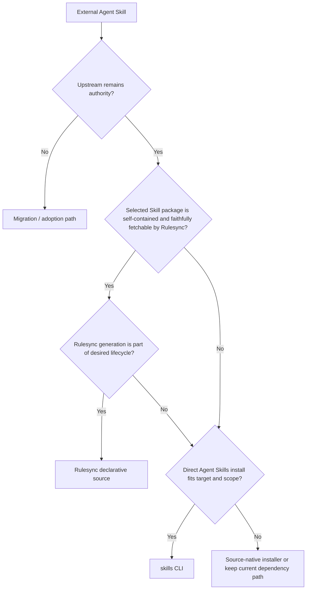

# External Skill Dependency Routing

외부 Agent Skill을 dependency로 사용할 때 **하나의 installer로 통일하는 것보다 upstream Skill과 runtime semantics를 가장 충실하게 보존하는 경로를 선택**하는 패턴입니다.

## Purpose

같은 표준 Agent Skill이라도 저장소 구조, supporting resources, 설치 scope와 target별 delivery 방식은 다를 수 있습니다. Dependency manager는 단순히 `SKILL.md`를 가져오는 데서 끝나지 않고 다음 상태를 함께 보존해야 합니다.

- 어느 upstream과 revision을 사용하는지
- Skill package에 필요한 resource가 빠지지 않는지
- project 또는 user scope와 target별 설치 위치가 의도와 맞는지
- reinstall과 update가 같은 dependency identity를 유지하는지

이 패턴은 Rulesync와 skills CLI를 경쟁 도구로 보지 않고 **서로 다른 dependency 경로**로 사용합니다.

## Core

- 외부 upstream을 계속 authority로 두면 authored source로 흡수하지 않고 dependency로 관리합니다.
- 한 dependency의 source selection과 lock/update 책임은 한 경로만 소유합니다. 같은 Skill을 Rulesync lock과 skills CLI lock에 동시에 등록하지 않습니다.
- Tool compatibility보다 **semantic fidelity와 lifecycle fit**을 먼저 봅니다.
- Lock과 설치 결과는 dependency state이지 local authored source가 아닙니다.
- 더 단순한 경로가 같은 결과를 보존하면 그 경로를 선택합니다.

## Routing

| 상황 | 보통 선택 | 이유 |
| --- | --- | --- |
| Skill directory가 self-contained이고 Rulesync가 package를 손실 없이 가져올 수 있음 | Rulesync declarative sources | source declaration, resolved revision과 integrity, generation을 하나의 Rulesync lifecycle로 관리하기 쉬움 |
| Repository가 이미 Rulesync를 canonical multi-target distribution layer로 사용함 | Rulesync declarative sources | 외부 Skill도 같은 install → generate 흐름에 둘 수 있음 |
| 표준 Skill을 target runtime의 project/global Skill 위치에 직접 설치하는 것이 목적 | skills CLI | Agent Skills 설치·target·scope·update lifecycle을 직접 다룸 |
| 여러 agent에 같은 표준 Skill을 배포하고 Rulesync 변환이나 projection이 필요하지 않음 | skills CLI | 불필요한 intermediate representation을 만들지 않음 |
| Skill이 directory 밖 resource, symlink, vendor-specific agent·command·extension 또는 source-native installer에 의존함 | 둘 중 충실한 경로를 검증하고, 필요하면 source-native installer 유지 | 일부만 설치된 상태를 정상 dependency처럼 만들지 않음 |

Rulesync를 사용한다는 이유만으로 모든 외부 Skill을 Rulesync source로 바꾸지 않습니다. 반대로 표준 Agent Skill이라는 이유만으로 항상 skills CLI를 선택하지도 않습니다.

## Rulesync Path

Rulesync declarative source가 적합한 전형적인 Skill은 다음처럼 **선택한 Skill directory 자체가 runtime package를 완결**합니다.

```text
upstream/
└─ skills/
   └─ review-pr/
      ├─ SKILL.md
      ├─ references/
      └─ scripts/
```

대표적인 dependency surface는 다음과 같습니다.

```jsonc
{
  "sources": [
    {
      "source": "owner/repo",
      "ref": "main",
      "skills": ["review-pr"]
    }
  ]
}
```

일반적인 lifecycle은 다음과 같습니다.

```text
rulesync.jsonc
    ↓
rulesync install
    ↓
rulesync.lock
    ↓
.rulesync/skills/.curated/
    ↓
rulesync generate
    ↓
target runtime surfaces
```

Git source의 lock은 requested ref를 실제 commit revision으로 resolve하고 artifact integrity를 기록할 수 있습니다. 이미 lock된 상태를 재현할 때는 일반 install을 사용하고, upstream ref를 다시 resolve하려는 의도적인 update에서는 Rulesync의 update install 경로를 사용합니다.

이 경로는 특히 **repository-local dependency + Rulesync generation**을 하나의 lifecycle로 유지하고 싶을 때 잘 맞습니다.

## skills CLI Path

skills CLI는 표준 Agent Skill을 runtime이 사용하는 Skill location에 직접 설치하는 경로가 더 자연스러울 때 적합합니다.

```text
upstream Skill
    ↓
skills add
    ↓
project or global Skill installation
    ↓
skills-lock.json
    ↓
skills update
```

skills CLI는 source와 Skill을 선택하고 project/global scope, target agent와 copy/symlink 설치 방식을 다룹니다. Project dependency에는 `skills-lock.json`으로 source, ref, `skillPath`와 installed Skill content hash 같은 상태를 기록할 수 있습니다.

이 경로는 다음과 같은 경우 단순합니다.

- Rulesync authoring이나 target projection이 필요하지 않음
- Agent Skills package를 가능한 그대로 설치하고 싶음
- user/global Skill installation이 주된 목적임
- target별 표준 Skill directory 배치가 dependency lifecycle의 핵심임

## Fidelity Gate

Tool을 결정하기 전에 **선택한 경로가 실제 Skill package를 완결해서 설치하는지** 확인합니다.

예를 들어 다음 구조는 `SKILL.md` 하나만 가져와서는 충분하지 않을 수 있습니다.

```text
upstream/
├─ skills/humanize/
│  ├─ SKILL.md
│  └─ references -> ../../shared/references
├─ shared/references/
├─ agents/
├─ scripts/
└─ install.sh
```

확인할 것은 단순합니다.

1. Skill 본문이 참조하는 resource가 설치 결과에도 존재하는가?
1. Skill directory 밖의 script·agent·extension이 실제 runtime behavior에 필요한가?
1. Symlink나 package-relative path가 materialization 과정에서 보존되는가?
1. Target과 scope가 upstream이 의도한 설치 방식과 같은가?
1. Update 후에도 같은 dependency identity와 필요한 resource가 유지되는가?

하나라도 보존되지 않으면 **설치 성공을 semantic parity로 간주하지 않습니다.** Rulesync 또는 skills CLI가 일부만 표현할 수 있다면 source-native installer를 유지하거나 upstream package가 self-contained해질 때까지 통합을 미룹니다.

## Typical Decision Flow



이 flow는 rigid priority가 아닙니다. 핵심은 **dependency를 가장 적은 adaptation으로 충실하게 유지하는 경로**를 찾는 것입니다.

## Anti-patterns

- 같은 Skill을 `rulesync.lock`과 `skills-lock.json` 양쪽에서 독립적으로 update합니다.
- Rulesync가 읽을 수 있다는 이유만으로 supporting resources가 빠지는 package를 강제로 변환합니다.
- skills CLI가 많은 target을 지원한다는 이유만으로 upstream의 별도 agents, commands, extensions까지 같은 Skill payload라고 가정합니다.
- Generated 또는 installed copy를 local canonical source처럼 직접 수정합니다.
- Lockfile이 있다는 이유만으로 실제 설치 결과의 resource completeness를 검증하지 않습니다.
- Tool 통일 자체를 목표로 삼아 더 단순하고 충실한 native lifecycle을 제거합니다.

## Extensions

규모가 커지면 dependency마다 다음 정도의 metadata를 별도 manifest나 inventory에 둘 수 있습니다.

```text
identity
upstream
installation path owner
update owner
scope / targets
exception reason, if any
```

다만 Rulesync와 skills CLI가 이미 소유하는 lock metadata를 다시 복제하지 않습니다. 별도 inventory는 **왜 특정 경로를 선택했는지 복원할 필요가 있을 때만** 추가합니다.

## References

- [Rulesync Declarative Sources](https://github.com/dyoshikawa/rulesync/blob/main/docs/guide/declarative-sources.md)
- [Rulesync](https://github.com/dyoshikawa/rulesync)
- [skills CLI](https://github.com/vercel-labs/skills)
- [Agent Skills Specification](https://agentskills.io/specification)

## Boundary

이 패턴은 특정 repository의 mandatory dependency policy, 각 도구의 전체 CLI contract, Agent Skill authoring 규격이나 vendor runtime semantics를 재정의하지 않습니다. 실제 지원 범위와 command behavior는 사용 시점의 upstream tool과 target runtime을 확인합니다.
