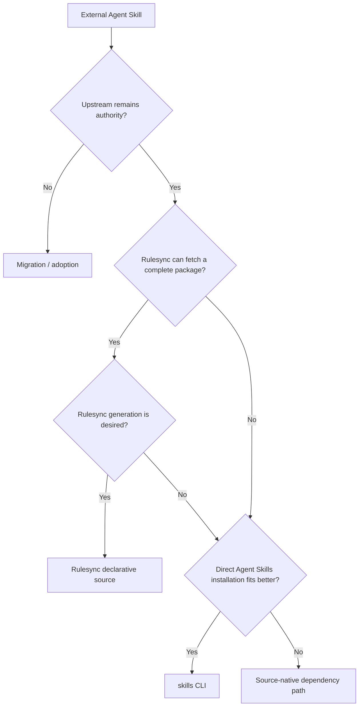

# External Skill Dependency Routing

외부 Agent Skill을 dependency로 사용할 때 **도구를 하나로 통일하기보다 upstream Skill과 runtime semantics를 가장 충실하게 보존하는 설치 경로를 선택**하는 패턴입니다.

## Purpose

표준 Agent Skill이라도 package 구조, supporting resources, 설치 scope와 target별 delivery 방식은 다를 수 있습니다. 따라서 `SKILL.md`를 읽을 수 있다는 사실만으로 적합한 dependency 경로라고 판단하지 않습니다.

이 패턴은 Rulesync와 skills CLI를 경쟁 도구가 아니라 **서로 다른 상황에 맞는 dependency 경로**로 봅니다.

## Core

- 외부 upstream을 계속 authority로 두면 local authored source로 흡수하지 않고 dependency로 관리합니다.
- 같은 dependency의 source selection과 lock/update 책임은 한 경로만 소유합니다.
- Tool compatibility보다 **semantic fidelity와 lifecycle fit**을 우선합니다.
- Lock과 설치 결과는 dependency state이지 local authored source가 아닙니다.
- 같은 결과를 보존한다면 더 단순한 경로를 선택합니다.

## Typical Routing

| 상황 | 보통 선택 | 이유 |
| --- | --- | --- |
| Skill directory가 self-contained이고 Rulesync가 package를 손실 없이 가져올 수 있음 | Rulesync declarative sources | source, lock, install, generate를 하나의 Rulesync lifecycle로 관리하기 쉬움 |
| Repository가 Rulesync를 multi-target distribution layer로 사용하고 외부 Skill도 같은 흐름에 두고 싶음 | Rulesync declarative sources | 기존 generation pipeline을 그대로 재사용할 수 있음 |
| 표준 Skill을 target runtime의 project/global Skill location에 직접 설치하는 것이 목적 | skills CLI | Agent Skills의 target·scope·install·update lifecycle을 직접 다룸 |
| Rulesync projection이 필요 없고 여러 agent에 표준 Skill을 배포하고 싶음 | skills CLI | 불필요한 intermediate representation을 만들지 않음 |
| Skill이 directory 밖 resource, symlink, 별도 agent·command·extension 또는 source-native installer에 의존함 | 충실한 경로를 별도 검증 | Rulesync나 skills CLI 중 어느 쪽도 package 전체를 보존하지 못하면 source-native installer를 유지할 수 있음 |

Rulesync를 쓰고 있다는 이유만으로 모든 외부 Skill을 Rulesync source로 바꾸지 않습니다. 반대로 표준 Agent Skill이라는 이유만으로 항상 skills CLI를 선택하지도 않습니다.

## Case A — Rulesync Dependency

다음처럼 선택한 Skill directory 자체가 runtime package를 완결하고, repository가 이미 Rulesync generation을 사용한다면 declarative source가 자연스럽습니다.

```text
upstream/
└─ skills/
   └─ review-pr/
      ├─ SKILL.md
      ├─ references/
      └─ scripts/
```

```text
rulesync.jsonc
    ↓
rulesync install
    ↓
rulesync.lock
    ↓
rulesync generate
    ↓
target runtime surfaces
```

이 형태는 외부 Skill도 기존 Rulesync dependency와 generation lifecycle 안에서 관리할 수 있다는 장점이 있습니다.

## Case B — skills CLI Dependency

Rulesync authoring이나 projection이 필요하지 않고 **표준 Skill을 runtime이 기대하는 위치에 직접 설치**하는 것이 핵심이라면 skills CLI가 더 단순할 수 있습니다.

```text
upstream Skill
    ↓
skills add
    ↓
project or global Skill installation
    ↓
skills-managed dependency state
    ↓
skills update
```

Project-scoped dependency에서는 `skills-lock.json` 같은 local lock이 dependency state의 일부가 될 수 있습니다. Global installation의 상태 위치와 update semantics까지 이 패턴에서 하나의 파일로 일반화하지 않습니다.

특히 project/global scope, target agent와 표준 Skill installation 자체가 dependency lifecycle의 중심이라면 Rulesync를 중간에 추가할 이유가 줄어듭니다.

## Case C — Do Not Force Either Path

다음처럼 Skill directory 밖의 자산이 실제 동작에 필요하다면 먼저 package completeness를 확인합니다.

```text
upstream/
├─ skills/humanize/
│  ├─ SKILL.md
│  └─ references -> ../../shared/references
├─ shared/references/
├─ agents/
├─ scripts/
└─ install.sh
```

이 경우 `SKILL.md`만 설치되어도 명령 자체는 보일 수 있지만 supporting resource나 runtime behavior가 조용히 빠질 수 있습니다.

확인할 것은 다음 정도면 충분합니다.

- Skill이 참조하는 resource가 설치 결과에도 존재하는가?
- Skill directory 밖의 script·agent·extension이 실제 동작에 필요한가?
- Symlink와 package-relative path가 설치 과정에서 보존되는가?
- Target과 scope가 upstream이 의도한 방식과 같은가?
- Update 후에도 같은 dependency identity와 필요한 resource가 유지되는가?

하나라도 보존되지 않으면 **설치 성공을 semantic parity로 간주하지 않습니다.** 이때는 source-native installer를 유지하거나 upstream package가 더 self-contained해질 때까지 통합을 미룰 수 있습니다.

## Decision Flow



이 flow는 고정 우선순위가 아닙니다. 핵심은 **가장 적은 adaptation으로 dependency의 의미와 lifecycle을 보존하는 경로**를 찾는 것입니다.

## Avoid

- 같은 Skill을 `rulesync.lock`과 `skills-lock.json` 양쪽에서 독립적으로 관리합니다.
- Rulesync가 읽을 수 있다는 이유만으로 supporting resources가 빠지는 package를 강제로 가져옵니다.
- skills CLI가 많은 target을 지원한다는 이유만으로 upstream의 별도 agents, commands, extensions도 같은 Skill payload라고 가정합니다.
- Tool 통일 자체를 목표로 더 단순하고 충실한 native lifecycle을 제거합니다.

## References

- [Rulesync Declarative Sources](https://github.com/dyoshikawa/rulesync/blob/main/docs/guide/declarative-sources.md)
- [skills CLI](https://github.com/vercel-labs/skills)
- [Agent Skills Specification](https://agentskills.io/specification)

## Boundary

이 패턴은 특정 repository의 mandatory dependency policy나 각 도구의 전체 CLI contract를 정의하지 않습니다. 실제 지원 범위, lock semantics와 target behavior는 사용 시점의 upstream tool과 runtime을 확인합니다.
