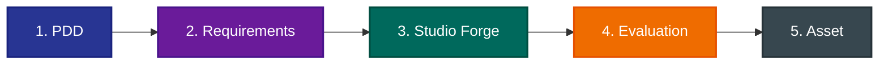

# OVERVIEW

`ACE-WF`는 `mols-agent` 프로젝트의 지능 자산을 설계, 검증 및 배포하기 위한 핵심 워크플로우입니다.

## THE WORKFLOW: 5-PHASE LIFECYCLE

## 1. PDD

- **Context**: [Discussion Directory](/discussion/) 내에서 제안, 토의, 비판 과정을 거쳐 합의를 도출합니다.
- **Output**: `Decision` 문서. 이 결정은 즉시 요구사항의 근거가 됩니다.
- **Reference**: [PDD Methods](/docs/methods/PDD.md)

## 2. Requirements

- **Context**: [Requirements Directory](/docs/requirements/)에 기술 요구사항을 공식화합니다.
- **Rule**: 이 문서가 완성되어야만 `studio/`의 작업 권한과 맥락(Context)이 확립됩니다.

## 3. Studio Forge

- **Context**: [Studio Directory](/studio/) 작업 환경.
- **Action**: 요구사항을 기반으로 실제 에이전트 규칙, 워크플로우 등을 구현합니다.
- **Constraint**: 작업 시작 시 반드시 상위 요구사항 문서를 참조(Bind)해야 합니다.

## 4. Evaluation

- **Context**: `studio/evaluation/` 혹은 관련 검증 프로세스.
- **Action**: 구현된 자산이 요구사항을 충족하는지 비판적으로 검증하고 로그를 남깁니다.

## 5. Asset

- **Context**: [Outputs Directory](/outputs/) .
- **Action**: 결과물을 저장하고, 임시 파일, 컨텍스트를 정리한다.
