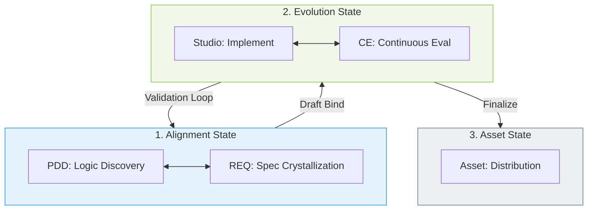

# SYNTHESIS: The Feedback-Driven Loop

To reconcile the structural governance of **Thesis (0)** with the operational agility required by **Antithesis (1)**, the `ACE-WF` is redefined from a linear sequence into an iterative, feedback-driven loop.

## 1. The Core Shift: From Phase to State

Instead of 5 terminal phases, we define 3 primary states with internal iteration loops.

## 2. Key Reconciliations: From Engineering to Contextual Evolution

### A. "Draft Binding" (Bridging the Logic Gap)

- **Insight**: Documentation shouldn't precede creation because logic is discovered during the forge.
- **Solution**: Use **Draft Requirements**. The forge (Studio) and documentation (REQ) evolve together. Formalization happens only after the logic "feels" right.

### B. "Subjective Validation" (Rejecting Objective Testing)

- **Insight**: Objective "tests" for intelligence are dangerous and impossible. CE is not code.
- **Solution**: Replace Phase 4 (Evaluation) with **Experiential Validation**.
  - **The Benchmark**: "Does it work in my next project?"
  - **Feedback Loop**: If it fails in practice, it is "brought back" to the Forge.
  - **The Risk**: Agent-led self-evaluation is recognized as a high-risk, volatile metric.

### C. "Reuse as the Ultimate Test"

- **Process**: An asset is only considered "Complete" after it has survived a real session or has been successfully reused in a different context without breaking the user's intent.

## 3. Revised Operational Model

| Element          | Previous Logic (Thesis/Antithesis) | Synthesis Logic (Experience-Driven)           |
| :--------------- | :--------------------------------- | :-------------------------------------------- |
| **Verification** | Automated Tests / Log Audit        | **Subjective Approval / Reuse Feedback**      |
| **Failure**      | Test Case Failure                  | **"It feels wrong" / "Doesn't work in-situ"** |
| **Success**      | Requirement Match                  | **Seamless Logic Alignment in Practice**      |

---

## CONCLUSION

The Synthesis ensures that we have the **Governance** needed for asset management without sacrificing the **Velocity** needed for intelligence engineering. The 5-phase model is preserved conceptually but implemented as a recursive loop.
