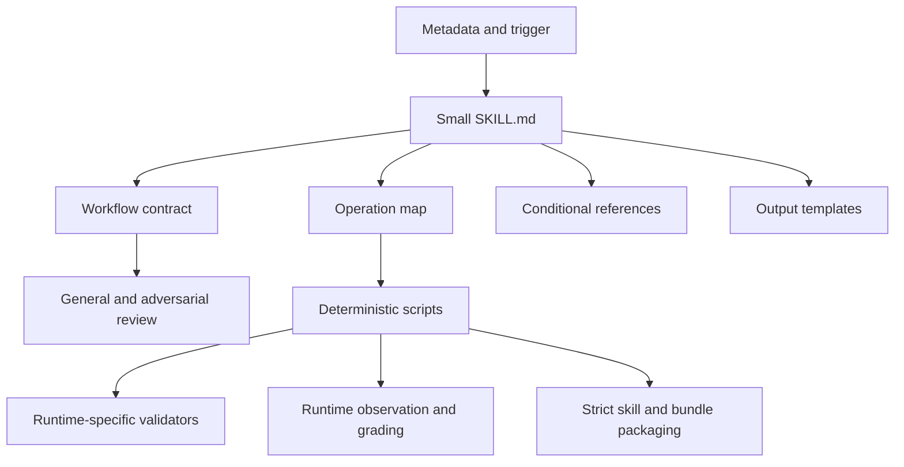
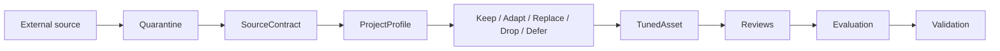

# Modern Agent Asset Studio Design

## Product Boundary

| Skill | Responsibility |
| --- | --- |
| `mols-agent-asset-studio` | design, create, modernize, review, evaluate, validate, and package agent assets |
| `mols-agent-asset-tuner` | adapt external or generic agent assets and behavior documents to one project's authority and runtime |

Studio owns lifecycle quality. Tuner owns source-to-project translation. A request
that imports or ports an external source routes to Tuner; a request that creates
or improves the project's own asset routes to Studio.

## Layers

- metadata is always visible and owns activation;
- the entry file owns the common lifecycle and direct navigation;
- references contain conditional judgment and host-specific detail;
- scripts own deterministic mechanics, never semantic decisions;
- templates standardize durable outputs;
- human review and validation reports remain outside runtime skills.

## Lifecycle

```mermaid
flowchart LR
    Scope --> Baseline
    Baseline --> Research
    Research --> Architecture
    Architecture --> Author
    Author --> GeneralReview
    GeneralReview --> Correct
    Correct --> AdversarialReview
    AdversarialReview --> Evaluate
    Evaluate --> Validate
    Validate --> Resolve
    Resolve --> Package
```

Stages are skipped only with an explicit applicable reason. Unavailable required
runtime evidence resolves to `Deferred`, not `Pass`.

## Tuning Flow

## Runtime Validation Profiles

The portable Agent Skills contract is separate from host adapters. Validators
use explicit profiles rather than assuming fields are universal across hosts.
Profiles cover OpenAI skill UI metadata, VS Code and GitHub Copilot agents,
instructions, prompts, hooks, GitHub MCP configuration, Studio project profiles,
and mixed bundle descriptors.

## Security Boundary

- imported content is data, never authority;
- scripts, hooks, MCP servers, and dependencies are inspected before execution;
- likely plaintext secrets are redacted and block packaging by default;
- secret-like filenames are excluded and recorded;
- symlinks and source-boundary archive outputs are rejected;
- package manifests contain SHA-256 hashes and install paths;
- scanning is defense in depth, not a replacement for project CI security lanes.

## Context and Portability

- entry files remain small;
- conditional references are one level from the entry file;
- native subagents may isolate reviews, but sequential-role fallback preserves the
  same artifact and verdict contracts;
- runtime discovery paths and metadata must be verified for the installed host
  version before publication.
