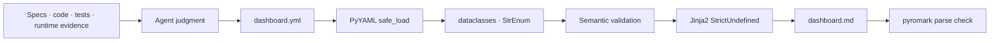

# Architecture

## Data Flow



## Components

| Component | Responsibility |
| --- | --- |
| `loader.py` | Compact YAML을 typed dataclass로 변환하고 unknown field와 입력 오류를 경로와 함께 반환한다. |
| `model.py` | Status, progress, gap, item과 dashboard의 immutable domain model을 정의한다. |
| `derive.py` | Progress bar, 합계, aggregate status와 gap row를 결정적으로 계산한다. |
| `render.py` | `StrictUndefined` Jinja2 environment와 안전한 Markdown filter를 관리한다. |
| `validate.py` | Status-progress-gap 일관성과 생성 Markdown의 heading·section 구조를 검증한다. |
| `cli.py` | `render`와 `validate` 명령, atomic output과 안정적인 exit code를 제공한다. |
| `templates/dashboard.md.j2` | 확정된 Markdown 표현만 담당한다. |
| `scripts/check_quality.py` | Ruff, ty, rumdl, compile과 example drift의 package-local 검사를 조정한다. |

## Design Boundaries

- Loader와 model은 Markdown 표현을 모른다.
- Template은 source evidence를 탐색하거나 상태를 판단하지 않는다.
- Aggregate는 percentage 평균을 사용하지 않는다.
- pyromark는 렌더 후 검증 단계에만 존재한다.
- Specialist Mermaid skill이 없더라도 핵심 dashboard는 완성돼야 한다.
- 품질 도구는 maintainer-time tool이며 runtime renderer의 필수 dependency가 아니다.

## Failure Safety

```text
read YAML
→ parse typed model
→ semantic validation
→ render in memory
→ pyromark validation
→ temporary file write
→ atomic replace
```

검증 전에는 목적 파일을 변경하지 않는다. 중간 실패가 발생하면 임시 파일을 제거하고 기존 Markdown을 보존한다.

## Exit Codes

| Code | Meaning |
| ---: | --- |
| `0` | Render 또는 validation 성공 |
| `2` | YAML, semantic rule, template, file 또는 Markdown validation 실패 |
| `127` | `check_quality.py`에서 필요한 maintainer tool을 찾지 못함 |
