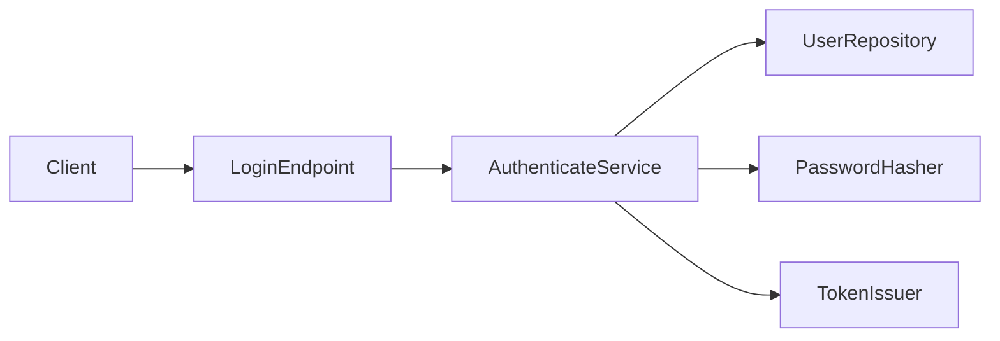

## Overview

Login API는 이메일과 비밀번호를 받아 사용자를 인증하고 access token을 반환한다.
HTTP entrypoint가 입력과 응답을 다루고, authentication service가 흐름을 조정하며,
repository와 token issuer가 저장소·암호화 경계를 담당한다. 분석 범위는 로그인
요청이며 회원가입과 token refresh는 제외한다.

## System Map

## Core Components

| Component | Responsibility | Input / Output | Dependencies |
| --- | --- | --- | --- |
| [`auth-login-endpoint`](auth-login-endpoint.md) | HTTP 요청 변환과 응답 매핑 | JSON / HTTP response | `AuthenticateService` |
| [`auth-authenticate-service`](auth-authenticate-service.md) | 인증 use case 조정 | credentials / access token | repository, hasher, issuer |
| [`auth-user-repository`](auth-user-repository.md) | 이메일 기반 사용자 조회 | email / `User \| None` | application DB |
| [`auth-token-issuer`](auth-token-issuer.md) | 인증된 사용자용 token 발급 | user ID / JWT | signing key, clock |

## Core Execution Walkthroughs

### 정상 로그인

1. **Start**: `POST /login`이 email과 password를 받는다.
2. **Call flow**: `login()`이 `authenticate()`를 호출하고, service가 사용자 조회,
   password 검증, token 발급을 순서대로 요청한다.
3. **State**: `UserRepository.find_by_email()`이 DB를 읽는다. 쓰기는 없다.
4. **Result**: endpoint가 access token을 `200 OK` body로 반환한다.
5. **Failure boundary**: 사용자가 없거나 password가 다르면 service의 인증 실패가
   endpoint에서 `401 Unauthorized`로 변환된다.

## Code Reading Guide

1. [`src/auth/http.py:18`](auth-login-endpoint.md) — 외부 입력과 응답 계약을 먼저 확인한다.
2. [`src/auth/service.py:24`](auth-authenticate-service.md) — 전체 인증 호출 순서를 따른다.
3. [`src/auth/repository.py:11`](auth-user-repository.md) — DB read 경계를 확인한다.
4. [`src/auth/tokens.py:16`](auth-token-issuer.md) — 최종 token 생성 계약을 확인한다.

## Understanding Notes

- **Contract**: 인증 실패 원인과 관계없이 외부 응답은 `401 Unauthorized`다.
- **Boundary**: DB와 signing key 접근은 repository와 token issuer 안에 머문다.
- **Inference / Unverified**: 배포 환경의 signing key rotation 주기는 코드만으로
  확인할 수 없다.
- **Terminology**: 이 보고서의 “token”은 login이 발급하는 access token을 뜻한다.
