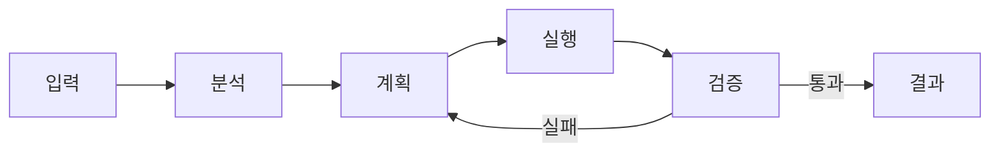
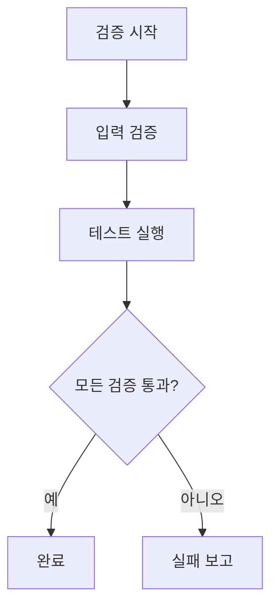
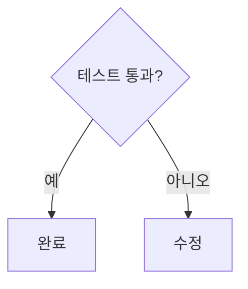
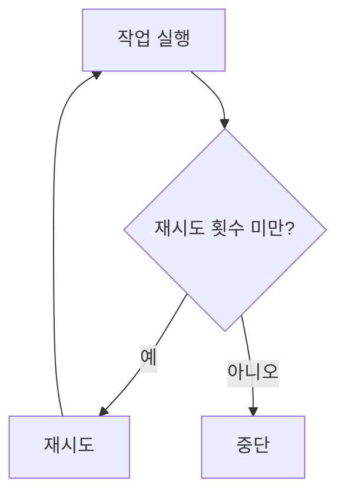
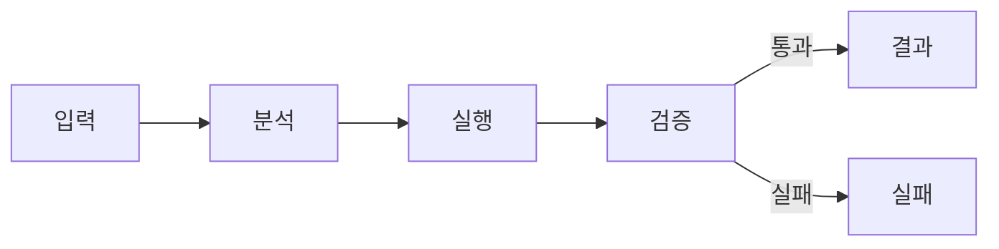
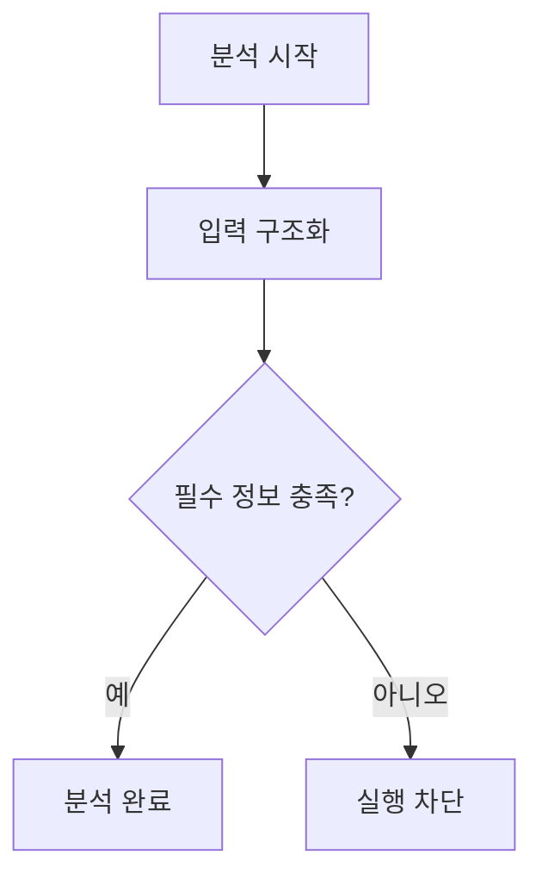

# Mermaid-Driven Workflow Agent Prompt Guide

## 1. 목적

복잡한 워크플로우를 Mermaid로 구조화하고, 필요한 상황에서 적절한 프롬프트를 꺼내 코딩 에이전트에 적용한다.
핵심 원칙:
> Mermaid는 구조와 흐름을 표현한다.
> 자연어 프롬프트는 해석 기준, 제약, 예외, 완료 조건을 보완한다.
권장 구조: `전체 흐름 → 모듈별 흐름 → 모듈 계약 → 상황별 프롬프트`

## 2. Mermaid 작성 가이드

### 전체 흐름

전체 Mermaid에는 주요 모듈만 둔다.



권장 기준:

- 노드 수는 5~12개로 유지한다.
- 성공과 실패 경로를 표시한다.
- 분기 조건은 엣지에 작성한다.
- 세부 로직은 별도 Mermaid로 분리한다.

### 모듈 분리

다음 중 하나 이상이면 별도 Mermaid로 나눈다.

- 입력과 출력이 독립적이다.
- 고유한 실패 조건이 있다.
- 별도로 검증할 수 있다.
- 재사용 가능하다.
- 내부 흐름이 복잡하다.



### 노드 작성

- 노드는 하나의 행동만 표현한다.
- ID는 `validate_input`, `save_result`처럼 의미 있게 작성한다.
- `step1`, `temp`, `nodeA` 같은 이름은 피한다.
- 중요한 의미를 색상이나 위치에만 의존하지 않는다.
- 하나의 Mermaid에는 하나의 관점만 담는다.


### 분기와 반복

분기 조건은 반드시 명시한다.



반복에는 종료 조건을 둔다.



## 3. 모듈 계약

Mermaid 아래에는 짧은 계약을 둔다.

```markdown
### Contract
- 입력: `ChangeSet`
- 출력: `VerificationReport`
- 성공 조건: 모든 필수 검증 통과
- 실패 조건: 하나 이상의 필수 검증 실패
- 다음 모듈: `output` 또는 `failure`
```

계약의 최소 항목:

- 입력
- 출력
- 성공 조건
- 실패 조건
- 다음 모듈
동일한 개념은 문서 전체에서 같은 이름을 사용한다.

## 4. 상황별 프롬프트

아래 블록은 상시 규칙이 아니다. 필요한 상황에서 하나만 선택해 사용한다.

### 4.1 전체 흐름 해석

```text
아래 Mermaid 워크플로우를 해석하라.

목표:
- 시작 노드와 종료 노드를 식별한다.
- 정상 경로와 실패 경로를 분리한다.
- 각 분기 조건을 설명한다.
- 모듈 간 의존성을 정리한다.

제약:
- Mermaid에 없는 전이를 추측하지 않는다.
- 불명확한 부분은 별도로 표시한다.

출력:
1. 전체 흐름 요약
2. 정상 경로
3. 실패 경로
4. 누락 또는 불명확한 항목
```

### 4.2 모듈 실행

```text
아래 Mermaid 모듈만 실행 대상으로 사용하라.

입력 계약:
[입력 계약]

출력 계약:
[출력 계약]

실행 지침:
- 시작 노드부터 엣지 방향을 따른다.
- 조건이 확인된 경로만 실행한다.
- Mermaid에 없는 단계를 추가하지 않는다.
- 각 노드의 결과를 기록한다.
- 출력 계약 충족 시에만 완료로 판단한다.

출력:
- 실행한 노드
- 실행 경로
- 생성된 결과
- 실패 또는 생략된 단계
```

### 4.3 구현 계획 생성

```text
아래 Mermaid를 구현 계획으로 변환하라.

요구사항:
- 각 노드를 구현 작업으로 매핑한다.
- 작업 순서는 엣지 방향을 따른다.
- 분기 조건을 구현 조건으로 유지한다.
- 검증 노드는 테스트 또는 검사 항목으로 변환한다.
- 실패 경로에는 복구 또는 중단 동작을 포함한다.

출력:
| 순서 | Mermaid 노드 | 구현 작업 | 입력 | 출력 | 검증 |
```

### 4.4 코드 변경

```text
아래 Mermaid와 모듈 계약을 기준으로 코드를 수정하라.

기준:
- Mermaid에 정의된 범위만 수정한다.
- 노드별 책임을 코드 구조에 대응시킨다.
- 분기 조건과 실패 경로를 구현한다.
- 기존 코드와 충돌하면 차이를 먼저 보고한다.
- 필요한 최소 범위만 변경한다.

완료 조건:
- 필수 노드가 코드에 반영됨
- 입력과 출력 계약이 유지됨
- 실패 경로가 구현됨
- 관련 테스트가 통과함
```

### 4.5 구현 검증

```text
아래 Mermaid와 구현 결과를 비교 검증하라.

검증 항목:
- 모든 필수 노드가 구현됐는가?
- 실행 순서가 엣지 방향과 일치하는가?
- 분기 조건이 반영됐는가?
- 실패 경로가 존재하는가?
- 입력과 출력 계약이 지켜졌는가?
- 종료 조건 없는 반복이 있는가?
- Mermaid에 없는 동작이 추가됐는가?

출력:
1. 통과 항목
2. 실패 항목
3. 누락 노드
4. 잘못된 전이
5. 수정 권장안
```

### 4.6 복잡도 점검

```text
아래 Mermaid가 에이전트가 해석하기에 지나치게 복잡한지 평가하라.

점검 기준:
- 노드와 분기 수
- subgraph 중첩
- 반복 경로
- 실패 경로
- 서로 다른 관점의 혼합

필요하면 다음 기준으로 분리안을 제시하라.
- 전체 흐름
- 모듈별 흐름
- 오류 처리
- 데이터 흐름
- 검증 흐름

출력:
1. 복잡도 판단
2. 이해를 방해하는 요소
3. 권장 분리안
```

## 5. 최소 문서 템플릿

````markdown
# Workflow Definition

## Objective
[워크플로우 목표]

## Global Workflow


## Module: analyze


### Contract
- 입력: `RawInput`
- 출력: `ValidatedSpec`
- 성공 조건: 목표와 제약 식별
- 실패 조건: 핵심 정보 누락
- 다음 모듈: `execute`

## Prompt
[상황별 프롬프트 하나를 삽입]
````

## 6. 최종 체크

- 시작과 종료 노드가 명확한가?
- 분기 조건이 표시됐는가?
- 반복에 종료 조건이 있는가?
- 모듈 입력과 출력 이름이 일치하는가?
- 실패 경로가 있는가?
- 현재 작업에 맞는 프롬프트만 선택했는가?
