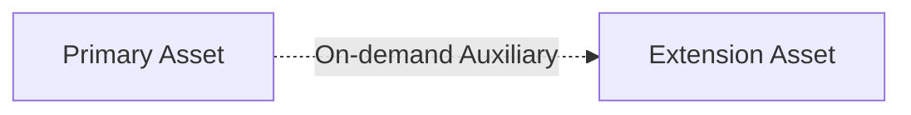

# Extension Pattern

Attach auxiliary functionality (sub-help, edge cases, advanced options) to a standalone primary asset to protect initial context.

## Essence

- **Standalone Completeness**: Primary asset functions fully on its own.
- **Auxiliary Attachment**: Extension assets load only when rare, advanced, or optional scenarios are triggered.

## Structure

## Naming Convention

- **Extension Attachment**: `<asset>-<extension>.md` (e.g. `workflow-help.md`, `config-advanced.md`)
