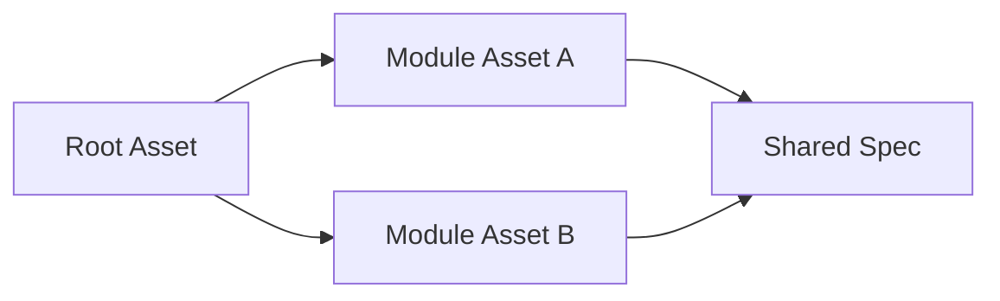

# Modular Asset Pattern

Decompose complex domain procedures into independent, single-responsibility modules to reduce context bloat and simplify maintenance.

## Essence

- **Domain Decomposition**: Split large or multi-step workflows into focused, single-responsibility units.
- **Selective Assembly**: Root asset conditionally orchestrates or references modules as needed for execution.

## Structure

## Rules

- **Single Responsibility**: Each module handles exactly one step or focused sub-task.
- **Clean Interfaces**: Define explicit inputs, outputs, and execution boundaries for each module.
