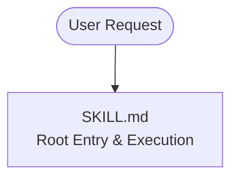
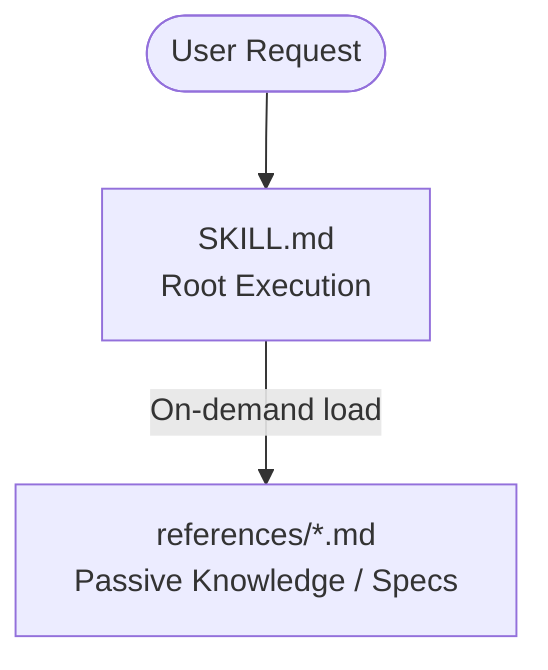
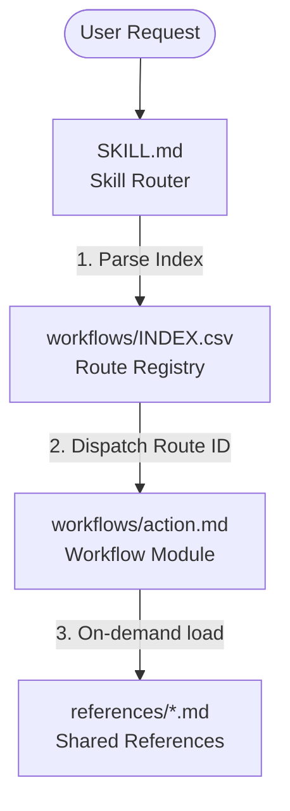
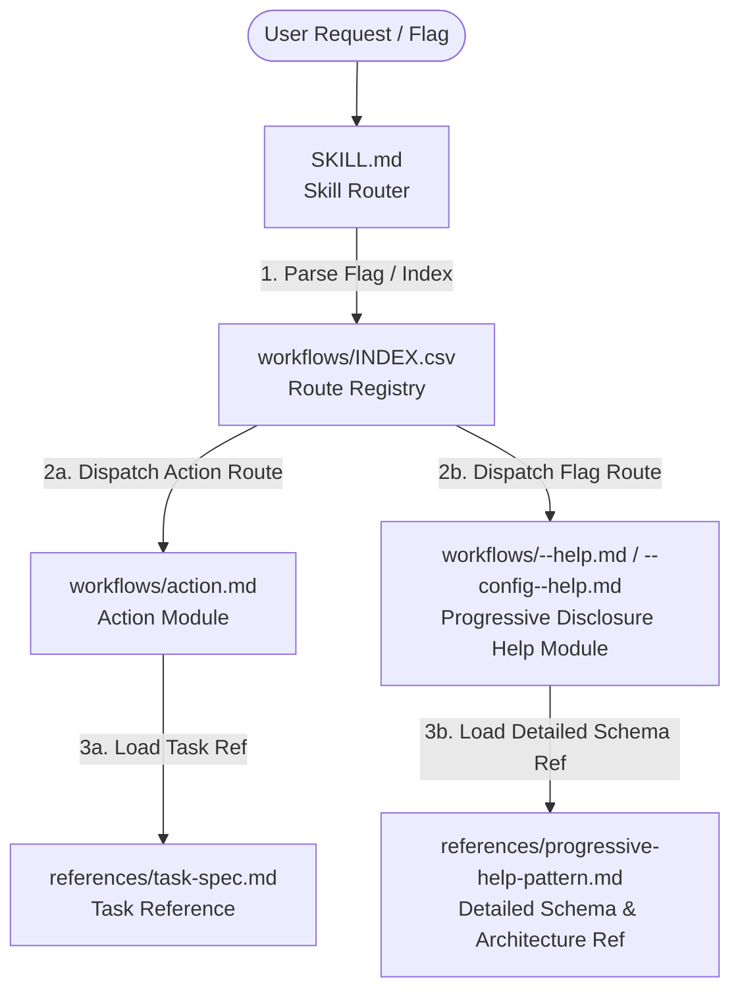

# Skill & Router Architecture Visualizations

## Goal

Provide Mermaid diagrams visualizing the progressive loading hierarchies of agent skills, ranging from simple single-file skills to multi-tiered routing architectures.

## 1. Single-File Skill Pattern (`SKILL.md` only)

Simple, self-contained skill where all instructions, procedures, and validation steps reside in a single root file.

## 2. Skill with Shared References Pattern (`SKILL.md` -> `references/`)

A skill that delegates passive knowledge, specifications, or rules to external reference files loaded on demand.

## 3. Composite Routing Skill Pattern (`SKILL.md` -> `workflows/INDEX.csv` -> `references/`)

A dedicated routing skill where `SKILL.md` acts as a pure router, evaluating incoming intent via `workflows/INDEX.csv`, dispatching to a specific workflow module in `workflows/`, and loading passive references only when needed.

## 4. Multi-Tiered Routing with Progressive Help Pattern (`SKILL.md` -> `workflows/INDEX.csv` -> `workflows/--help.md` -> `references/`)

A routing skill supporting optional command flag workflows (`--help`, `--config--help`, etc.) for progressive disclosure, where flag workflows load detailed reference schemas and architectural guides when explicitly requested.

