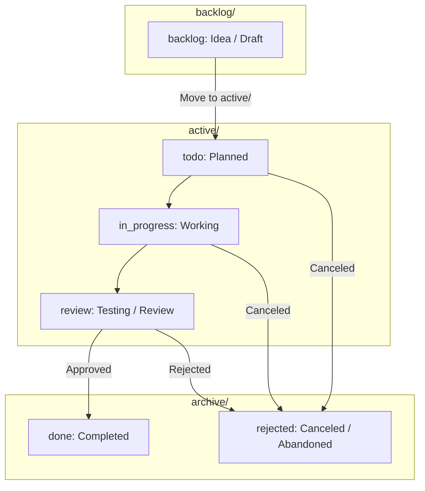

# Agent Instructions for mols Kanban Markdown (DEFAULT)

## Directory Structure

```text
<kanban_path>/
├── .configs/
│   ├── config.jsonc            # Frontmatter schema and validation settings
│   └── template.md             # Markdown card creation template
├── backlog/                    # Ideas and pending backlog cards (`backlog`)
├── active/                     # Active work-in-progress cards (`todo`, `in_progress`, `review`)
├── archive/                    # Completed or canceled cards (`done`, `rejected`)
├── README.md                   # Kanban board overview and index document
└── AGENTS.md                   # Agent guidelines for Kanban management
```

## Frontmatter Schema

See `<kanban_path>/.configs/config.jsonc`

## Write

Copy `<kanban_path>/.configs/template.md` to `<kanban_path>/backlog/`.

Replace placeholders. Follow and remove comments.

## Validate Doc Format

See `<this_skill_path>/workflows/validate.md`

## Lifecycle


