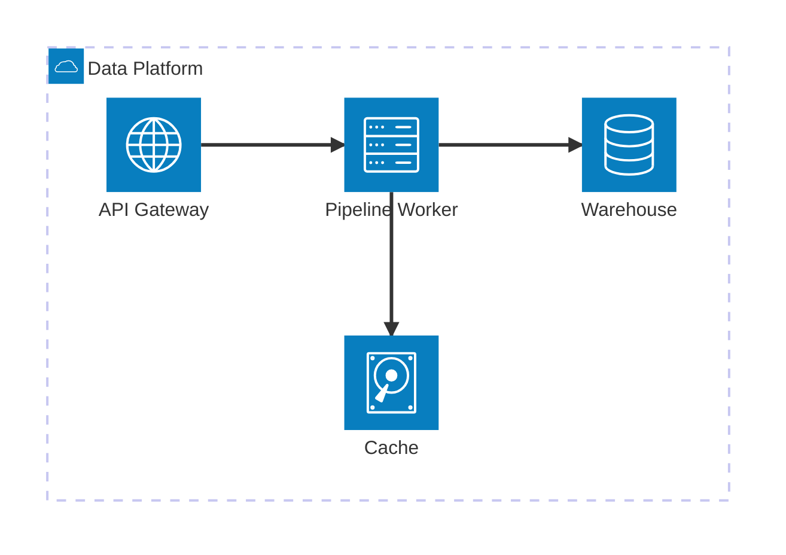
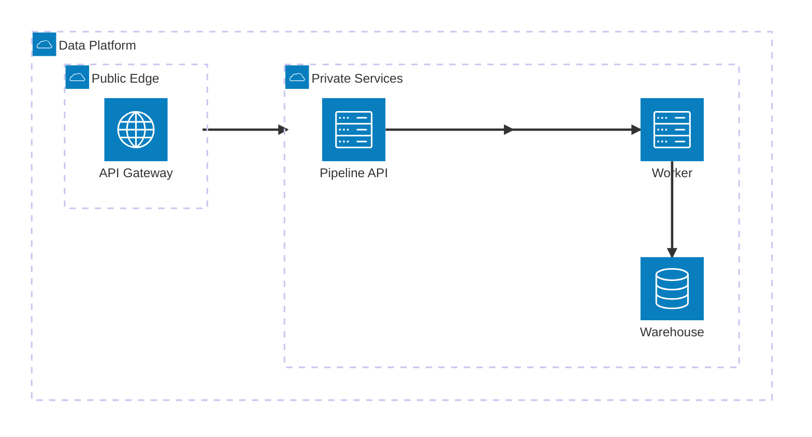
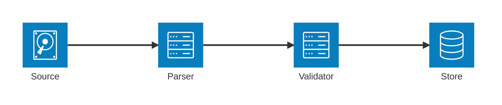
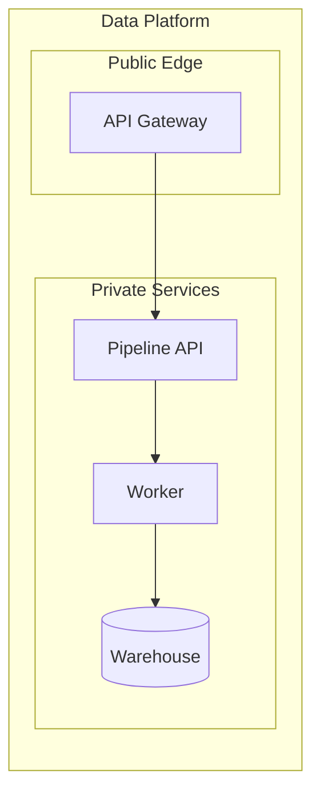

# Architecture Diagram

service·resource 사이의 relationship과 의미 있는 architecture grouping이 핵심이고 target renderer가 `architecture-beta`를 지원하면 사용한다. `L`, `R`, `T`, `B`는 domain port가 아니라 **edge가 붙는 면을 정하는 layout hint**이며, 실제 relationship direction은 arrow가 표현한다.

## Architecture Grouping And Boundary

`group`은 subsystem, trust·network zone, runtime 또는 deployment boundary처럼 **source가 실제로 구분하는 architecture grouping**에 사용한다. 단순히 가까이 배치하고 싶다는 이유로 group을 만들거나 logical grouping을 deployment boundary로 승격하지 않는다.

Nested group으로 hierarchy를 표현할 수 있고, 서로 다른 group 사이의 boundary crossing 자체를 읽기 쉽게 보여줘야 하면 service에 `{group}` modifier를 사용한다.

`{group}`은 group 자체를 edge endpoint로 만드는 문법이 아니다. Group ID를 직접 edge에 연결하지 않고, group 안의 service를 기준으로 boundary를 통과하는 edge를 표현한다. Boundary crossing이 핵심이 아니면 ordinary service-to-service edge가 더 단순하다.

## Sibling Alignment

> `align row` / `align column`은 Mermaid v11.16.0+ 기능이다.

같은 downstream service를 향하는 sibling이 layout heuristic 때문에 겹치거나 지나치게 넓게 퍼지면 topology를 바꾸기 전에 `align`을 검토한다. 같은 horizontal attachment pair로 연결되는 sibling은 `align column`으로 세로 stack을 만들 수 있어 portrait reading viewport에도 유리하다.

`align`은 presentation constraint다. 선언 순서를 chronology, priority 또는 ownership으로 해석하지 않는다. Align 순서가 기존 edge direction과 충돌하면 layout이 실패할 수 있으므로 target renderer에서 확인한다.

## Layout Tuning

> architecture layout tuning은 Mermaid v11.15.0+ 기능이다.

Topology와 grouping이 맞고 `align`으로 해결할 문제가 아닌데 spacing이나 density가 좋지 않을 때만 renderer config를 최소한으로 조정한다.

Layout config는 spacing과 force-directed layout을 조정할 뿐 topology를 수정하지 않는다. 동일한 logical position 때문에 sibling이 겹치는 문제는 config 값을 키우기보다 지원되는 renderer에서 `align`을 우선하고, 그래도 읽기 어렵다면 grouping이나 diagram split을 검토한다.

## Rules

- `group`은 source가 뒷받침하는 subsystem, zone, runtime 또는 deployment grouping에만 사용한다.
- service ID는 stable identifier로, bracket label은 사람이 읽는 이름으로 사용한다.
- arrow가 relationship direction을 소유한다. `L`, `R`, `T`, `B`는 edge attachment side일 뿐 data flow, dependency direction 또는 실제 network port를 의미하지 않는다.
- `align`과 layout config는 presentation layer다. 이 값으로 source에 없는 order, priority, ownership 또는 placement semantics를 만들지 않는다.
- `{group}` modifier는 boundary crossing을 시각적으로 명확히 할 필요가 있을 때만 사용한다.
- `junction`은 connection·fan-out 구조를 정리하는 특수 node이며 실제 service나 infrastructure component처럼 해석하지 않는다.
- external icon pack은 renderer configuration과 trust boundary가 확인된 경우에만 사용한다.
- topology가 복잡해 relationship 추적이 어렵거나 portrait viewport에서 과도한 horizontal spread가 생기면 config를 계속 조정하기보다 overview/detail 분리를 검토한다.

## Portable Fallback

`architecture-beta`나 필요한 version-sensitive feature를 target renderer가 지원하지 않으면 **relationship과 의미 있는 grouping을 보존하는 더 널리 지원되는 flowchart**로 전환한다. Attachment side, `align`, junction 같은 presentation detail을 억지로 재현하지 않는다.

Fallback에서도 source에 없는 boundary나 dependency를 새로 만들지 않는다. Architecture의 junction이 connection aid였다면 equivalent direct edge로 collapse할 수 있지만, junction이 표현하던 branching connectivity는 그대로 보존한다.
