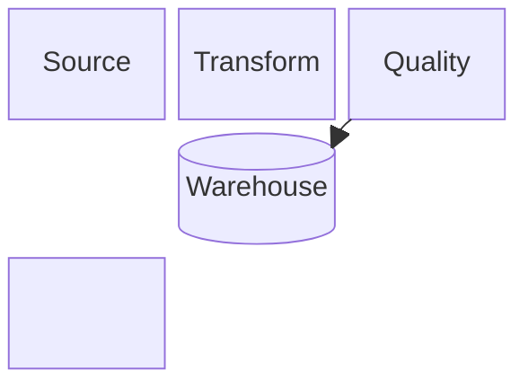
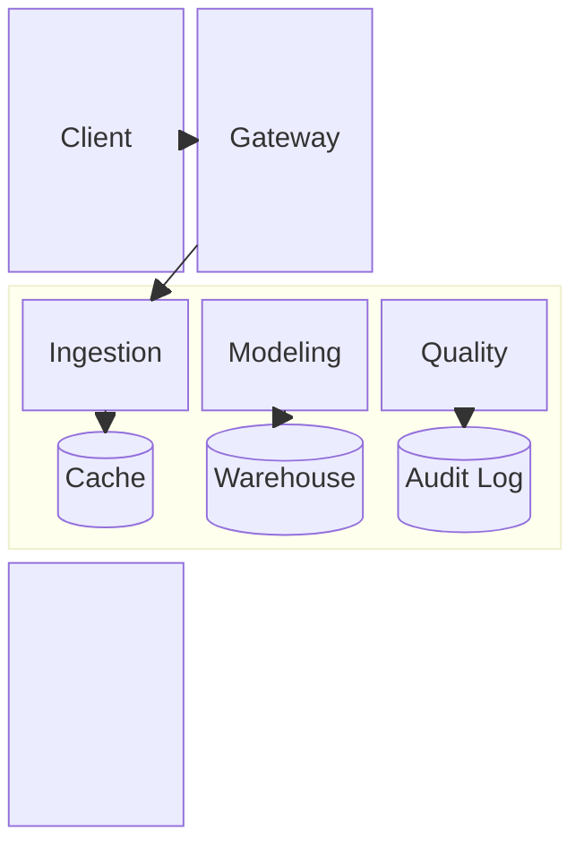

# Block Diagram

> Block syntax의 실제 지원 여부와 현재 세부 문법은 target renderer와 Mermaid 공식 문서를 확인한다. Local example은 `block` declaration을 사용하며, 오래된 source의 `block-beta`를 그대로 호환된다고 가정하지 않는다.

Block diagram은 relationship뿐 아니라 **author-controlled 2D arrangement**가 readability에 중요한 system overview에 사용한다. Grid 위치는 기본적으로 presentation constraint이며, source가 layer·zone·physical placement처럼 위치 자체에 의미를 부여한 경우가 아니면 domain fact로 해석하지 않는다.

## Basic: Grid Layout

`columns`, declaration order와 `space`로 block의 상대 배치를 직접 구성할 수 있다.

`columns`와 `space`는 layout을 제어한다. 빈 slot이나 같은 row에 있다는 사실만으로 dependency, chronology, ownership 또는 boundary를 주장하지 않는다. 실제 relationship은 edge로 명시한다.

`columns`를 생략하거나 `auto`를 사용한 상태가 portrait viewport에 맞춰 적절히 wrap된다고 가정하지 않는다. peer가 많아 한 줄이 지나치게 넓어질 수 있으면 작은 고정 column 수, grouping 또는 diagram split을 검토한다.

## Composite Blocks And Spans

Composite block은 child block을 함께 배치하는 **layout wrapper**로도 사용할 수 있고, source가 실제 containment, subsystem 또는 shared boundary를 뒷받침하면 그 grouping을 명시적으로 표현할 수도 있다. Composite ID, reader-visible label과 semantic boundary는 서로 다른 개념이다.

Span은 block이 차지하는 grid width를 조정할 뿐 component의 중요도, capacity 또는 scope 크기를 뜻하지 않는다.

`block:platform:3`의 `platform`은 composite ID이고 `:3`은 parent grid에서 차지하는 span이다. 이 ID가 reader-visible subsystem title이라고 가정하지 않는다. Visible label이나 boundary 의미를 부여한다면 source 근거와 target renderer의 실제 표시 결과를 함께 확인한다.

### Reliable Span And Nesting

Nested grid와 span은 문법적으로 지원되더라도 renderer layout에 민감하다. Portable documentation에서는 다음 범위부터 시작한다.

- span은 parent의 column 수를 넘기지 않는다.
- wide span이 현재 row의 남은 slot을 넘겨 배치되는 동작에 의존하지 않는다. 필요하면 `space`, declaration order 또는 다음 row 구조를 명시적으로 조정한다.
- 한 reading surface에서 deep nesting과 여러 span을 동시에 늘리지 않는다. 한 단계의 의미 있는 grouping으로 충분하지 않다면 overview/detail split을 먼저 검토한다.
- long label, mixed shape, nested composite와 multi-column span을 결합하면 source review만으로 layout을 보장하지 않고 실제 target renderer에서 확인한다.
- span 값을 의미 있는 fixed geometry contract처럼 취급하지 않는다. 같은 syntax도 renderer version과 host에 따라 sizing·wrapping이 달라질 수 있다.

문법상 가능한 조합이라도 actual render가 불안정하면 grid를 더 복잡하게 조정하기보다 nesting·span·label 길이를 줄이거나 다른 type으로 전환한다.

## Connections And Direction

Block diagram에서도 relationship과 directional decoration을 구분한다.

- edge가 relationship의 존재와 방향을 소유한다.
- composite ID에 edge를 연결할 수 있더라도 **relationship이 실제 aggregate/group을 대상으로 할 때만** 사용한다. 특정 child와의 관계라면 그 child에 직접 연결한다.
- block arrow는 directional shape를 가진 **block**이며 relationship edge가 아니다. 단순 연결 방향을 나타내려는 목적이라면 ordinary edge를 사용한다.
- unusual marker, dotted/thick edge 또는 양방향 marker가 별도 의미를 갖는다면 source나 local legend로 그 의미를 확인하고 target renderer에서 marker 방향을 검증한다. 장식 목적으로 edge vocabulary를 늘리지 않는다.

## Layout Versus Semantics

Block diagram은 placement control이 강하지만 **placement가 relationship을 대신하지 않는다.**

- `columns`, span, declaration order와 `space`는 presentation layer다.
- 같은 row·column, 가까운 거리 또는 넓은 span을 chronology, priority, throughput, ownership 또는 deployment fact로 해석하지 않는다.
- source가 실제 layer·rack·zone처럼 공간적 위치를 의미로 사용한다면 그 의미를 label·grouping·annotation으로도 드러내고 grid 위치에만 의존하지 않는다.
- `space`와 `space:n`은 빈 grid slot이다. 누락된 component, network gap, trust boundary 또는 reserved capacity를 나타내지 않는다.
- shape 차이가 domain type을 뜻한다면 source나 local notation convention으로 그 의미가 확인되어야 한다. Shape의 일반적 인상만으로 database, decision, priority 같은 의미를 발명하지 않는다.

## Choosing Block Versus Other Types

- **Block**: 특정 상대 배치와 grouping을 직접 제어하는 것이 readability의 핵심일 때.
- **Flowchart**: process, decision, dependency path와 자동 relationship layout이 핵심일 때.
- **Architecture**: service/resource topology와 architecture boundary를 해당 notation으로 직접 표현하는 것이 핵심일 때.

Block의 grid를 유지하려고 relationship이나 grouping을 왜곡해야 한다면 다른 type이나 overview/detail split을 우선한다. Portrait reading viewport에서 과도한 horizontal spread가 생기면 column 수, grouping 또는 diagram split을 먼저 검토하고 unreadable downscaling로 해결하지 않는다.

## Renderer-Sensitive Review

Block diagram은 **syntax validity와 visual stability를 별도로 검증**한다. 실제 target renderer를 사용할 수 있다면 특히 다음을 확인한다.

1. span이 의도한 row와 width에 머물고 sibling을 밀거나 겹치지 않는가.
1. nested composite의 child와 border·visible label이 겹치거나 잘리지 않는가.
1. long label과 non-rectangular shape가 span 안에서 clipping되지 않는가.
1. edge target과 arrow marker가 source relationship의 endpoint·direction과 일치하는가.
1. portrait viewport에서 default/auto row가 과도하게 넓어지지 않는가.

문제가 있으면 style tweak보다 grid 단순화, label 축약, span 축소, nesting 축소 또는 diagram split을 먼저 검토한다. Accessibility가 중요한 rendered artifact는 Block에 한정된 과거 제약을 가정하지 말고 현재 target renderer의 accessibility output을 실제로 확인한다.

## Rules

- Grid arrangement는 기본적으로 presentation constraint다.
- Composite block을 layout wrapper로 사용할 수 있지만 source에 없는 containment·subsystem·boundary 의미를 부여하지 않는다.
- Composite ID, visible label과 semantic boundary를 구분한다.
- Span과 `space`는 layout control이며 domain magnitude나 missing entity를 뜻하지 않는다.
- span overflow나 deep nested grid의 renderer-specific 동작에 의존하지 않는다.
- adjacency나 block arrow로 source에 없는 relationship을 암시하지 않는다.
- aggregate relation이 아니면 composite ID 대신 실제 child endpoint에 연결한다.
- 자동 relationship 배치가 질문에 더 적합하면 flowchart 또는 architecture diagram을 사용한다.

## Portable Fallback

Target renderer가 Block diagram을 지원하지 않거나 필요한 nested/span layout을 안정적으로 표현하지 못하면 relationship과 실제 grouping을 보존하는 flowchart 또는 text/table로 전환한다. Fallback에서 grid 좌표, `space`, span과 layout-only composite를 억지로 재현하지 않는다.
