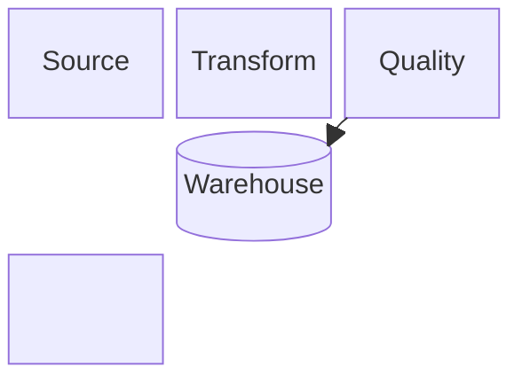
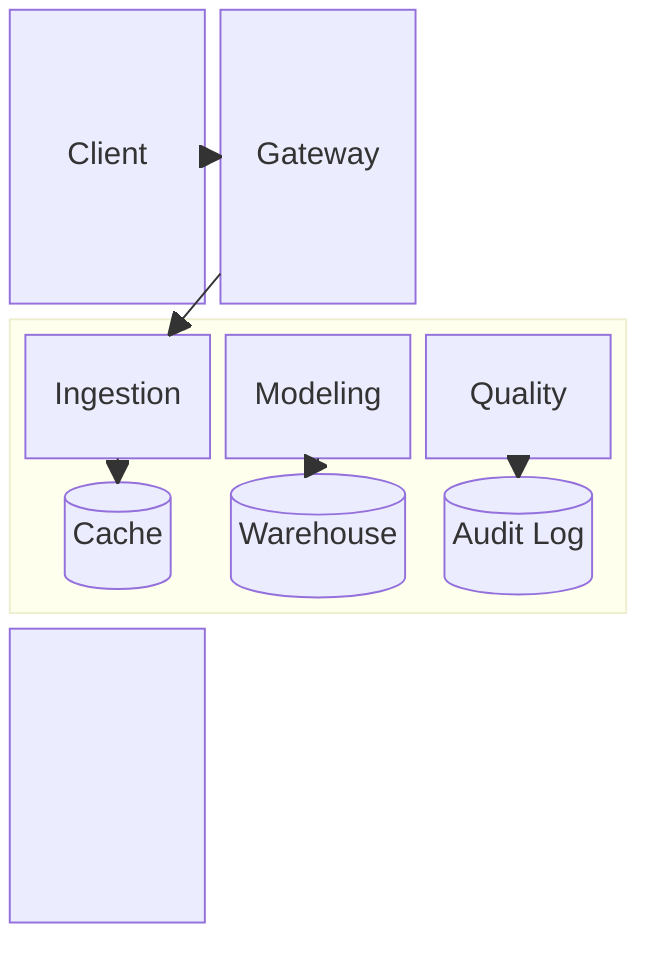

# Block Diagram

> Block syntax의 실제 지원 여부와 현재 세부 문법은 target renderer와 Mermaid 공식 문서를 확인한다.

Block diagram은 relationship뿐 아니라 **author-controlled 2D arrangement**가 readability에 중요한 system overview에 사용한다. Grid 위치는 기본적으로 presentation constraint이며, source가 layer·zone·physical placement처럼 위치 자체에 의미를 부여한 경우가 아니면 domain fact로 해석하지 않는다.

## Basic: Grid Layout

`columns`, declaration order와 `space`로 block의 상대 배치를 직접 구성할 수 있다.

`columns`와 `space`는 layout을 제어한다. 빈 slot이나 같은 row에 있다는 사실만으로 dependency, chronology, ownership 또는 boundary를 주장하지 않는다. 실제 relationship은 edge로 명시한다.

## Composite Blocks And Spans

Composite block은 child block을 함께 배치하는 **layout wrapper**로도 사용할 수 있고, source가 실제 containment, subsystem 또는 shared boundary를 뒷받침하면 그 grouping을 명시적으로 표현할 수도 있다. Labeled composite나 boundary로 읽히는 grouping에는 source 근거가 필요하다.

Span은 block이 차지하는 grid width를 조정할 뿐 component의 중요도, capacity 또는 scope 크기를 뜻하지 않는다.

`block:platform:3`의 `:3`은 parent grid에서 차지하는 span이다. Layout을 맞추기 위해 labeled composite block을 추가하면서 source에 없는 subsystem이나 ownership boundary를 만들지 않는다.

## Layout Versus Semantics

Block diagram은 placement control이 강하지만 **placement가 relationship을 대신하지 않는다.**

- edge가 relationship의 존재와 방향을 소유한다.
- `columns`, span, declaration order와 `space`는 presentation layer다.
- 같은 row·column, 가까운 거리 또는 넓은 span을 chronology, priority, throughput, ownership 또는 deployment fact로 해석하지 않는다.
- source가 실제 layer·rack·zone처럼 공간적 위치를 의미로 사용한다면 그 의미를 label·grouping·annotation으로도 드러내고 grid 위치에만 의존하지 않는다.
- `space`는 빈 grid slot이다. 누락된 component, network gap 또는 security boundary를 나타내지 않는다.

## Choosing Block Versus Other Types

- **Block**: 특정 상대 배치와 grouping을 직접 제어하는 것이 readability의 핵심일 때.
- **Flowchart**: process, decision, dependency path와 자동 relationship layout이 핵심일 때.
- **Architecture**: service/resource topology와 architecture boundary를 해당 notation으로 직접 표현하는 것이 핵심일 때.

Block의 grid를 유지하려고 relationship이나 grouping을 왜곡해야 한다면 다른 type이나 overview/detail split을 우선한다. Portrait reading viewport에서 과도한 horizontal spread가 생기면 column 수, grouping 또는 diagram split을 먼저 검토하고 unreadable downscaling로 해결하지 않는다.

## Rules

- Grid arrangement는 기본적으로 presentation constraint다. 위치 자체가 load-bearing information일 때만 semantic meaning을 부여한다.
- Composite block을 layout wrapper로 사용할 수 있지만, source가 뒷받침하지 않는 containment·subsystem·boundary 의미를 부여하지 않는다.
- Span과 `space`는 layout control이며 domain magnitude나 missing entity를 뜻하지 않는다.
- Edge를 생략하고 adjacency만으로 relationship을 암시하지 않는다.
- block span과 nested block을 과도하게 사용해 layout puzzle로 만들지 않는다.
- shape 차이가 domain type을 뜻한다면 source나 local notation convention으로 그 의미가 확인되어야 한다.
- 자동 relationship 배치가 질문에 더 적합하면 flowchart 또는 architecture diagram을 사용한다.

## Portable Fallback

Target renderer가 Block diagram을 지원하지 않으면 relationship과 실제 grouping을 보존하는 flowchart 또는 text/table로 전환한다. Fallback에서 grid 좌표, `space`와 span 같은 presentation detail을 억지로 재현하지 않는다.
