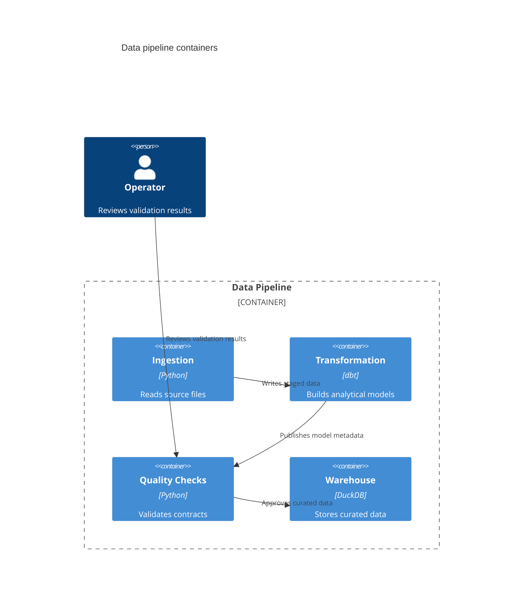
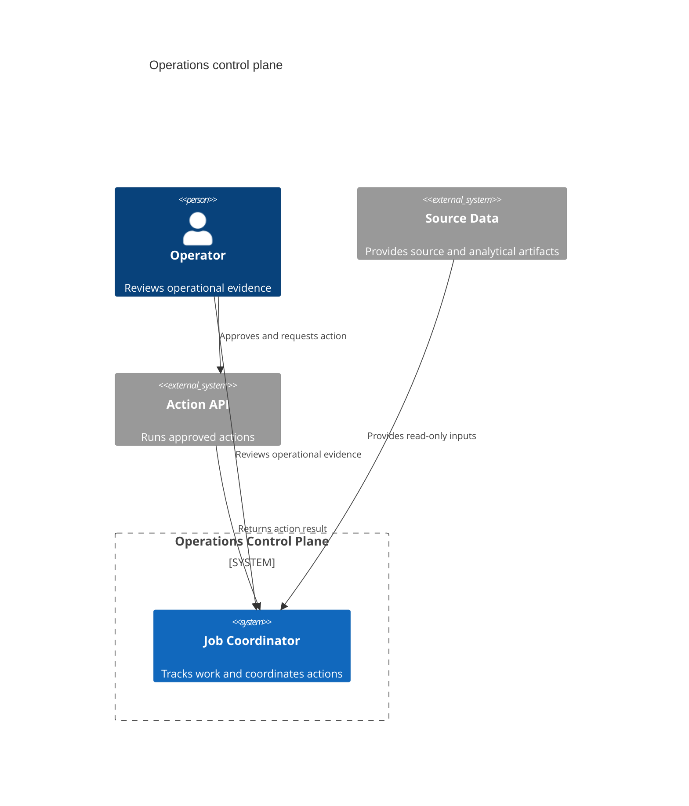
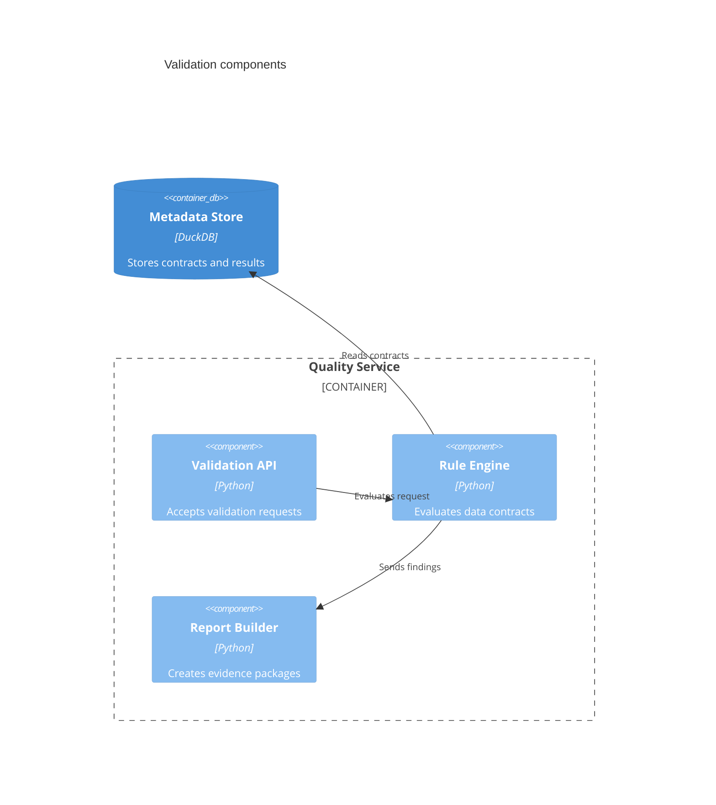
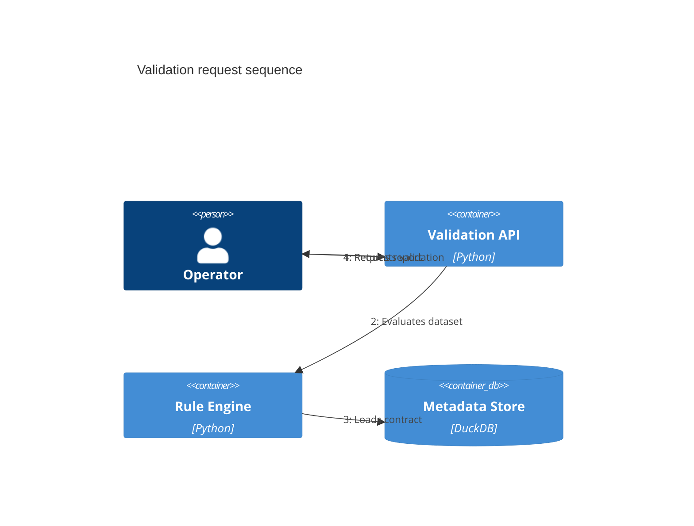
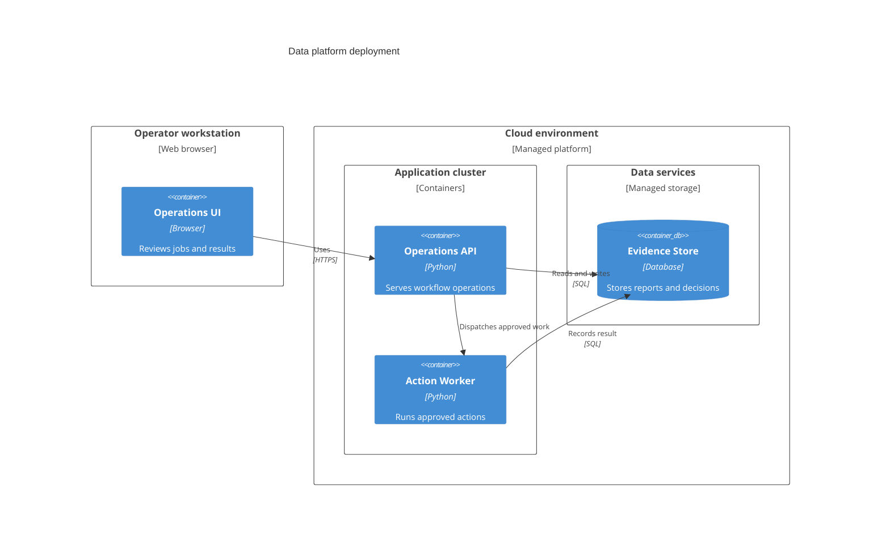

# C4 Context

> Mermaid의 C4 syntax는 현재 **experimental**이다. Syntax와 property가 바뀔 수 있으므로 실제 target renderer와 현재 공식 문서를 확인한다.

시스템 경계와 외부 actor·dependency가 핵심이면 C4 view를 사용한다. renderer가 지원하지 않으면 architecture, flowchart 또는 text description으로 대체한다.

## Context To Containers

Context view는 system boundary와 외부 관계를 설명하고, Container view는 그 boundary 내부의 주요 runtime·data responsibility를 확대한다. 상위 view의 요소를 기계적으로 반복하지 말고 **현재 zoom level의 relationship을 이해하는 데 필요한 actor와 external system만 유지한다.**

`Operator`는 이 Container view에서 `Quality Checks`와의 interaction이 중요하기 때문에 유지한다. 반대로 내부 관계를 이해하는 데 기여하지 않는 external element는 생략할 수 있다.

## Explicit Boundary And Relationship Meaning

C4의 핵심은 element 수보다 **zoom level, boundary, responsibility와 relationship 의미**다. Relationship label은 단순한 “uses”보다 무엇을 제공하거나 요청하는지 드러낼 때 유용하다.

## Component And Dynamic Views

같은 질문을 여러 view에 반복하지 않고 zoom level을 명확히 한다. Exact syntax와 support는 target renderer와 현재 Mermaid 문서를 확인한다.

Dynamic view의 번호는 source가 뒷받침하는 interaction order를 표현할 때만 사용한다.

## Deployment View

Deployment view는 logical container가 실제 execution environment에 어떻게 배치되는지 보여준다. Logical responsibility와 deployment topology를 하나의 view에서 임의로 섞지 않는다.

## Rules

- 먼저 Context, Container, Component, Dynamic, Deployment 중 **현재 질문의 zoom level**을 정한다.
- 상위 view의 element를 completeness를 위해 반복하지 않는다. 현재 view의 관계를 이해하는 데 필요한 context만 유지한다.
- zoom level을 바꾸면서 source에 없는 component, container, deployment 또는 interaction을 발명하지 않는다.
- experimental syntax의 exact behavior는 local example이 아니라 현재 공식 문서와 target renderer가 소유한다.
- 실제 render를 확인하지 못했다면 C4 support를 단정하지 않는다.
