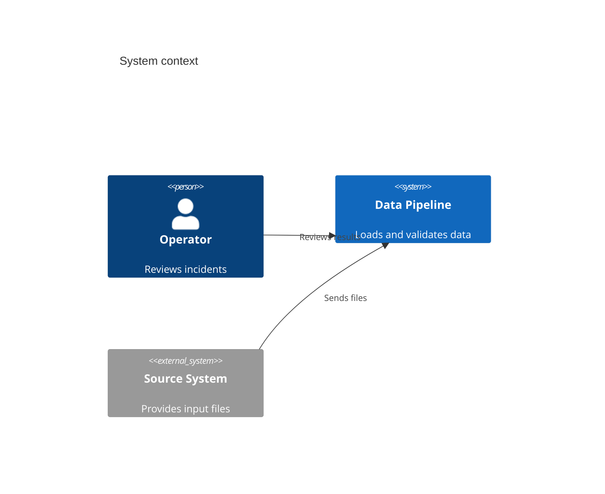
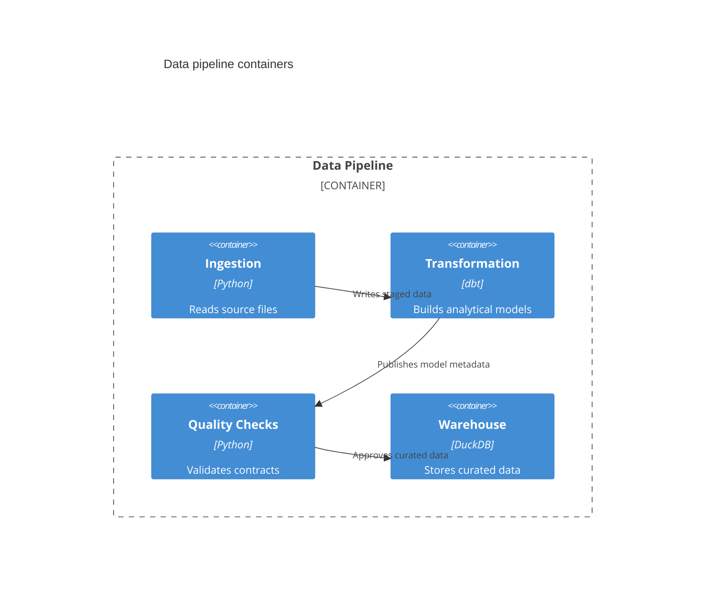
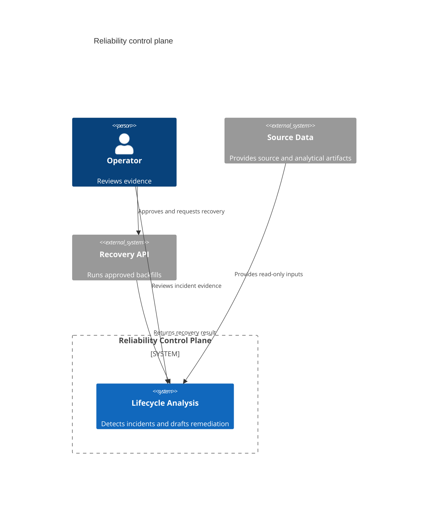
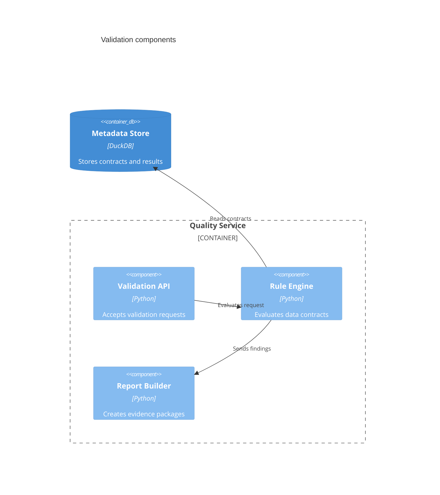
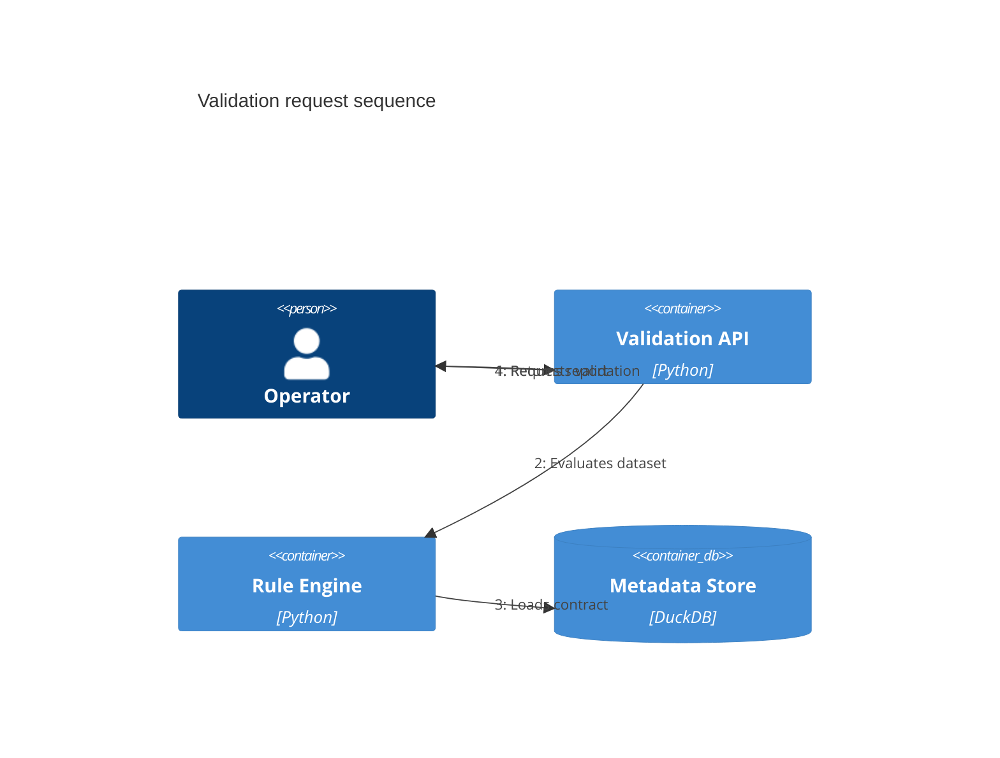

# C4 Context

시스템 경계와 외부 actor·dependency가 핵심이면 C4 context diagram을 사용한다. renderer가 지원하지 않으면 flowchart나 text description으로 대체한다.

## Advanced: Context To Containers

context diagram이 시스템 경계와 외부 관계를 설명한다면, 다음 단계에서는 system 내부의 주요 container와 책임을 분리한다. context의 actor와 external system을 container detail에 다시 복사하지 말고, 내부 책임에 집중한다.

## Improvement: Explicit Boundary And Relationship Meaning

개선된 C4는 system boundary, container 책임, relationship의 방향과 message 의미를 명시한다. 단순 component 목록보다 “누가 무엇을 제공하는가”를 읽을 수 있어야 한다.

## Advanced: Component And Dynamic Views

C4는 여러 zoom/view를 지원할 수 있지만 exact support는 target renderer와 현재 Mermaid 문서를 확인한다. 같은 질문을 여러 view에 반복하지 않고 zoom level을 명확히 한다.

## Advanced: Deployment View

C4 Deployment는 container가 실제 execution environment에 어떻게 배치되는지 보여준다. logical container diagram과 deployment topology를 한 view에 섞지 않는다.

C4 support는 target-dependent하다. 실제 render를 확인하지 못했다면 support를 단정하지 않고, portable 문서에는 architecture, flowchart 또는 text fallback을 제공한다.
