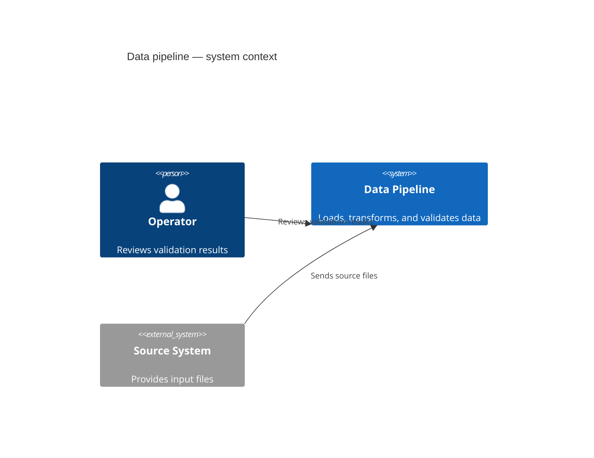
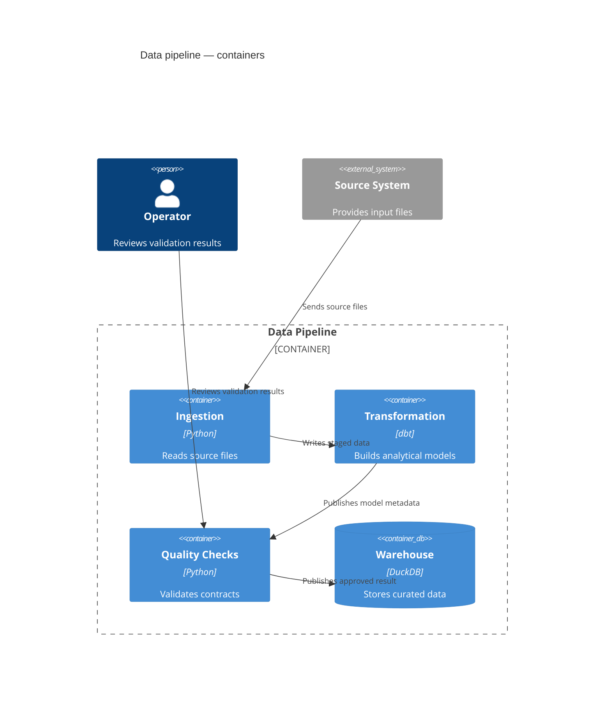
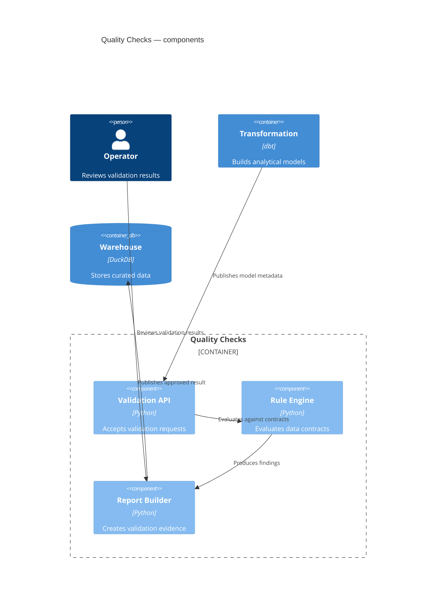
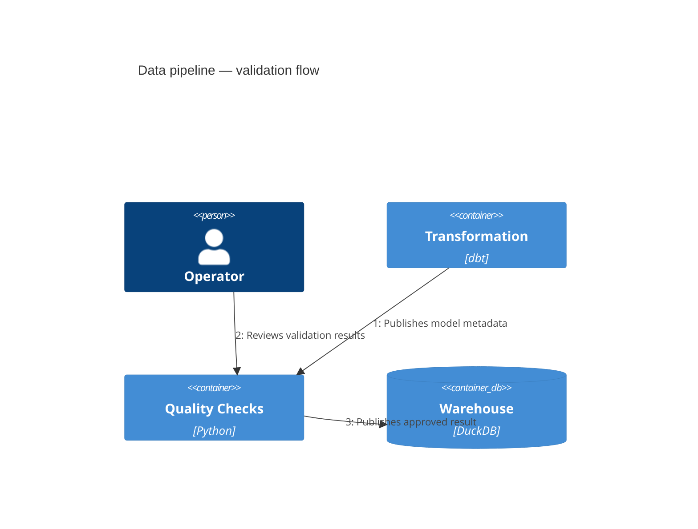
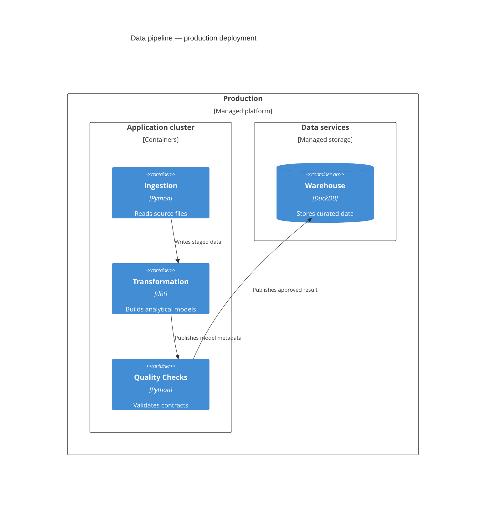

# C4 Diagrams

> Mermaid의 C4 syntax는 현재 **experimental**이다. Syntax와 property가 바뀔 수 있으므로 실제 target renderer와 현재 공식 문서를 확인한다.

C4는 software architecture를 **abstraction level과 scope를 유지하면서 여러 view로 설명**할 때 사용한다. Mermaid는 `C4Context`, `C4Container`, `C4Component`, `C4Dynamic`, `C4Deployment`를 지원하지만, 이들을 모두 같은 종류의 zoom level로 취급하지 않는다.

- **Mermaid가 지원하는 static zoom**: Context → Container → Component
- **Supporting view**: Dynamic, Deployment

C4 모델의 core static hierarchy에는 Code level도 있지만 Mermaid C4 syntax는 별도 Code view를 지원하지 않는다. 질문에 필요한 view만 사용하고, 모든 level을 completeness를 위해 만들거나 unsupported view를 local syntax로 발명하지 않는다.

## System Context

System Context는 **하나의 software system in scope**와 그 system에 직접 연결된 사람·외부 software system을 보여준다. 내부 container나 component를 이 view에서 미리 분해하지 않는다.

Context에서 technology, deployment node, 내부 service를 섞지 않는다. 내부 책임이 질문의 핵심이면 Container view로 내려간다.

## Container Zoom

Container view는 system boundary 안의 주요 application·data store와 responsibility를 확대한다. 상위 Context의 모든 요소를 반복할 필요는 없지만, **현재 container와 직접 관계가 있는 person·external system은 relationship과 함께 유지한다.**

Context의 `Source System → Data Pipeline` 관계는 zoom 후 `Source System → Ingestion`처럼 더 구체적인 endpoint로 이어질 수 있다. 반대로 source가 뒷받침하지 않는 container나 relation을 zoom 과정에서 새로 만들지 않는다.

## Component Zoom

Component view는 **하나의 container** 내부를 확대한다. 해당 component와 직접 연결된 다른 container, person, software system은 supporting context로 유지할 수 있다.

같은 model을 여러 view에서 다룰 때 element의 identity와 abstraction type을 일관되게 유지한다. Container였던 element를 설명 편의를 위해 Component로 바꾸거나, Component를 Dynamic view에서 Container로 승격하지 않는다.

## Dynamic View

Dynamic은 static zoom level이 아니라 **기존 static model element가 특정 feature·story·use case에서 runtime에 어떻게 협력하는지** 보여주는 supporting view다. 먼저 어떤 static level의 element를 사용할지 정하고 그 identity와 abstraction을 그대로 유지한다.

아래 예제는 Container model을 기반으로 한다.

Mermaid의 `RelIndex(index, ...)`는 **`index` 인자를 sequence number로 사용하지 않는다. Relationship statement가 작성된 순서가 표시 번호를 결정한다.** 따라서 interaction order가 source에 의해 확인된 경우에만 statement 순서를 그 순서대로 작성한다. 숫자 인자 자체를 semantic source로 취급하지 않는다.

## Deployment View

Deployment는 static zoom level이 아니라 **특정 deployment environment에서 system/container instance가 infrastructure에 어떻게 배치되는지** 보여주는 supporting view다. Production, staging, development처럼 environment scope를 먼저 명확히 한다.

아래 예제의 production node와 placement는 Container view에서 자동으로 추론한 정보가 아니라, **별도의 deployment source가 이를 뒷받침한다고 가정한 추가 사실**이다.

Logical responsibility와 deployment placement를 같은 사실로 취급하지 않는다. Container model에 없는 replica, cluster, node 또는 environment를 보기 좋다는 이유로 발명하지 않는다.

## Relationship Meaning

Relationship label은 단순한 `uses`보다 **무엇을 제공·요청·전송하는지** 드러내는 동사를 우선한다. Arrow가 dependency를 뜻하는지 data flow를 뜻하는지는 source와 질문에 맞게 일관되게 정하고, label이 그 방향과 일치해야 한다.

Zoom을 바꿀 때 relationship endpoint가 더 구체적인 element로 바뀔 수는 있지만, relationship 자체를 새로 만들거나 방향을 뒤집지 않는다.

## Mermaid-Specific Layout

Mermaid C4는 fully automated layout을 사용하지 않으며 **statement order가 shape position에 영향을 줄 수 있다.** 이 특성은 presentation layer다.

- statement order를 chronology, priority, ownership 또는 dependency semantics로 해석하지 않는다.
- readability를 위해 statement order를 조정할 수 있지만 relationship meaning은 바꾸지 않는다.
- Mermaid 공식 C4 구현은 `Lay_U`, `Lay_D`, `Lay_L`, `Lay_R` 같은 layout statement를 지원하지 않는다.
- `UpdateLayoutConfig`는 row당 shape·boundary 수를 조정하는 제한된 tuning으로만 사용한다. 잘못된 scope나 과도한 element 수를 layout config로 숨기지 않는다.
- renderer version에 따라 wrapping behavior가 달라질 수 있으므로 long label이 중요하면 실제 target에서 확인한다.

## Rules

- 먼저 **Mermaid가 지원하는 static abstraction level(Context / Container / Component)**을 정한다.
- Runtime interaction이 질문이면 기존 static model을 기반으로 Dynamic을 추가한다.
- 실제 deployment placement가 질문이면 environment를 정한 뒤 Deployment를 추가한다.
- 상위 view의 모든 element를 completeness를 위해 반복하지 않되, 현재 view의 직접 relationship을 이해하는 데 필요한 supporting element는 유지한다.
- view를 바꾸면서 source에 없는 system, container, component, deployment node, environment 또는 interaction을 발명하지 않는다.
- 같은 model element의 identity와 abstraction type을 view 사이에서 임의로 바꾸지 않는다.
- Mermaid C4의 statement order와 layout tuning은 presentation constraint이며 domain semantics가 아니다.
- experimental syntax의 exact behavior는 local example이 아니라 현재 Mermaid 공식 문서와 target renderer가 소유한다.
- 실제 render를 확인하지 못했다면 C4 support나 visual result를 단정하지 않는다.

## Portable Fallback

Target renderer가 C4를 지원하지 않으면 질문에 맞는 `architecture-beta`, flowchart 또는 text/table 표현으로 전환한다. Fallback은 C4 notation 모양을 흉내 내기보다 **scope, boundary, element identity와 relationship meaning**을 보존한다.
